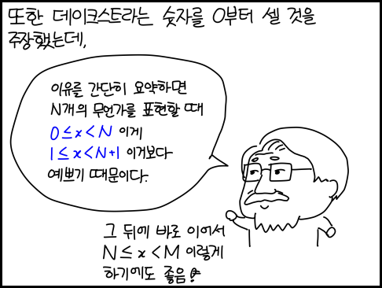

GitHub Pages 작성에 유용한 마크다운 팁 정리  

<!-- more -->

---

## 이모지

⭐⚡❗💡  
🏆🥇🥈🥉🏅  
🏷️🔖📎📌🔑🗝️🧭  
🌟🌠☄️🌈🔥💧❄️  
🥞🧀🥓🍔🍕🍺  
🇰🇷💣💢💥💯💤🦈🎓💎🔔💰💲  
🔋💻🖥️🔒🔗  
⭕❌✔️©️®️™️  

전체 이모지는 [여기](https://github.com/ikatyang/emoji-cheat-sheet/blob/master/README.md)에서 확인할 수 있다.  

!!! tip
    Windows에서는 ++windows+period++, ++windows+semicolon++ 단축키로도 확인할 수 있다.  

## 이미지/동영상 삽입

### 이미지 삽입

이미지를 삽입하려면 이미지를 어딘가에 업로드 하고 링크를 걸면 된다.  

```

```

{ loading=lazy }

### 동영상 삽입

마크다운은 기본적으로 동영상 임베드를 허용하지 않아서 아래와 같이 미리보기를 띄우고 링크를 걸어야 한다.  

```
[](https://youtu.be/YOUTUBE_VIDEO_ID_HERE)
```

[](https://youtu.be/jNQXAC9IVRw){ loading=lazy }

미리보기 방식 대신 유튜브 동영상을 임베드 하고 싶다면 유튜브 동영상을 우클릭하여 `소스 코드 복사`를 한 다음에 붙여넣으면 된다.  

```html
<iframe src="https://www.youtube.com/embed/jNQXAC9IVRw" title="Me at the zoo" frameborder="0" allowfullscreen></iframe>
```

<iframe src="https://www.youtube.com/embed/jNQXAC9IVRw" title="Me at the zoo" frameborder="0" allowfullscreen></iframe>

## 수식 입력

LaTex를 지원한다면 테마에서 수식을 입력할 때는 양 끝에 `$$`표시를 해서 LaTex 문법을 사용하면 된다.  
LaTeX 사용법은 [위키백과 TeX 문법](https://ko.wikipedia.org/wiki/%EC%9C%84%ED%82%A4%EB%B0%B1%EA%B3%BC:TeX_%EB%AC%B8%EB%B2%95)([영어](https://en.wikipedia.org/wiki/Help:Displaying_a_formula))을 참고  

```
$$
\bar{x} = \frac{1}{n}\sum_{i=1}^{n}x_{i}
$$
```

$$
\bar{x} = \frac{1}{n}\sum_{i=1}^{n}x_{i}
$$

!!! tip
    [CodeCogs Equation Editor](https://editor.codecogs.com/)을 이용하면 쉽게 LaTex 수식을 만들 수 있다.  

## \* 삽입

마크다운에서 \*을 삽입하려면, 아래와 같이 입력하면 된다.  

```markdown
\*
```

\*

??? note "Deprecated"

    ## 템플릿 언어 인식 금지

    `{{ }}`와 같은 템플릿 언어를 인식하지 않도록 작성하고 싶을 때는 앞 뒤로 `{{ "  {{ "`을 넣어주면 된다.  

    ```liquid
    {{ "  {{ "
    ```

    ## 펼치기/접기

    마크다운 자체에는 펼치기/접기 기능이 없어서, HTML의 `<details>` 태그를 사용해야 한다. `<summary>` 태그는 내용의 요약을 표시할 수 있고, 접혀진 부분 안에서 다시 마크다운 문법을 사용하려면 `<div markdown="1">` 태그로 구역을 만들어줘야 한다. 참고로 태그와 마크다운 문법 사이에 빈 줄이 있어야 정상적으로 마크다운 문법을 인식한다.  

    ```html
    <details><summary>summary</summary><div markdown="1">

    > **Your** Contents

    </div></details>
    ```

    <details><summary>summary</summary><div markdown="1">
    > **Your** Contents
    </div></details>
