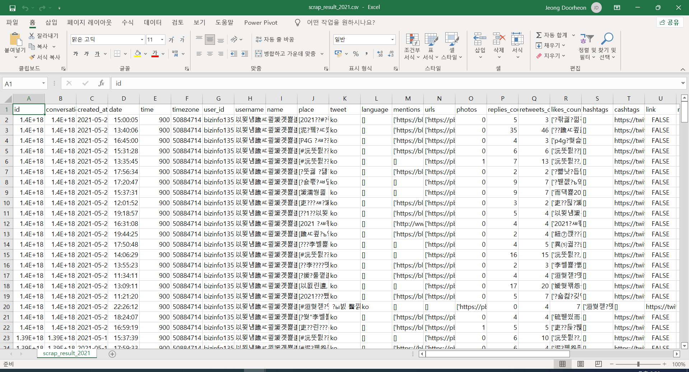
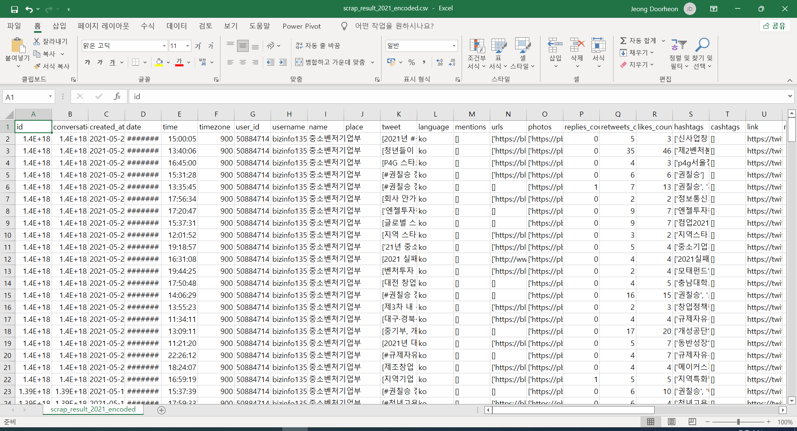

pandas로 csv 인코딩 바꾸기  

<!-- more -->

---

## csv encoding

인터넷에서 가져온 csv 파일의 경우 아래와 같이 인코딩 문제로 다 깨져서 나오는 경우가 많다.  

{ loading=lazy }

이럴 때는 메모장으로 열어서 인코딩을 `ANSI`나 `UTF-8(BOM)`으로 변경하여 저장하면 되기는 하는데, pandas를 사용해서 바꿔주려면 아래와 같이 `encoding` 파라미터를 `'utf-8-sig'`로 지정해주면 된다.  

```python
import pandas as pd

df = pd.read_csv('FILE_NAME.csv')
df.to_csv('FILE_NAME.csv', encoding='utf-8-sig')
```

결과물은 아래와 같다.  

{ loading=lazy }

---
## Reference
[pandas.DataFrame.to_csv](https://pandas.pydata.org/docs/reference/api/pandas.DataFrame.to_csv.html)