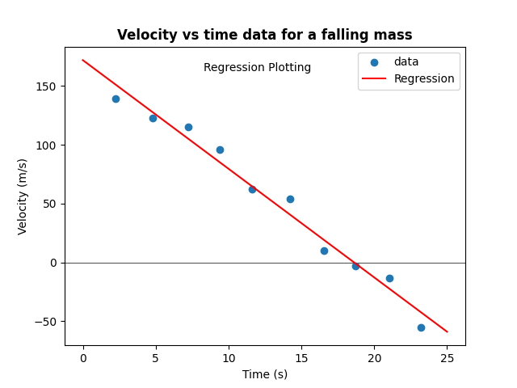

선형회귀 수식 구현하기. 수업에서 쪽지시험으로 진행했던 문제

<!-- more -->

---

## 문제

1. read the `data.txt` and define first column as $t$, second column as $v$, third column as $e$.
1. use following formulas below to create `python def LineFit(x, y)` which defines $y = b + Wx$.

    $$
    \begin{align*}
    \overline{x} & = \frac{1}{n} \sum_{i=1}^{n}x_{i} \\
    \\
    \overline{y} & = \frac{1}{n} \sum_{i=1}^{n}y_{i} \\
    \\
    W & = \frac{\sum_{i=1}^{n}(x_{i} - \overline{x})y_{i}}{\sum_{i=1}^{n}(x_{i} - \overline{x})x_{i}} \\
    \\
    b & = \overline{y} - W\overline{x} \\
    \\
    \end{align*}
    $$

1. in case of $v = v_{0} + gt$, find values of $v_{0}$, $g$.
1. plotting linear regression of $t$ and $v$.

``` title="data.txt"
Velocity vs time data for a falling mass
time (s) velocity (m/s) uncertainty (m/s)
2.23 139 16
4.78 123 16
7.21 115 4
9.37 96 9
11.64 62 17
14.23 54 17
16.55 10 12
18.70 -3 15
21.05 -13 18
23.21 -55 10
```

## 풀이

### 1번 문제 풀이

```python
import numpy as np
import matplotlib.pyplot as plt

data = np.loadtxt('./data.txt', skiprows=2)

t = data[:, 0]
v = data[:, 1]
e = data[:, 2]
```

### 2번 문제 풀이

```python
numeric = list[int | float]


def bar(data: numeric) -> float:
    """returns expectation/sample mean"""

    return sum(data) / len(data)


def lineFit(x: numeric, y: numeric) -> tuple:
    """returns linear regression coefficient(weight) and intercept of two random variables"""

    x_bar, y_bar = bar(x), bar(y)
    w = sum((x - x_bar) * y for x, y in zip(x, y)) / sum((x - x_bar) * x for x in x)
    i = y_bar - (w * x_bar)
    return i, w
```

### 3번 문제 풀이

```python
v0, g = lineFit(t, v)

print(f'v0 = {v0}\ng = {g}')
```
```
v0 = 171.89273556960842
g = -9.23414248039144
```

### 4번 문제 풀이

```python
exog = np.linspace(0, 25, 251)
endog = v0 + (g * exog)

fig, axes = plt.subplots()

axes.scatter(
    x=t,
    y=v,
    label='data',
)

axes.plot(
    exog,
    endog,
    label='Regression',
    color='red',
)

axes.set_xlabel('Time (s)')
axes.set_ylabel('Velocity (m/s)')

axes.text(
    x=12,
    y=170,
    s='Regression Plotting',
    ha='center',
    va='top',
)

axes.set_title(
    label='Velocity vs time data for a falling mass',
    weight='heavy',
)

axes.axhline(
    color='black',
    linewidth=1.5,
    zorder=-1,
)

axes.legend()
plt.show()
```

{ loading=lazy }
