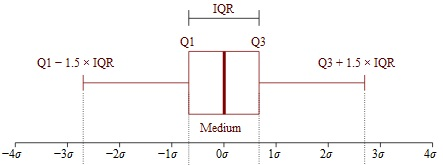
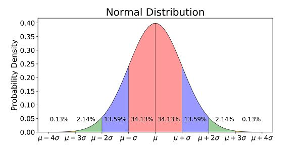

IQR 방식을 통한 데이터의 이상점 확인  

<!-- more -->

---

## 0. 용어 정의

글을 시작하기에 앞서, 이상점을 탐지한다는 말은 여러 가지의 의미로 사용되고 있어 용어 정의가 먼저 필요하다.  

> `D. M. Hawkins`의 `Identification of Outliers(1980)`에 따르면 `outlier`란 어떤 데이터 안에서 다른 관측값들과 다른 방법에 의해 생성되었다고 의심되는 관측값을 말한다.  

**이상점 탐지(outlier detection)**라는 용어는 기본적으로 **noise detection**, **abnormal/novelty detection**의 두 가지 의미를 모두 포함한다. 여기서 **noise**는 관측값이 비정상으로 나타나서 전체 데이터에 왜곡을 주는 데이터를 말하며, **abnormal/novelty**란 데이터가 비정상적인 관측값에 의해 왜곡 또는 오염되지 않은 상태에서, 독립변수들에 의해 결정된 종속변수가 비정상이나 특이점에 위치한 데이터를 말한다.  

쉽게 설명하자면, 종속변수와 독립변수의 형식으로 정리된 데이터가 있다고 할 때, **outlier/noise value**는 하나의 칼럼 안에서 존재하는 이상점을 말하고, 그 예시로는 나이 칼럼에 나타난 `10,000살`과 같은 데이터가 있다. **abnormal/novelty value**는 독립변수들의 영향을 받아 이상점, 특이점으로 나타난 종속변수의 이상점을 말하고, 그 예시로는 제조 데이터의 `불량품 발생` 또는 `설비 고장`과 같은 데이터가 있다.  

따라서 전처리 단계에서의 이상점 탐지에 대해 다루는 이 글에서는 **noise detection**에 대해서 다룬다.  

scikit-learn 패키지의 경우 **outlier detection**와 **novelty detection**에 대해서 [아래와 같이 정리](https://scikit-learn.org/stable/modules/outlier_detection.html)하고 있다.  

|outlier detection|novelty detection|
|-|-|
|The training data contains outliers which are defined as observations that are far from the others. Outlier detection estimators thus try to fit the regions where the training data is the most concentrated, ignoring the deviant observations.|The training data is not polluted by outliers and we are interested in detecting whether a new observation is an outlier. In this context an outlier is also called a novelty.|

## 1. 이상점 탐지 방법

우선 나는 지도교수님의 영향을 받아서인지, 모델링을 무작정 시작하기 전에 범주형 데이터를 기반으로 데이터셋을 분리해서 각각의 범주별로 특화된 모델을 만드는 것이 통합된 데이터로 일반화된 모델을 만드는 것보다 더 좋다고 생각하는 편이다.  

아무튼 데이터 분리 단계를 넘어간 후에 모델링 하는 과정에서의 전처리 단계에서 데이터의 noise를 처리하는 방법은 일반적으로 다음의 네 가지 방식을 사용한다.  

- $\pm1.5*IQR$ 이상/이하 제거
- 표준정규분포로 변환 후 $\pm 3 \sigma$ 이상/이하 제거
- 도메인 지식을 이용한 제거 및 대체
- Binning 처리

## 2. IQR 방식을 사용한 이상점 제거

앞서 소개한 네 가지 이상점 처리 방법 중에 가장 편하게 많이 사용되는 방식은 $IQR$ 방식의 이상점 탐지 및 제거로, 기본 원리는 아래 그림과 같다.  

{ loading=lazy }  
^[출처: Interquartile Range (IQR): What it is and How to Find it](https://www.statisticshowto.com/probability-and-statistics/interquartile-range/)^

$IQR$이란 **InterQuartile Range(사분위수 범위)**의 약자로, 데이터를 순서대로 나열했을 때 25% 지점(1분위수)에 있는 데이터와 75% 지점(3분위수)에 있는 데이터의 차이를 말하며, 위 그림에서 볼 수 있듯이, $IQR$ 방식에서 정상 데이터로 분류될 범위를 계산하는 방식은 아래와 같다.

$$
\begin{align*}
IQR & = Q3 - Q1 \\
min & = Q1 - 1.5 * IQR \\
max & = Q3 + 1.5 * IQR \\
\end{align*}
$$

계산식에서 계수로 1.5를 곱하는 이유는 짧게 얘기하자면 적당해서.. 인데 자세히 설명하자면 다음과 같다.  

### 2-1. IQR 방식에서 IQR의 계수로 1.5를 사용하는 이유

{ loading=lazy }  
^[출처: 9 Real Life Examples Of Normal Distribution](https://studiousguy.com/real-life-examples-normal-distribution/)^

통계학 기본을 공부 했다면 위 그림과 같은 표준 정규분포 그래프를 본 적이 있을 텐데, 약 $\pm 2 \sigma$에서 95%, 약 $\pm 3 \sigma$에서 99% 수준으로 표준 정규분포에 들어가게 되고, 분야에 따라 다르지만 일반적으로 $\pm 3 \sigma$를 의미 있는 데이터로 본다. ([표준정규분포표 보러가기](https://en.wikipedia.org/wiki/Standard_normal_table#Cumulative(less_than_Z)))

그리고 $Q1$과 $Q3$는 각각 $\pm 0.675 \sigma$에 위치하는데, 이 사실을 기반으로 계수에 따른 $IQR$의 범위를 구해보면,  

**계수가 1일 때** 아래와 같이 정상 데이터의 범위가  $\pm 2.025 \sigma$ 수준으로 한정되기 때문에 데이터가 정상일 것으로 예상되는 $\pm 3 \sigma$에 한참 못 미친다.  

$$
\begin{align*}
\text{min range} & = Q1 - 1 * IQR \\
& = Q1 - 1 * (Q3 - Q1) \\
& = -0.675 \sigma - 1 * (0.675 - (-0.675)) \sigma \\
& = -0.675 \sigma - 1 * 1.35 \sigma \\
& = -2.025 \sigma \\
\\
\text{max range} & = Q3 + 1 * IQR \\
& = Q3 + 1 * (Q3 - Q1) \\
& = 0.675 \sigma + 1 * (0.675 - (-0.675)) \sigma \\
& = 0.675 \sigma + 1 * 1.35 \sigma \\
& = 2.025 \sigma \\
\end{align*}
$$

반대로 **계수가 2일 때**는 아래와 같이 $\pm 3.375 \sigma$까지로 정상 데이터의 범위가 늘어나기 때문에 너무 많은 데이터를 정상으로 판별하게 된다.  

$$
\begin{align*}
\text{min range} & = Q1 - 2 * IQR \\
& = Q1 - 2 * (Q3 - Q1) \\
& = -0.675 \sigma - 2 * (0.675 - (-0.675)) \sigma \\
& = -0.675 \sigma - 2 * 1.35 \sigma \\
& = -3.375 \sigma \\
\\
\text{max range} & = Q3 + 2 * IQR \\
& = Q3 + 2 * (Q3 - Q1) \\
& = 0.675 \sigma + 2 * (0.675 - (-0.675))\sigma \\
& = 0.675 \sigma + 2 * 1.35 \sigma \\
& = 3.375 \sigma \\
\end{align*}
$$

마지막으로 **계수가 1.5일 때**는 아래와 같이 $\pm 2.7 \sigma$가 정상 데이터의 범위로 들어오기 때문에 $\pm 3 \sigma$에 적당히 가까우면서도 계산하기 편한 값이 나오게 된다.  

$$
\begin{align*}
\text{min range} & = Q1 - 1.5 * IQR \\
& = Q1 - 1.5 * (Q3 - Q1) \\
& = -0.675 \sigma - 1.5 * (0.675 - (-0.675)) \sigma \\
& = -0.675 \sigma - 1.5 * 1.35 \sigma \\
& = -2.7 \sigma \\
\\
\text{max range} & = Q3 + 1.5 * IQR \\
& = Q3 + 1.5 * (Q3 - Q1) \\
& = 0.675 \sigma + 1.5 * (0.675 - (-0.675))\sigma \\
& = 0.675 \sigma + 1.5 * 1.35 \sigma \\
& = 2.7 \sigma \\
\end{align*}
$$

좀 더 정확한 계산값을 사용하고 싶을 때는 $1.7$을 계수로 사용하면 정상 데이터의 범위가 $\pm 2.97 \sigma$이 되어 $\pm 3 \sigma$에 좀 더 가까운 결과가 나오게 된다.  

!!! note annotate
    실제 데이터의 분포에 상관없이 표준 정규분포를 가정하고 IQR 방식을 사용할 수 있는 이유는 [중심극한정리](2023-02-15-sampling_distribution.md/#2-2)(1)가 이론적 배경이라고 한다. 중심극한정리는 모집단이 어떤 분포를 가지고 있던지 간에 (모집단 분포가 어떤 모양이던 상관없이) 일단 표본의 크기가 충분히 크다면 표본평균들의 분포가 모집단의 모수를 기반으로한 정규분포를 이룬다는 정리이다.  

1. [위키피디아 - 중심 극한 정리](https://ko.wikipedia.org/wiki/%EC%A4%91%EC%8B%AC_%EA%B7%B9%ED%95%9C_%EC%A0%95%EB%A6%AC)

!!! warning
    문제는 정확히 어떤 논리적 전개를 통해서 중심극한정리가 IQR 방식 이상점 제거의 이론적 근거가 되는지는 명확한 설명을 아직 못 찾았다. 관련 교재 등에 IQR 방식으로 이상점을 찾는다고 해서 정리는 해보았는데, 근거가 있는 내용인지 조금 의심스럽다.  

## 3. Python으로 구현하기

이제 복잡한 이론적 배경은 치워두고 Python으로 구현하는 방법을 알아보자.  

```python
import pandas as pd


def get_outlier(data: pd.Series, weight: float = 1.5):
    """get index of outlier by IQR method"""

    q_25 = data.quantile(q=0.25)
    q_75 = data.quantile(q=0.75)
    iqr_weight = (q_75 - q_25) * weight

    bound_l = q_25 - iqr_weight
    bound_u = q_75 + iqr_weight

    outlier_idx = data[(data < bound_l) | (data > bound_u)].index
    return outlier_idx


def drop_outlier_series(data: pd.Series, weight: float = 1.5, reset_idx: bool = True):
    """drop data by IQR method"""

    outlier_idx = get_outlier(data=data, weight=weight)
    data.drop(labels=outlier_idx, inplace=True)
    
    if reset_idx:
        data.reset_index(drop=True, inplace=True)
    else: ...

    return data
```

pandas의 `Series` 구조의 데이터셋에서 이상점을 찾아내고 제거하는 방식의 함수이다. 필요한 내용에 따라 수정 및 응용하면 된다. 예를 들면 데이터셋에서 위 함수를 이용해 특정 칼럼의 이상점을 기준으로 해당 행을 제거하는 방법은 아래와 같다.  

```python
import pydataset as pds

df = pds.data('iris')
df.info()
```
```
<class 'pandas.core.frame.DataFrame'>
Int64Index: 150 entries, 1 to 150
Data columns (total 5 columns):
 #   Column        Non-Null Count  Dtype  
---  ------        --------------  -----  
 0   Sepal.Length  150 non-null    float64
 1   Sepal.Width   150 non-null    float64
 2   Petal.Length  150 non-null    float64
 3   Petal.Width   150 non-null    float64
 4   Species       150 non-null    object 
dtypes: float64(4), object(1)
memory usage: 7.0+ KB
```
```python
for col in df:
    if df[col].dtypes != 'object' and get_outlier(df[col]).empty is not True:
        print(col, get_outlier(df[col]))
```
```
Sepal.Width Int64Index([16, 33, 34, 61], dtype='int64')
```
```python
df.drop(index=get_outlier(df['Sepal.Width']), inplace=True)
df.info()
```
```
<class 'pandas.core.frame.DataFrame'>
Int64Index: 146 entries, 1 to 150
Data columns (total 5 columns):
 #   Column        Non-Null Count  Dtype
---  ------        --------------  -----
 0   Sepal.Length  146 non-null    float64
 1   Sepal.Width   146 non-null    float64
 2   Petal.Length  146 non-null    float64
 3   Petal.Width   146 non-null    float64
 4   Species       146 non-null    object
dtypes: float64(4), object(1)
memory usage: 6.8+ KB
```

---
## Reference
- [Why “1.5” in IQR Method of Outlier Detection?](https://towardsdatascience.com/why-1-5-in-iqr-method-of-outlier-detection-5d07fdc82097)
- [위키피디아: 중심극한정리](https://en.wikipedia.org/wiki/Central_limit_theorem)([한글](https://ko.wikipedia.org/wiki/%EC%A4%91%EC%8B%AC_%EA%B7%B9%ED%95%9C_%EC%A0%95%EB%A6%AC))