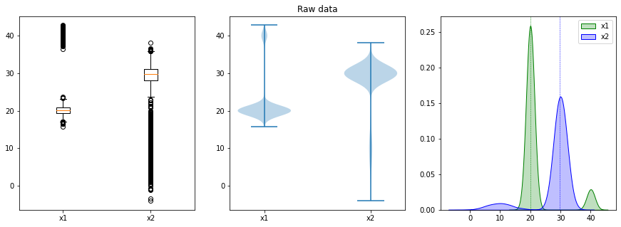
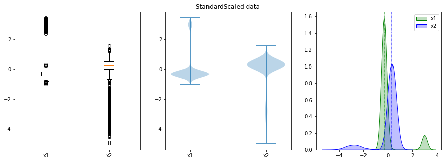
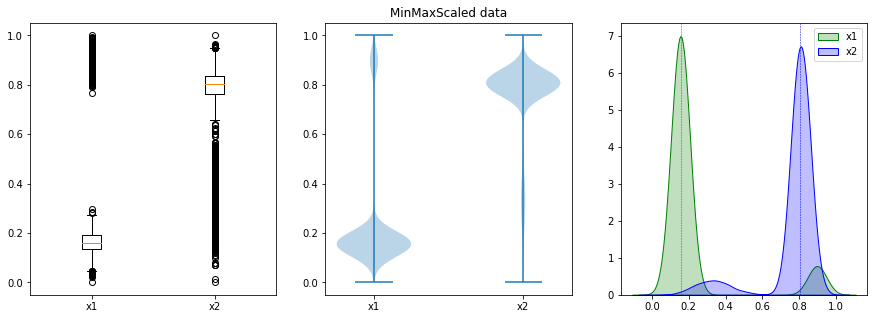
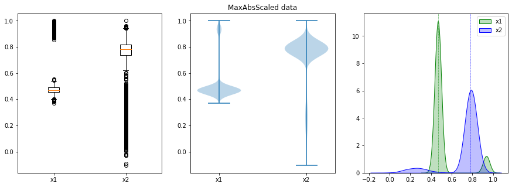
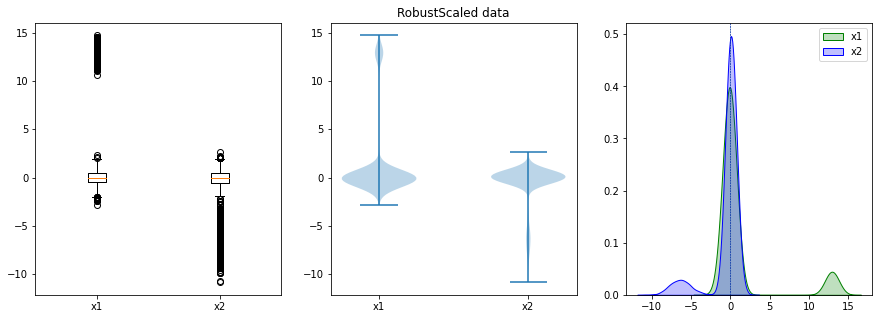
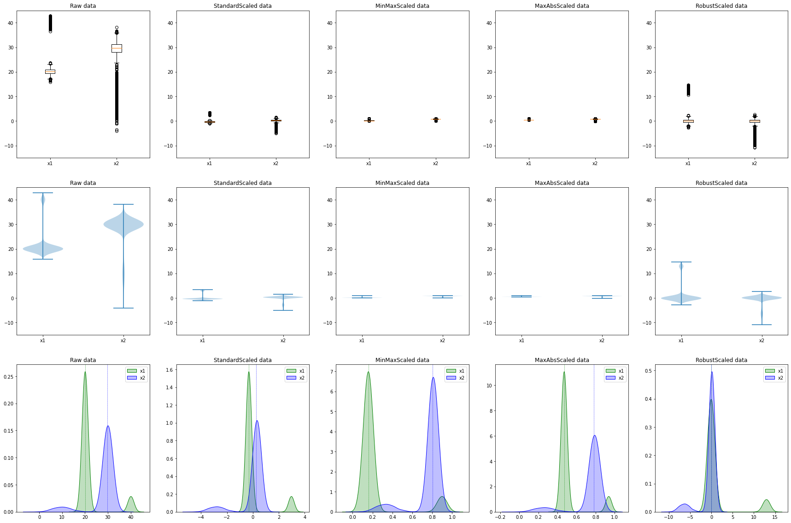

data scaling을 위한 다양한 종류의 scaler들  

<!-- more -->

---

## 개요

데이터의 전처리 과정 중에 **scaling**이라는 단계가 있다. 데이터 분석의 근본이라할 수 있는 통계학에서의 **[정규화(Normalization)](https://en.wikipedia.org/wiki/Normalization_(statistics))**에서 출발한 방법론인데, 모델의 왜곡(학습 결과의 발산)과 성능 저하(학습 속도 및 메모리 최적화)를 막기 위한 전처리로, 여러 가지 방법들이 있어 정리해둔다.  

| 이름           | 설명                                          |
| -------------- | --------------------------------------------- |
| StandardScaler | 평균과 표준편차를 통한 표준정규화             |
| MinMaxScaler   | 최대, 최소값이 각각 1, 0이되도록 스케일링     |
| MaxAbsScaler   | 최대절대값과 0이 각각 1, 0이되도록 스케일링   |
| RobustScaler   | 중앙값과 IQR 사용. 아웃라이어의 영향을 최소화 |

## 예제 데이터

아래와 같이 이상점이 잔뜩 포함된 데이터를 만들어보자.  

```python
import numpy as np
import pandas as pd
import matplotlib.pyplot as plt
import seaborn as sns

np.random.seed(30)

df = pd.DataFrame({
    'x1': np.concatenate([np.random.normal(20, 1, 9000), np.random.normal(40, 1, 1000)]),
    'x2': np.concatenate([np.random.normal(30, 2, 9000), np.random.normal(10, 4, 1000)])
})

print(df.describe())
```
```
                 x1            x2
count  10000.000000  10000.000000
mean      22.006365     28.001690
std        6.089750      6.458527
min       15.805688     -4.077173
25%       19.420740     28.083654
50%       20.152711     29.726212
75%       20.961248     31.200478
max       42.820763     38.087098
```

데이터의 분포를 시각화하면 아래와 같다.  

```python
def plotting(df: pd.DataFrame, title: str):
    _, axes = plt.subplots(nrows=1, ncols=3, figsize=(15, 5))
    axes[0].boxplot(df)
    axes[0].set_xticks(ticks=[1, 2], labels=df.columns)

    axes[1].violinplot(df)
    axes[1].set_xticks(ticks=[1, 2], labels=df.columns)
    axes[1].set_title(title)

    sns.kdeplot(x=df['x1'], ax=axes[2], shade=True, color='g', label='x1')
    sns.kdeplot(x=df['x2'], ax=axes[2], shade=True, color='b', label='x2')
    axes[2].axvline(x=df['x1'].median(), linestyle='--', linewidth=0.5, color='g')
    axes[2].axvline(x=df['x2'].median(), linestyle='--', linewidth=0.5, color='b')
    axes[2].legend()
    axes[2].set_xlabel('')
    axes[2].set_ylabel('')
    
    plt.show()

plotting(df=df, title='Raw data')
```

{ loading=lazy }

## StandardScaler

**StandardScaler**는 데이터가 정규분포를 따른다는 가정하에 표준정규화(표준화, standardization)하는 방법론으로, 중심극한정리에 따라 모든 데이터는 표준 정규분포를 따르기 때문에 이에 따라 적용하는 방법론이다. scaling에 평균값이 사용되기 때문에 이상점의 영향을 많이 받는다. 표준 점수(standard score, z score)화 하는 scaling이기 때문에 **z-score scaling**이라고도 부른다.  

Python으로 구현하면 아래와 같다.  

```python
from sklearn.preprocessing import StandardScaler

# StandardScaling
scaler = StandardScaler()
df_standard_scaled = scaler.fit_transform(df)
df_standard_scaled = pd.DataFrame(df_standard_scaled, columns=df.columns)

print(df_standard_scaled.describe())
```
```
                 x1            x2
count  1.000000e+04  1.000000e+04
mean  -4.547474e-16  4.092726e-16
std    1.000050e+00  1.000050e+00
min   -1.018266e+00 -4.967149e+00
25%   -4.246077e-01  1.269134e-02
50%   -3.044044e-01  2.670281e-01
75%   -1.716277e-01  4.953060e-01
max    3.418111e+00  1.561643e+00
```

```python
# plotting StandardScaled data
plotting(df=df_standard_scaled, title='StandardScaled data')
```

{ loading=lazy }

## MinMaxScaler

모든 feature의 값이 0 ~ 1 사이에 위치하도록 데이터를 scaling한다. 따라서 이상점에 극도로 민감하여 변환된 값이 매우 좁은 범위로 압축될 수 있다. Python으로 구현하면 아래와 같다.  

```python
from sklearn.preprocessing import MinMaxScaler

# MinMaxScaling
scaler = MinMaxScaler()
df_minmax_scaled = scaler.fit_transform(df)
df_minmax_scaled = pd.DataFrame(df_minmax_scaled, columns=df.columns)

print(df_minmax_scaled.describe())
```
```
                 x1            x2
count  10000.000000  10000.000000
mean       0.229527      0.760807
std        0.225420      0.153175
min        0.000000      0.000000
25%        0.133816      0.762751
50%        0.160911      0.801707
75%        0.190840      0.836672
max        1.000000      1.000000
```

```python
# plotting MinMaxScaled data
plotting(df=df_minmax_scaled, title='MinMaxScaled data')
```

{ loading=lazy }

## MaxAbsScaler

절대값이 0 ~ 1 사이에 위치하도록 scaling하여 -1 ~ 1 사이로 재조정한다. 따라서 MinMaxScaler 마찬가지로 이상점에 극도로 민감하다. Python으로 구현하면 아래와 같다.  

```python
from sklearn.preprocessing import MaxAbsScaler

# MaxAbsScaling
scaler = MaxAbsScaler()
df_maxabs_scaled = scaler.fit_transform(df)
df_maxabs_scaled = pd.DataFrame(df_maxabs_scaled, columns=df.columns)

print(df_maxabs_scaled.describe())
```
```
                 x1            x2
count  10000.000000  10000.000000
mean       0.513918      0.735201
std        0.142215      0.169573
min        0.369113     -0.107049
25%        0.453536      0.737353
50%        0.470629      0.780480
75%        0.489511      0.819188
max        1.000000      1.000000
```

```python
# plotting MaxAbsScaled data
plotting(df=df_maxabs_scaled, title='MaxAbsScaled data')
```

{ loading=lazy }

## 💡RobustScaler

중앙값과 [IQR](./2022-04-01-iqr_method.md)을 사용하기 때문에 이상점의 영향을 덜 받는다는 장점이 있다. Python으로 구현하면 아래와 같다.  

```python
from sklearn.preprocessing import RobustScaler

# RobustScaling
scaler = RobustScaler()
df_robust_scaled = scaler.fit_transform(df)
df_robust_scaled = pd.DataFrame(df_robust_scaled, columns=df.columns)

print(df_robust_scaled.describe())
```
```
                 x1            x2
count  1.000000e+04  10000.000000
mean   1.203274e+00     -0.553295
std    3.953079e+00      2.072150
min   -2.821811e+00    -10.845458
25%   -4.751494e-01     -0.526998
50%   -1.153096e-15      0.000000
75%    5.248506e-01      0.473002
max    1.471466e+01      2.682501
```

```python
# plotting RobustScaled data
plotting(df=df_robust_scaled, title='RobustScaled data')
```

{ loading=lazy }

## 결과 비교

전체 결과를 비교하면 아래와 같다. 데이터의 분포의 변화에 집중해서 확인하자.  

```python
dfs = [df, df_standard_scaled, df_minmax_scaled, df_maxabs_scaled, df_robust_scaled]
titles = ['Raw data', 'StandardScaled data', 'MinMaxScaled data', 'MaxAbsScaled data', 'RobustScaled data']

fig, axes = plt.subplots(nrows=3, ncols=5, figsize=(30, 20))
for i, ax in enumerate(axes.flatten()):
    j = i % 5
    if i < 5:
        ax.boxplot(dfs[j])
        ax.set_xticks(ticks=[1, 2], labels=df.columns)
    elif 5 <= i < 10:
        ax.violinplot(dfs[j])
        ax.set_xticks(ticks=[1, 2], labels=df.columns)
    else:
        c1 = 'g'
        c2 = 'b'
        sns.kdeplot(x=dfs[j]['x1'], ax=ax, shade=True, color=c1, label='x1')
        sns.kdeplot(x=dfs[j]['x2'], ax=ax, shade=True, color=c2, label='x2')
        ax.axvline(x=dfs[j]['x1'].median(), linestyle='--', linewidth=0.5, color=c1)
        ax.axvline(x=dfs[j]['x2'].median(), linestyle='--', linewidth=0.5, color=c2)
        ax.legend()
    ax.set_xlabel('')
    ax.set_ylabel('')
    ax.set_title(titles[j])

plt.savefig(fname='plot_Scaled', bbox_inches='tight')
plt.show()
```

{ loading=lazy }

변화된 분포를 원본 데이터와 비교해보면, Robust Scaling이 가장 이상점의 영향을 적게 받아 변환된 결과를 보여주고, 다음으로는 Standard Scaling이 비교적 이상점의 영향을 적게 받는 결과를 보여준다.  

---
## Reference
- [Wikipedia: Normalization (statistics)](https://en.wikipedia.org/wiki/Normalization_(statistics))
- [sklearn.preprocessing.StandardScaler](https://scikit-learn.org/stable/modules/generated/sklearn.preprocessing.StandardScaler.html#sklearn.preprocessing.StandardScaler)
- [sklearn.preprocessing.MinMaxScaler](https://scikit-learn.org/stable/modules/generated/sklearn.preprocessing.MinMaxScaler.html#sklearn.preprocessing.MinMaxScaler)
- [sklearn.preprocessing.MaxAbsScaler](https://scikit-learn.org/stable/modules/generated/sklearn.preprocessing.MaxAbsScaler.html#sklearn.preprocessing.MaxAbsScaler)
- [sklearn.preprocessing.RobustScaler](https://scikit-learn.org/stable/modules/generated/sklearn.preprocessing.RobustScaler.html#sklearn.preprocessing.RobustScaler)
- [[Python] 어떤 스케일러를 쓸 것인가?](https://mkjjo.github.io/python/2019/01/10/scaler.html)