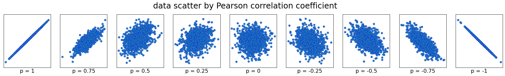

Python으로 상관계수 계산 기능 구현하기  

<!-- more -->

---

## 개요

**상관분석(correlation analysis)**은 한 변수의 변화에 따른 다른 변수의 변화 정도와 방향(상관관계)을 확인하는 분석기법으로, 두 변수 사이의 통계적 관계를 표현하기 위해 특정한 상관관계의 정도를 수치적으로 나타낸 수치인 **상관계수(correlation coefficient)**를 통해 상관의 정도를 파악한다.  

상관계수는 **-1에서 1 사이의 값**을 지니며, 부호는 상관관계의 방향, 수치는 상관의 정도를 나타낸다. 데이터 분석에 있어서 요구되는 상관계수의 수치는 분석 대상에 따라 달라지는데, 대체로 사회과학에서는 수치가 조금 낮아도 강력한 상관관계로 해석하며 오히려 너무 높은 상관관계는 데이터 조작을 의심하게 되지만, 반대로 공학계통에서는 높은 상관관계를 요구한다.  

!!! tip
    상관계수는 **데이터가 추세선을 중심으로 분포한 정도**만 알려줄 뿐 추세선의 기울기는 알려주지 않는다. 추세선의 기울기를 분석하는 방법은 [회귀분석](./2022-01-23-regression_statsmodels.md)이다.  

## 수치형 변수의 상관계수

### 공분산

두 확률변수의 선형관계를 나타내는 **공분산(covariance)**은 아래와 같이 정의된다.  

$$
Cov(X, Y) = E((X - \mu_{X})(Y - \mu_{Y}))
$$

**공분산 행렬(covariance matrix)**은 위의 공분산을 각 변수들마다 계산하는 것으로, 공분산 행렬 $\Sigma$는 아래와 같다.  

$$
\Sigma = \begin{bmatrix}
Cov(X, X) & Cov(X, Y) \\
Cov(Y, X) & Cov(Y, Y) \\
\end{bmatrix}
$$

NumPy가 제공하는 공분산 행렬을 계산하는 함수를 사용하면 두 변수 간의 공분산을 구할 수 있다.  

```python
import numpy as np

a = [2.23, 4.78, 7.21, 9.37, 11.64, 14.23, 16.55, 18.70, 21.05, 23.21]
b = [139, 123, 115, 96, 62, 54, 10, -3, -13, -55]

covariance = np.cov(a, b)[0][1]
```

### 피어슨 상관계수

**피어슨 상관계수(Pearson correlation coefficient, Pearson's r)**는 데이터 분석에서 가장 널리 쓰이는 상관계수로, 측정하려는 두 변수의 상관관계가 서로 **선형**일 때(1차 함수로 표현 가능)할 때 사용할 수 있다. 피어슨 상관계수는 두 변수의 공분산을 각각의 표준편차의 곱으로 나눈 값으로, 아래 공식을 통해 구할 수 있다.  

$$
r_{x, y} = Cor(X, Y) = \frac{Cov(X, Y)}{\sqrt{Var(X)}\sqrt{Var(Y)}}
$$

아래와 같이 NumPy와 SciPy를 통해서 상관계수를 쉽게 구할 수 있다.  

```python
import numpy as np
from scipy import stats

a = [2.23, 4.78, 7.21, 9.37, 11.64, 14.23, 16.55, 18.70, 21.05, 23.21]
b = [139, 123, 115, 96, 62, 54, 10, -3, -13, -55]

corrcoef = np.corrcoef(a, b)
pearsonr = stats.pearsonr(a, b)
```

!!! info
    피어슨 상관계수 $r$의 제곱과 다중 선형 회귀 모델의 결정 계수(Coefficient of determination) $R^{2}$은 같지 않다. 자세한 내용은 [여기](https://rython.tistory.com/17)를 참고하자.  

### 상관계수에 따른 데이터 분포

피어슨 상관계수에 따른 데이터 분포를 직접 확인해보면 아래와 같다.  

```python
import numpy as np
import matplotlib.pyplot as plt

np.random.seed(0)

corrs = [1, 0.75, 0.5, 0.25, 0, -0.25, -0.5, -0.75, -1]

data = [np.random.multivariate_normal(mean=[0, 0], cov=[[1, r], [r, 1]], size=1000).T for r in corrs]

fig, axes = plt.subplots(nrows=1, ncols=len(corrs), figsize=(len(corrs)*3, 3))

for i, ax in enumerate(axes.flatten()):
    ax.scatter(x=data[i][0], y=data[i][1], edgecolors='b', linewidths=0.3)
    ax.axis('equal')
    ax.set_xticks([])
    ax.set_yticks([])
    ax.set_xlabel(f'p = {corrs[i]}', fontsize=16)

plt.suptitle('data scatter by Pearson correlation coefficient', fontsize=24, y=1.05)
plt.savefig(fname='plot_corr', bbox_inches='tight')
plt.show()
```

{ loading=lazy }

!!! warning
    참고로 특정 분포의 데이터들은 명백하게 상관관계가 있음에도 불구하고 피어슨 상관관계가 0으로 계산되는데, 이 때는 구간을 나누어서 확인해야 한다. 자세한 내용은 [여기](https://datascienceschool.net/02%20mathematics/07.05%20%EA%B3%B5%EB%B6%84%EC%82%B0%EA%B3%BC%20%EC%83%81%EA%B4%80%EA%B3%84%EC%88%98.html#id8)를 참고하자.

## 순서형 변수의 상관계수

### 스피어만 상관계수

두 변수 간의 **스피어만 상관계수(Spearman's rank correlation coefficient)**는 두 변수의 순위 값 사이의 피어슨 상관계수와 같다. 따라서 피어슨 상관계수가 두 변수 사이의 선형 관계를 평가하는 반면 스피어만의 상관계수는 단조적 관계(선형인지 여부는 아님)를 평가한다.  

NumPy에서는 관련 API를 제공하지 않고, SciPy를 사용해 구할 수 있다.  

```python
from scipy import stats

a = [1, 2, 3, 4, 5]
b = [5, 6, 7, 8, 7]

spearmanr = stats.spearmanr(a, b)
```

### 켄달 상관계수

**켄달 상관계수(Kendall rank correlation coefficient, Kendall tau)**는 스피어만 상관계수와 마찬가지로 두 변수들 간의 순위를 비교하여 연관성을 계산한다.  

스피어만 상관계수와 마찬가지로 NumPy에서는 관련 API를 제공하지 않고, SciPy를 사용해 구할 수 있다.  

```python
from scipy import stats

a = [1, 2, 3, 4, 5]
b = [5, 6, 7, 8, 7]

tau = stats.kendalltau(a, b)
```

---
## Reference
- [위키피디아: 피어슨 상관계수](https://ko.wikipedia.org/wiki/%ED%94%BC%EC%96%B4%EC%8A%A8_%EC%83%81%EA%B4%80_%EA%B3%84%EC%88%98)([영문](https://en.wikipedia.org/wiki/Pearson_correlation_coefficient))
- [위키피디아: 스피어만 상관계수](https://ko.wikipedia.org/wiki/%EC%8A%A4%ED%94%BC%EC%96%B4%EB%A8%BC_%EC%83%81%EA%B4%80_%EA%B3%84%EC%88%98)([영문](https://en.wikipedia.org/wiki/Spearman%27s_rank_correlation_coefficient))
- [Wikipedia: Kendall rank correlation coefficient](https://en.wikipedia.org/wiki/Kendall_rank_correlation_coefficient)
