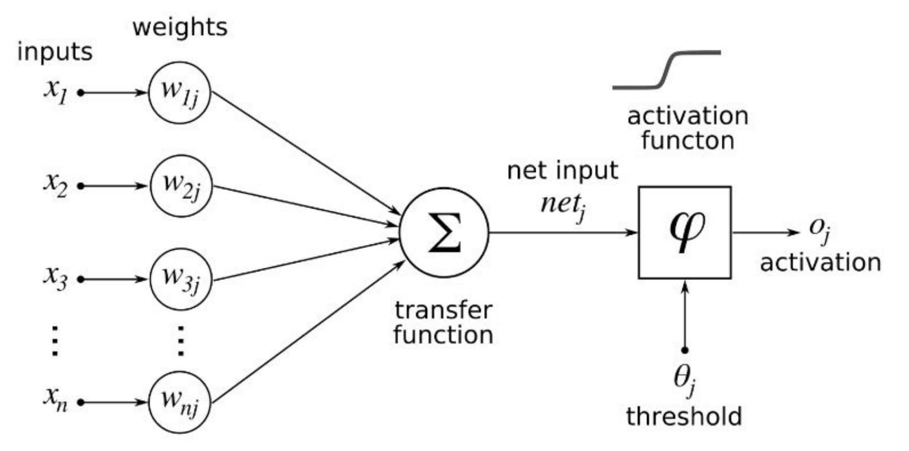
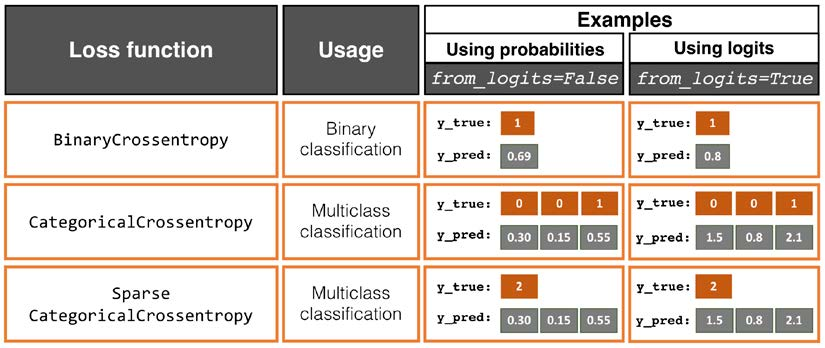
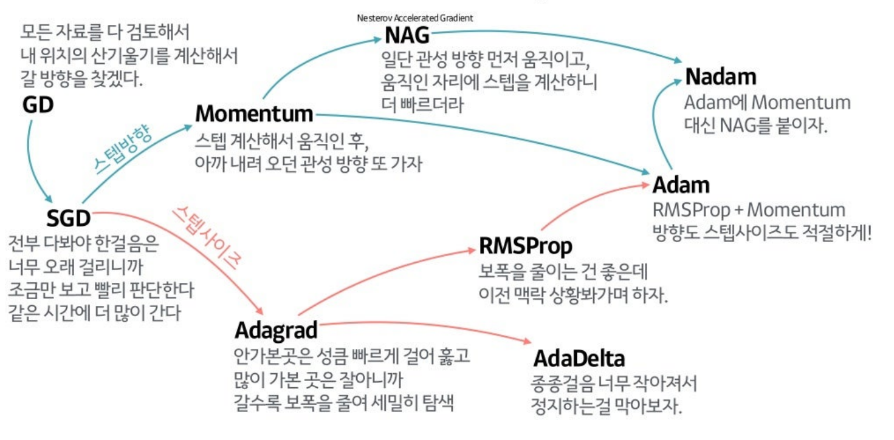
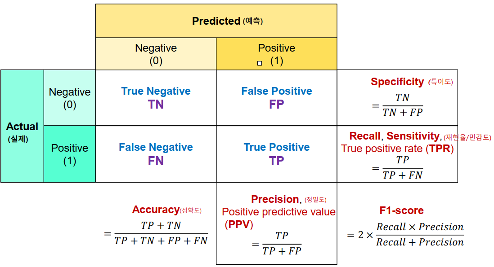

복잡한 인공신경망들의 용어를 정리해보자.  

<!-- more -->

## 인공신경망

**인공신경망(Artificial Neural Network)**은 소프트웨어로 인간 뇌의 뉴런 구조를 본따 만든 구조의 알고리즘을 말한다. 아래 그림과 같은 구조를 갖는 **퍼셉트론(Perceptron)**을 기초로 한다. 세부적으로는 전체적인 알고리즘의 구조 및 구성 요소들의 변화에 따라 각각 다른 알고리즘으로 구별된다.  

{ loading=lazy }

## node/layer

아래 그림과 같이 모든 노드가 loop가 없이 완전히 연결된 기본 구조의 인공신경망을 **다층 퍼셉트론(Multi-Layer Perceptron, MLP)**이라고 부르며, 가중치가 적용되어 활성화 되거나 비활성화 되는 각각의 **퍼셉트론(Perceptron)** 지점을 **노드(Node)**, 노드가 구성하는 층을 **Layer**라고 부른다.  

{ loading=lazy }  
^[Multi layer Perceptron (MLP) Models on Real World Banking Data](https://becominghuman.ai/multi-layer-perceptron-mlp-models-on-real-world-banking-data-f6dd3d7e998f)^

## 입력층/은닉층/출력층 

위 그림에 설명된 바와 같이 데이터가 입력되는 layer를 **입력층(Input Layer)**, 결과 데이터가 출력되는 layer를 **출력층(Output Layer)**이라고 부르며, 둘 사이에 숨겨저 있는 층을 **은닉층(Hidden Layer)**이라고 부른다.  

## 딥러닝

**딥러닝(Deep Learning)**은 은닉층(Hidden Layer)이 많은 인공신경망을 부르는 말로, 명확한 기준은 없으나 은닉층이 최소 2개는 넘어야 한다고 한다.  

## 순전파/역전파

인공신경망을 학습시킨다는 것은 최종 출력값과 실제값의 오차가 최소화되도록 각 노드와 레이어의 가중치(weight)와 바이어스(bias)를 계산하여 결정하는 것을 말한다.  

이 때 입력층에서 은닉층 방향으로 이동하면서 각 입력에 해당하는 가중치가 곱해지고, 결과적으로 가중치 합을 출력층으로 전달해 최종 출력값과 실제값의 오차를 확인하는 것을 **순전파(Feedforward)**라고 하며, 최종 출력값과 실제값의 오차가 최소화되도록 가중치(Weight)와 바이어스(Bias)를 업데이트하는 것을 **역전파(Backpropagation)**라고 한다. 역전파에는 미분이 활용된다.  

## epoch/batch size/iteration

인공신경망을 학습시킬 때 전체 데이터에 대해 순전파와 역전파가 1번 이루어지는 것을 1 **epoch**라고 한다. 문제는 데이터가 많아질수록 하드웨어의 한계로 인해 학습 속도가 느려지기 때문에 데이터를 나누어서 학습을 진행하게 된다. 이때, **batch size**는 나누어진 크기를 말하며 **iteration**은 데이터를 몇 개로 나누었는지를 의미한다.  

$$
1 \ \text{epoch} = \text{input total number of data into training one time}
$$

$$
\frac{\text{total number of data}}{\text{iteration}} = \text{batch size}
$$

## 활성화 함수

인공신경망의 구성에 있어서 가중치와 layer의 데이터가 각각 곱해서 더해진, 즉 내적된 결과값이 입력된 다음 층의 노드의 활성화 여부를 결정하는 함수를 말한다. 아래와 같이 다양한 활성화 함수들이 있다.  

- Sigmoid
    - Logistic 함수라고도 불리며 x의 값에 따라 0 ~ 1의 값을 출력하는 함수로, 중심이 0이 아니기 때문에 학습이 느려질 수 있는 단점이 있는데다가 Vanishing Gradient 문제 때문에 복잡한 모델에서는 잘 사용하지 않는다
- Tanh
    - Hyperbolic Tangent는 Sigmoid 함수를 변형해서 나오는 함수로, 함수의 중심점을 0으로 옮겨 Sigmoid의 단점 중 느린 속도를 해결했으나, 여전히 Vanishing Gradient 문제를 갖고 있다
- ReLU
    - Rectified Linear Unit 함수는 입력값이 0보다 크면 기울기가 1인 직선, 0 이하면 함수 값이 0인 경사 함수로, sigmoid, tanh 함수보다 학습이 빠르고, 연산 비용이 적고, 구현이 매우 간단하다는 특징이 있다
- Leaky ReLU
    - ReLU 함수는 입력값이 0 이하일 때 출력값이 0이 되고 미분이 불가능해지기 때문에 그 뒤로는 업데이트가 제대로 이루어지지 않는 Dying ReLU 문제를 갖고 있다. 이를 해결하기 위해 고안된 함수로 입력값이 0보다 작으면 매우 작은 값을 출력하나 0이 되지는 않는다
- ELU
    - Exponential Linear Unit 함수는 입력값이 0 이하일 때 자연로그의 밑 e를 밑으로 갖는 지수함수, 입력값이 0보다 크면 기울기가 1인 직선인 활성화 함수로, Dying ReLU 문제를 해결했다
- Swish
    - 시그모이드 함수에 입력값을 곱한 함수로 특이한 형태를 지닌 함수로 구글의 연구원들이 고안하였다고 한다
- Linear
    - Linear 함수는 입력된 값을 그대로 출력하기 때문에 은닉층에 사용되면 딥러닝 알고리즘의 장점인 비선형 데이터의 특징 추출을 무효화한다. 따라서 은닉층 노드의 활성화 함수로는 사용하지 않고 회귀 문제의 출력층에서 예측 수치를 그대로 출력하기 위해 사용한다
- Softmax
    - Softmax는 출력층에서만 사용되는 활성화 함수로, 다중 분류 문제를 해결하는 모델에서 각 클래스에 해당될 확률을 표기해주기 위해 사용된다

이 외에도 다양한 활성화 함수들이 있고, 수학에 자신이 있다면 자신만의 새로운 활성화 함수를 사용해도 된다. `tensorflow`에서 기본 제공하는 활성화 함수는 [여기](https://www.tensorflow.org/api_docs/python/tf/keras/activations), `pytorch`에서 기본 제공하는 활성화 함수는 [여기](https://pytorch.org/docs/stable/nn.html#non-linear-activations-weighted-sum-nonlinearity)를 참고하자.  

### Vanishing Gradient/Exploding

위에서 **경사 소실(Vanishing Gradient)** 문제가 잠깐 언급되었는데, 이는 딥러닝 알고리즘을 학습하다보면 역전파 과정에서 입력층으로 갈수록 기울기(Gradient)가 점차적으로 작아지는 현상이 발생하는 것을 말한다. 기울기(Gradient)는 역전파에 사용되는 미분값 즉 변화량을 의미하는데, 이 변화량이 매우 작다면, 역전파 과정에서 인공신경망을 정상적으로 학습시키지 못하고, 오차율이 미쳐 다 낮아지지 못한채 0으로 수렴해버려 입력층에 가까운 층들에서 가중치들이 제대로 업데이트 되지 않아 최적의 모델을 찾을 수 없게 되는 문제가 발생한다. 이를 Vanishing Gradient Problem이라고 한다.  

이와는 반대로, 기울기가 점차 커지더니 가중치들이 비정상적으로 큰 값이 되면서 결국 발산되기도 하는데, 이를 **경사 폭주(Gradient Exploding)**라고 한다.  

## 손실 함수

**손실 함수(loss function)**는 학습 중인 모델이 Train set을 토대로 설정된 가중치가 출력하는 output data와 Validation set의 실제값을 비교하여 예측값과 실제값의 차이를 표현하는 지표로, 손실 함수를 줄여나가는 방향으로 학습이 진행된다.  

크게 회귀(Regression) 문제인지 분류(Classification) 문제인지에 따라 종류가 나뉘며 대표적인 손실 함수들은 다음과 같다.  

- 회귀(Regression) 문제
    - Mean Absolute Error(MAE), 평균 절대 오차
    - Mean Squared Error(MSE), 평균 제곱 오차
    - Root Mean Squared Error(RMSE), 평균 제곱근 오차
- 분류(Classification) 문제
    - Cross Entropy
        - 교차 엔트로피, 두개의 확률분포가 얼마나 비슷한지 계산하는 함수로, 실무적으로는 사용하지 않음
    - Binary Cross Entropy
        - 출력층의 활성화 함수가 Sigmoid 함수와 같은 이진 분류에서 사용되는 손실 함수
    - Categorical Cross Entropy
        - 라벨이 `one-hot encoding`의 형태인 다중 분류에서 사용되는 손실 함수
    - Sparse Cross Entropy
        - 라벨이 `integer` 형태인 다중 분류에서 사용되는 손실 함수

{ loading=lazy }

## 학습률/최적화 함수

인공신경망에서 손실 함수의 최소값을 찾기 위해, 즉 문제 해결에 최적화된 가중치들을 찾아내기 위해 **경사하강법(Gradient descent)**을 사용한다. 이 때 계산의 효율을 높이기 위해 일부 데이터는 건너 뛰면서 계산을 수행하게 되는데, 이 과정에서 어느 정도로 건너뛸지를 나타내는 것을 **학습률(learning rate)**이라고 한다.  

경사하강법 알고리즘은 local minimum이나 saddle point에서 멈추거나 학습이 더디게 진행되는 문제점이 있어 이를 개선하기 위한 **최적화 함수(Optimizer)**가 적용된다.  
**최적화 함수(Optimizer)**는 어떤 지점에서 계산을 수행할지를 결정하는 함수로, 인공신경망의 현재의 손실 함수 값이 감소하는 방향으로 파라미터를 업데이트 시킬 때 가장 중요한 부분인 어느 방향으로 얼만큼 갈 것인지 결정하는 함수를 말한다.  

{ loading=lazy }
^[출처: 자습해도 모르겠던 딥러닝, 머리속에 인스톨 시켜드립니다.](https://www.slideshare.net/yongho/ss-79607172%20)^

## metrics

모델 **평가 지표(metrics)**는 말 그대로 모델을 평가하는 기준 지표로, 학습을 통해 도출된 모델이 Test set 데이터에서 인퍼런스(inference)를 수행하였을 때 출력되는 결과값을 말한다. Machine Learning에 대한 지식이 없는 사람들의 경우 단순히 모델 정확도라고 표현하기도 한다.  

모델의 최종 평가지표이며, 손실 함수와 마찬가지로 크게 회귀(Regression) 문제인지 분류(Classification) 문제인지에 따라 종류가 나뉜다. 손실 함수를 그대로 다시 사용할 수도 있으며, 평가 지표는 모델 학습에 영향을 미치지 않기 때문에 여러 가지 평가지표를 동시에 적용할 수도 있다. 대표적인 metrics의 종류는 다음과 같다.  

- 회귀(Regression) 문제
    - Mean Absolute Error(MAE), 평균 절대 오차
    - Mean Squared Error(MSE), 평균 제곱 오차
    - Root Mean Squared Error(RMSE), 평균 제곱근 오차
- 분류(Classification) 문제
    - 분류 문제의 경우 **Confusion Matrix(혼동행렬, (정)오분류표)**을 기반으로 한 모델 평가 방법론들을 사용한다.  

{ loading=lazy }
