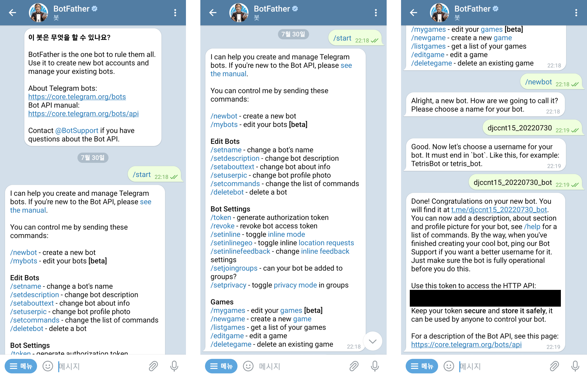
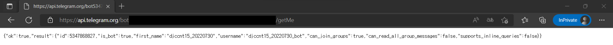
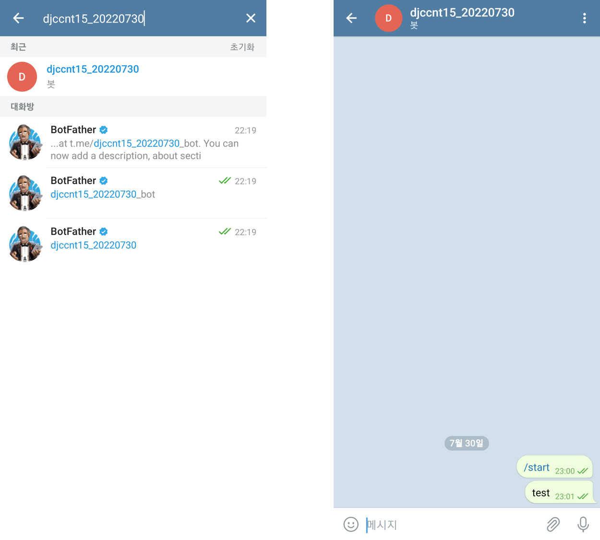
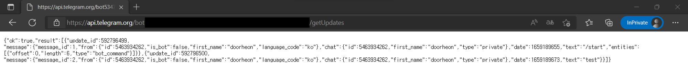
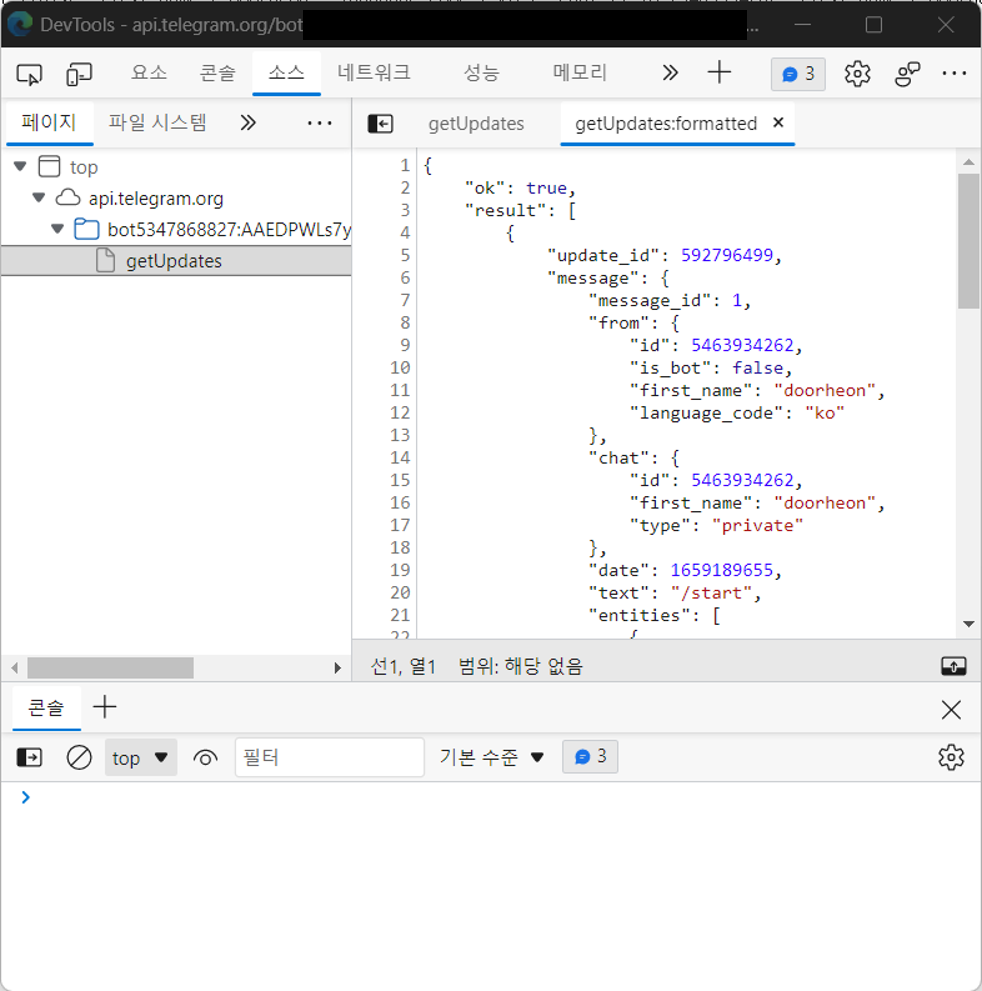
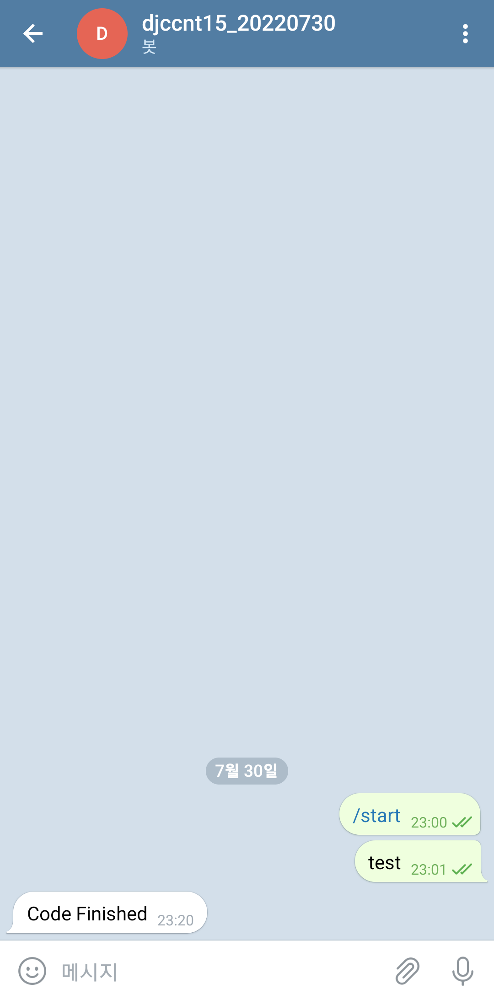
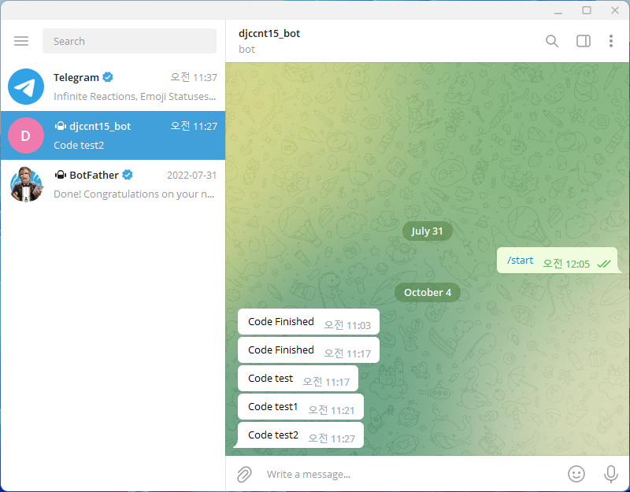

Telegram Bot API로 Python 자동 알림 만들기  

<!-- more -->

---

## 0. 왜?

회사에서 머신러닝 모델 개발 및 학습 업무를 담당하고 있는데, 코드가 다 돌면 매번 결과 확인 후 하이퍼파라미터 튜닝을 해줘야 하기 때문에 계속 신경 써줘야하는 주제에 시간은 오래 걸리고 자동화는 어렵다. ~~빨리 AutoML을 적용해야 하는데 ㅠ~~  

그래서 Python과 [Telegram Bot API](https://core.telegram.org/bots/api)를 활용해서 코드가 다 돌아가면(학습이 끝나면) 자동으로 텔레그램 봇이 메세지를 보내주는 프로그램을 만들어보았다.  

## 1. Telegram 준비 및 bot 설정

Telegram을 가입 후 **BotFather**를 검색해서 새로운 bot을 만들자.  



검정색으로 가려진 부분이 **HTTP access token**이다.  

!!! warning
    공식 마크를 잘 확인하자  

## 2. HTTP 호출을 통한 bot 생성 확인

웹브라우저 주소창에 아래와 같이 입력하면 생성한 bot과의 연결 상태를 확인할 수 있다.  

```
https://api.telegram.org/bot{YOUR_HTTP_ACCESS_TOKEN}/getMe
```



{ loading=lazy width="50%" }

## 3. ID 확인

bot에게 말을 걸어서 대화방을 생성하고 **id**를 확인하자. 스팸의 위험성 때문에 bot이 먼저 사용자에게 말을 걸 수는 없도록 되어있다고 한다.  

{ loading=lazy width="50%" }

웹브라우저 주소창에 아래와 같이 입력하면 생성한 bot과의 대화방을 업데이트 한다.  

```
https://api.telegram.org/bot{YOUR_HTTP_ACCESS_TOKEN}/getUpdates
```

{ loading=lazy }

{ loading=lazy width="50%" }

`message`의 `from` `id`를 보면 되는데, 이 경우에는 `5463934262`이다.  

## 4. 메세지 보내기

### GET 방식

이제 아래와 같이 주소로 `sendMessage` API를 사용해서 HTTP `requests`를 보내면 메시지가 전송된다.  

```
https://api.telegram.org/bot{YOUR_HTTP_ACCESS_TOKEN}/sendMessage?chat_id={YOUR_ID}&text={YOUR_MESSAGE}
```

Python에서 메세지를 보내는 코드는 아래와 같다.  

```python
import requests

requests.get('https://api.telegram.org/bot{YOUR_HTTP_ACCESS_TOKEN}/sendMessage?chat_id=5463934262&text=Code Finished')
```

{ loading=lazy width="25%" }

### POST 방식

위와 같이 GET 방식을 써서 메세지를 보내도 되지만, 이러면 코드 자체에 토큰이 노출되어 git 저장소에 토큰과 채팅 id가 업로드 되고, URL에도 중요한 정보들이 노출될 것이다. 소스 코드에 대한 최소한의 보안성을 높이려면 데이터는 JSON 파일로 분리하고, POST 방식을 통해서 데이터를 전송해야 한다.  

아래와 같이 `bot.json` 파일을 만들어서 관련 데이터를 따로 보관하고 해당 파일을 `.gitignore` 파일에 등록해두면 중요 데이터가 적어도 소스 코드와 URL에는 노출되지 않는다.  

```json
{
    "token": "YOUR_HTTP_ACCESS_TOKEN",
    "message": {
        "chat_id": "YOUR_chat_id",
        "text": "text_for_message"
    }
}
```

위의 JSON 파일을 읽어서 POST 방식으로 보내는 코드는 아래와 같다.  

```python
import json

import requests

with open('bot.json') as input:
    json_data = json.load(fp=input)
    token = json_data["token"]
    msg = json_data["message"]

requests.post(
    url=f'https://api.telegram.org/bot{token}/sendMessage',
    data=msg
)
```

{ loading=lazy }

정상적으로 메세지가 보내지는 것을 확인할 수 있다.  

## 5. 💡객체 지향적 활용

아래와 같이 `class`를 사용해서 bot을 객체로 만들어두면 여러 개의 bot을 사용하는 동시에 각 bot이 상황에 따라 다른 작업을 수행하도록 할 수 있다.  

```json
{"token": "YOUR_HTTP_ACCESS_TOKEN"}
```
```python
import json
import requests


class BotTelegram:
    """
    simple telegram bot
    must be initiated with JSON file which contains token like below
    e.g. {"token": "YOUR_HTTP_ACCESS_TOKEN"}
    """

    def __init__(self, fn: str) -> None:
        # get url of chat bot
        with open(fn) as f:
            token: str = json.load(fp=f)["token"]
        self.url: str = f"https://api.telegram.org/bot{token}/"

        # get chat id of the user
        chat_id: str = requests.post(url=f'{self.url}getUpdates').json()["result"][0]["message"]["chat"]["id"]
        self.data: dict = {"chat_id": chat_id}

    def contact_test(self) -> dict:
        return requests.post(url=f"{self.url}getMe").json()

    def send_msg(self, msg) -> dict:
        self.data["text"] = msg
        return requests.post(url=f"{self.url}sendMessage", data=self.data).json()
```

위와 같이 선언한 bot 객체를 사용해서 메세지를 보내는 코드의 예시는 아래와 같다.  

```python
if __name__ == "__main__":
    from datetime import datetime

    print("run your code")

    try:
        bot = BotTelegram("bot.json")       # create instance from BotTelegram class
        print(bot.contact_test())           # testing contact with bot API
        now = datetime.now().replace(microsecond=0)
        msg = "test message"
        bot.send_msg(msg=f"{now} : {msg}")  # send message to your telegram chat bot
    except Exception as e:
        print(f"AlarmBot Error: {e}")
```

참고로 텔레그램 봇은 일정 시간 이상 메세지가 전달되지 않으면 일종의 휴면 상태에 들어가서 사용하려면 사용자가 메세지를 다시 보내줘야 한다.  
이 경우 `id`를 읽을 수 없게 되어 에러가 발생하는데, 텔레그램 봇의 에러 발생과 상관없이 다른 작업이 수행되도록 하고 싶다면 위와 같이 봇 관련 코드를 `try, except`문 안에 넣어두면 된다.  

---
## Reference
- [계속 업데이트 중인 전체 코드 git repository](https://github.com/djccnt15/messenger_bot)
- [Telegram Bot API](https://core.telegram.org/bots/api)
- [Telegram bot을 활용한 코드 실행이 끝나면 핸드폰으로 메시지 보내기](https://blog.knowblesse.com/43?category=733209)