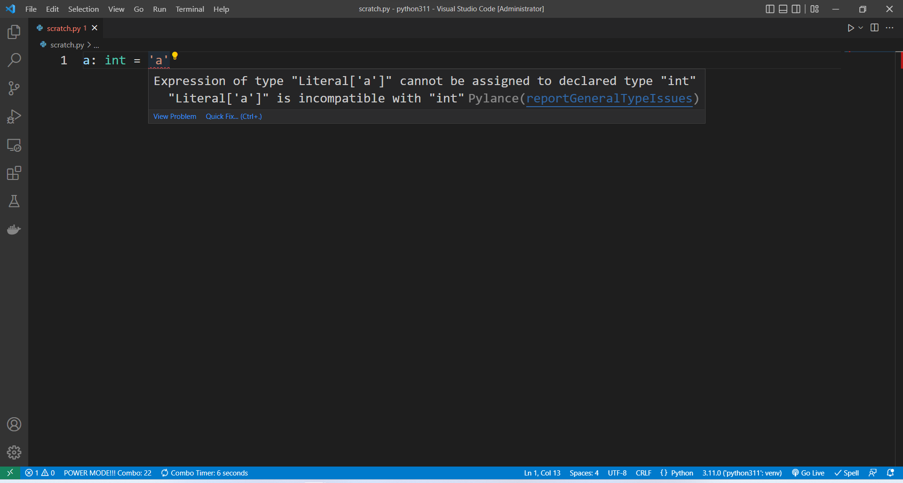
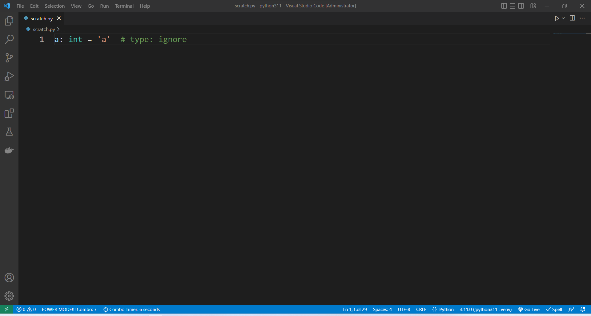

Python에서 변수 타입을 고정하고 엄격하게 사용하는 방법  

<!-- more -->

---

## 정적 타입 언어와 동적 타입 언어

프로그래밍 언어는 변수의 타입이 정해지는 시점에 따라 [정적 타입 언어와 동적 타입 언어](https://en.wikipedia.org/wiki/Type_system#Type_checking)로 나누어진다.  

**정적 타입(Statically Typed)** 언어는 컴파일 시점에 변수의 타입이 결정되는 언어로, 이를 위해 코드에 미리 데이터의 자료형을 지정해줘야 한다. 타입 에러로 인한 문제를 컴파일 타임에 해결할 수 있기 때문에 안정성이 높고, 컴파일 시에 미리 타입을 결정하기 때문에 실행속도가 빠르지만, 프로그래밍의 유연성이 낮다. C, C++, Java 등이 대표적인 정적 타입 언어들이다.  

**동적 타입(Dynamically Typed)** 언어는 런타임 시점에 변수의 타입이 결정되는 언어로, 따라서 코드에 미리 데이터의 자료형을 지정해줄 필요가 없다. 코딩 시 타입에 대한 제한이 없기 때문에 유연성이 높아 생산성이 좋지만, 런타임 단계에서 데이터의 자료형으로 인한 오류가 발생할 수 있다. Python, Ruby, JavaScript 등이 대표적인 동적 타입 언어들이다.  

## Python에서 정적 타입 사용하기

### 사용 방법

#### 변수 및 함수

아래와 같이 Python 3.5 부터 추가된 타입 힌트를 사용하면 변수에 자료형에 대한 지침을 부여할 수 있다.  

```python
a: int = 3
```

아래와 같이 함수나 클래스의 파라미터에 타입 힌트를 적용할 수 있다.  

```python
def add(a: 'expression', b: int) -> int:
    return a + b

print(add.__annotations__)
```
```
{'a': 'expression', 'b': <class 'int'>, 'return': <class 'int'>}
```

#### Union/Optional

둘 이상의 타입을 조합한 Union 타입이나 `None`을 조합한 Optional 타입을 만들 수 있다.  

```python
from typing import Union

old: Union[int, None]
new: int | None  # (1)!
```

1. 3.10 버전부터 사용 가능

#### Alias

아래와 같이 타입의 별칭을 만들 수 있다.  

```python
scalar = int | float
vector = list[scalar]
matrix = list[vector]
```

#### Literal

특정 목록 중 하나로 한정하고 싶을 경우 아래와 같이 `Literal` 객체를 사용하면 된다.  

```python
from typing import Literal

MyType = Literal[1, 2, 3]
```

#### Final

특정 변수의 값을 고정하고 싶을 때는 아래와 같이 `Final` 객체를 사용하면 된다.  

```python
from typing import Final

bfg: Final = 9000
```

#### Forward references

뒤에 정의되는 타입을 정의되기 전에 사용하고 싶다면 [forward references](https://peps.python.org/pep-0484/#forward-references)를 사용하면 된다.  

!!! quote
    When a type hint contains names that have not been defined yet, that definition may be expressed as a string literal, to be resolved later.  

```python
class Outer:
    def __init__(self):
        self.name = "Outer"
        self.inner = self.Inner(self)

    def show(self):
        print("Name:", self.name)

    class Inner:
        def __init__(self, outer: "Outer"):  # (1)!
            self.name = "Inner"
            self.outer = outer

        def display(self):
            print("Name:", self.name)
            print("Outer:", id(self.outer))


# create Outer class object and call method of it
outer = Outer()
outer.show()

# create a Inner class and call method of it
inner = outer.inner
inner.display()

# check if the outer class is actually pass to inner class
print(outer is inner.outer)
```

1. forward reference

```
Name: Outer
Name: Inner
Outer: 2246742564560
True
```

!!! warning
    forward reference는 reference 될 객체가 해당 모듈에 작성되어 있거나 `import` 되어 있을 때 IDE가 해당 객체를 정상적으로 인식하는데, 순환참조를 조심해야한다.  

### 검사 방법

#### Mypy 사용

[Mypy](https://github.com/python/mypy)를 사용하면 정적 타입 언어처럼 미리 타입 에러를 체크해볼 수 있다.  

Mypy는 아래와 같이 pip을 통해서 설치할 수 있다.  

```
pip install mypy
```

아래와 같이 짧은 코드를 작성하고 `test.py`로 저장한 후  

```python
a: int = 'a'  # annotate a as int but declare it as str
```

`mypy`를 통해서 파일을 시행하면,  

```
> mypy test.py
```
```
test.py:1: error: Incompatible types in assignment (expression has type "str", variable has type "int")
Found 1 error in 1 file (checked 1 source file)
```

이렇게 타입 에러를 검사해준다. 참고로 Python의 Annotations은 Comment와 마찬가지로 강제성이 전혀 없기 때문에 실행 시에 Annotations을 작성해주는 것 자체로는 런타임 시에 에러가 나지는 않는다.  

{ loading=lazy }

#### IDE 기능 사용

VS Code에서 Python 스크립트를 코딩할 때 사용하는 extension 중 [Pylance](https://marketplace.visualstudio.com/items?itemName=ms-python.vscode-pylance)가 있다. Pylance의 `Type Checking Mode`옵션을 켜주면 아래 그림과 같이 데이터의 자료형을 검사해준다.  

{ loading=lazy }

### Annotation 무시하기

이런저런 이유로 Annotation을 무시하고 싶을 수도 있는데, 이 때는 아래와 같이 `# type: ignore` 주석을 해당 라인 뒤에 붙여주면 된다.  

```python
a: int = "a"  # type: ignore
```

{ loading=lazy }

---
## Reference
- [[CS 기초] 정적타입 언어 vs 동적타입 언어](https://algorfati.tistory.com/112)
- [PEP 484 – Type Hints](https://peps.python.org/pep-0484/)
- [PEP 526 – Syntax for Variable Annotations](https://peps.python.org/pep-0526/)
- [typing — Support for type hints](https://docs.python.org/3/library/typing.html)
- [mypy - Type hints cheat sheet](https://mypy.readthedocs.io/en/stable/cheat_sheet_py3.html)
- [How to Use Static Type Checking in Python 3.6](https://medium.com/@ageitgey/learn-how-to-use-static-type-checking-in-python-3-6-in-10-minutes-12c86d72677b)
