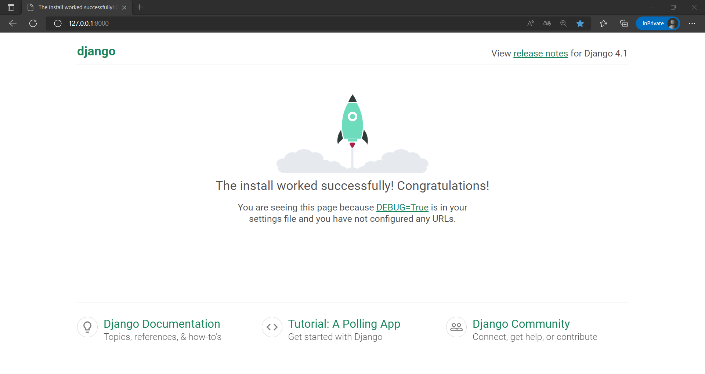
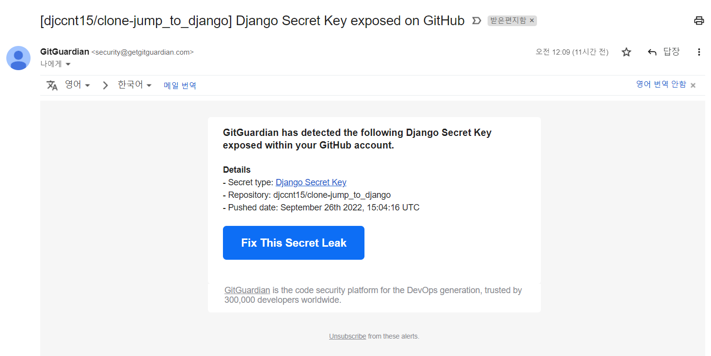
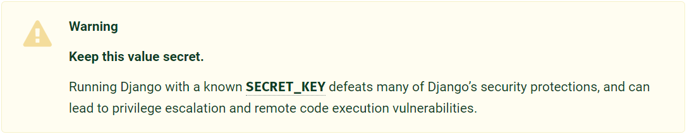

Django 설치, 프로젝트 시작, 개발서버 구동, Secret Key 숨기기  

<!-- more -->

---

## 0. 개요

*The web framework for perfectionists with deadlines*라는 슬로건으로 제공되는 Django는 Python을 기반으로 하는 오픈 소스 풀 스택 웹 프레임워크로, 웹 개발을 아주 빠르고 쉽게 진행할 수 있도록 해주는 프레임워크이다. 웹 개발 입문을 위해 [Django 튜토리얼](https://docs.djangoproject.com/en/4.1/intro/tutorial01/)과 [점프 투 장고](https://wikidocs.net/book/4223)를 따라해보면서 Django를 공부해보려고 한다.  

## 1. Django 설치

Django도 기본적으로 Python 라이브러리이기 때문에 `pip`를 통해서 설치하면 된다.  

```bat
pip install Django
```

아래와 같이 Django와 Python [호환성 제약](https://docs.djangoproject.com/en/4.1/faq/install/#what-python-version-can-i-use-with-django)이 있으니 [Python 가상환경](./2022-01-05-venv_guide.md)을 사용해서 버전을 맞춰주어야 한다.  

| Django version | Python versions                                            |
| -------------- | ---------------------------------------------------------- |
| 2.2            | 3.5, 3.6, 3.7, 3.8 (added in 2.2.8), 3.9 (added in 2.2.17) |
| 3.1            | 3.6, 3.7, 3.8, 3.9 (added in 3.1.3)                        |
| 3.2            | 3.6, 3.7, 3.8, 3.9, 3.10 (added in 3.2.9)                  |
| 4.0            | 3.8, 3.9, 3.10                                             |
| 4.1            | 3.8, 3.9, 3.10, 3.11                                       |

## 2. Project 시작

### 2-1. Project 생성

Django 공식 홈페이지에서는 아래와 같은 명령어로 프로젝트를 시작하면 된다고 한다.  

```bat
django-admin startproject [project_name]
```

다만 위와 같이 시작하면 현재 위치의 `project_name` 디렉토리가 생성되어 해당 디렉토리에서 프로젝트를 관리하게 된다. 아래와 같이 `config .` 옵션을 사용해 `config` 디렉토리를 사용하는게 명확성에 더 좋다.  

```bat
django-admin startproject config .
```

프로젝트를 시작하면 아래와 같은 파일들이 생성된다.  

- `manage.py`
    - 개발자가 Django 프로젝트와 상호작용할 수 있도록 해주는 파일([공식 문서](https://docs.djangoproject.com/en/4.1/ref/django-admin/))
- `config` directory
    - 해당 디렉토리는 프로젝트를 위한 실제 Python 패키지로, 해당 디렉토리의 이름을 사용해서 import를 진행함
- `config/__init__.py`
    - 해당 디렉토리가 Python 패키지임을 알려주는 역할을 하는 파일([Python 공식 문서](https://docs.python.org/3/tutorial/modules.html#packages))
- `config/settings.py`
    - Django 프로젝트에 대한 본격적인 configuration 파일로 프로젝트의 각종 설정을 세팅할 수 있는 파일([공식 문서](https://docs.djangoproject.com/en/4.1/ref/settings/))
- `config/urls.py`
    - 각종 URL을 설정할 수 있는 파일로, Django 프로젝트의 table of contents에 대한 파일([공식 문서](https://docs.djangoproject.com/en/4.1/topics/http/urls/))
- `config/asgi.py`
    - ASGI 호환성을 위한 entry-point 파일([공식 문서](https://docs.djangoproject.com/en/4.1/howto/deployment/asgi/))
- `config/wsgi.py`
    - WSGI 호환성을 위한 entry-point 파일([공식 문서](https://docs.djangoproject.com/en/4.1/howto/deployment/wsgi/))

!!! note
    추가로, 대부분의 Python 프로젝트와 마찬가지로 프로젝트가 저장된 root 디렉토리의 이름은 아무 영향이 없어서 마음대로 바꿔도 된다고 한다. 다만 가상환경을 사용하는 경우 가상환경을 새로 구성해줘야 하는 점은 주의하자.  

### 2-2. 언어 및 시간대 설정

`config/setting.py` 파일을 아래와 같이 수정해 프로젝트의 기본 언어와 시간대를 수정할 수 있다.  

```python title="setting.py"
# Internationalization
# https://docs.djangoproject.com/en/4.1/topics/i18n/

LANGUAGE_CODE = 'ko'

TIME_ZONE = 'Asia/Seoul'
```

## 3. 개발 서버 구동

아래 명령어로 개발 서버를 구동하고, 특정 포트를 할당할 수도 있다.  

```bat
manage.py runserver
```

```bat
manage.py runserver [port_num]
```
```
Watching for file changes with StatReloader
Performing system checks...

System check identified no issues (0 silenced).

You have 18 unapplied migration(s). Your project may not work properly until you apply the migrations for app(s): admin, auth, contenttypes, sessions.
Run 'python manage.py migrate' to apply them.
September 25, 2022 - 21:54:52
Django version 4.1.1, using settings 'config.settings'
Starting development server at http://127.0.0.1:8000/
Quit the server with CTRL-BREAK.
```

위와 같이 개발 서버가 작동하면 [http://127.0.0.1:8000/](http://127.0.0.1:8000/)로 접속할 수 있고, ++ctrl+c++로 서버를 중지할 수 있다. 개발 서버에 접속하면 아래와 같이 정상 작동 중인 것을 확인할 수 있다.  

{ loading=lazy }

## 4. Secret Key 숨기기

구성한 프로젝트를 GitHub에 그대로 push 하면 *Django Secret Key exposed on GitHub*이라는 제목으로 경고가 날아온다.  

{ loading=lazy }

Django 프로젝트의 Secret Key가 노출되었다는 것인데, Secret Key는 [디지털 서명](https://docs.djangoproject.com/en/1.11/topics/signing/)을 위해 사용되고, 사용 대상은 아래와 같다.  

- `django.contrib.sessions.backends.cache`이외의 session backend를 사용하거나 기본 `get_session_auth_hash`를 사용하는 모든 [session](https://docs.djangoproject.com/en/1.11/topics/http/sessions/)
- `CookieStorage`나 `FallbackStorage`를 사용하는 모든 [메세지](https://docs.djangoproject.com/en/1.11/ref/contrib/messages/)
- 모든 [`PasswordResetView`](https://docs.djangoproject.com/en/1.11/topics/auth/default/#django.contrib.auth.views.PasswordResetView) 토큰
- 다른 키가 제공되지 않는 모든 [디지털 서명](https://docs.djangoproject.com/en/1.11/topics/signing/)

Django의 Secret Key에 대한 상세한 설명은 [공식 문서](https://docs.djangoproject.com/en/4.1/ref/settings/#std:setting-SECRET_KEY)에서 확인할 수 있는데, Secret Key를 노출시키면 Django가 제공하는 보안 관련 기능을 무력화하니 주의하라고 한다.  

{ loading=lazy }

이번 경우에는 이미 노출되었으니 다음과 같은 두 단계로 해결해야 한다.  

1. Secret Key 변경
1. Secret Key 분리

### 4-1. Secret Key 변경

Secret Key를 코드에서 단순히 지우는 것으로는 충분하지 않고 변경을 해야 하는데, 코드에서 Secret Key를 지우더라도 git 히스토리에 남아 있기 때문이다.  

Secret Key는 50자의 랜덤한 문자로 생성되는데 직접 생성 코드를 짜서 만들어도 되고, [Django Secret Key Generator](https://miniwebtool.com/django-secret-key-generator/) 같은 사이트에서 생성해도 된다.  

### 4-2. Secret Key 분리

Secret Key는 `config/setting.py`에 아래와 같이 저장된다.  

```python
# SECURITY WARNING: keep the secret key used in production secret!
SECRET_KEY = 'django-insecure-a)a75!_s7sm8rgd!gw7##m0b3nqzxybw($o+_+2oj^oo34)210'
```

우선 이 부분을 아래와 같이 변경하자. JSON 파일로 분리한 Secret Key를 읽어오는 코드다.  

```python  title="setting.py"
import json

from django.core.exceptions import ImproperlyConfigured

# SECURITY WARNING: keep the secret key used in production secret!
secret_file = BASE_DIR, / 'secrets.json'  # set location of secrets.json
with open(secret_file) as f:  # get data from secrets list
    secrets = json.loads(f.read())

def get_secret(var, secrets=secrets):
    """get secret variable or raise ImproperlyConfigured error"""
    try:
        return secrets[var]
    except KeyError:
        error_msg = f'set {var} environment variable'
        raise ImproperlyConfigured(error_msg)

SECRET_KEY = get_secret(var="SECRET_KEY")
```

다음으로는 위 코드를 통해 Secret Key를 읽어올 `secrets.json` 파일을 root 디렉토리에 아래와 같이 만들어주자.  

```json
{"SECRET_KEY": "YOUR_SECRET_KEY"}
```

!!! danger
    해당 JSON 파일은 `.gitignore` **파일에 반드시 추가**해서 공개된 저장소에 올라가지 않도록 설정하고, 별도로 보관해야 한다.  

## 5. 감상..?

공식 문서를 조금 들여다보고 튜토리얼을 조금 진행했을 뿐인데 확실히 Django는 웹 서비스 개발을 종합적으로 지원하는 프레임워크라는 점을 느낄 수 있었다.  

나처럼 특정 기능을 위한 소규모 API를 구현할 일이 더 많은 사람은 API 구현 툴에 가까운 [FastAPI](https://fastapi.tiangolo.com/)를 사용하는게 더 나은 것 같다.  

---
## Reference
- [전체 실습 코드](https://github.com/djccnt15/study_django)
- [Writing your first Django app, part 1](https://docs.djangoproject.com/en/4.1/intro/tutorial01/)
- [Writing your first Django app, part 3](https://docs.djangoproject.com/en/4.1/intro/tutorial03/)
- [점프 투 장고: 1-04 장고 프로젝트 생성하기](https://wikidocs.net/72377)
- [Django - settings.py 의 SECRET_KEY 변경 및 분리하기](https://wayhome25.github.io/django/2017/07/11/django-settings-secret-key/)