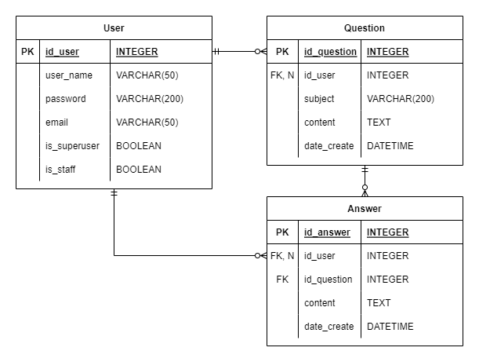
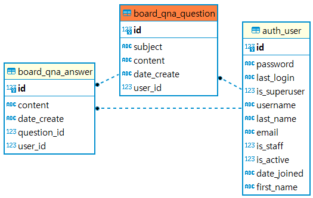
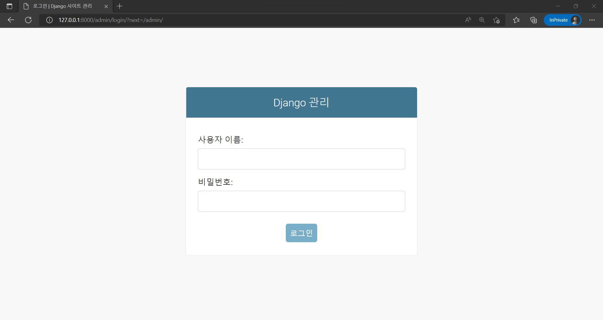
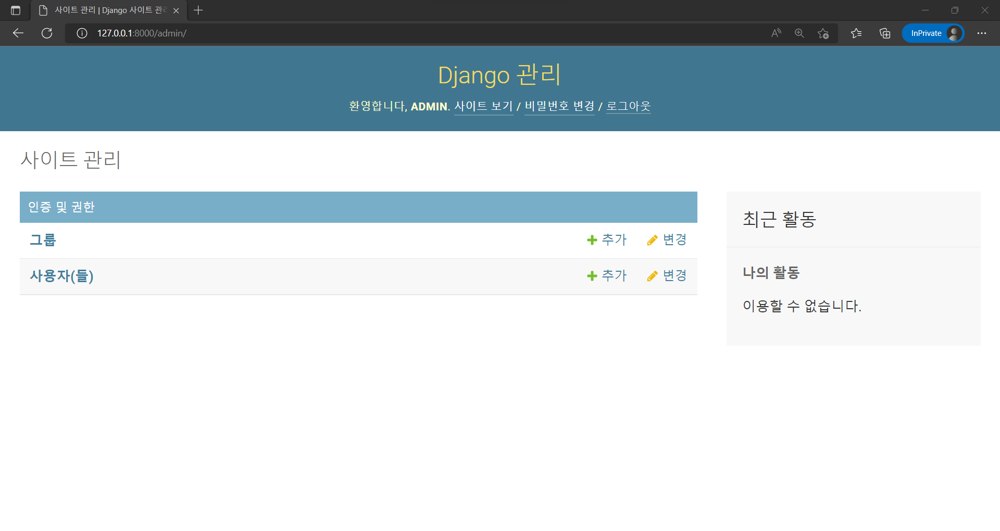
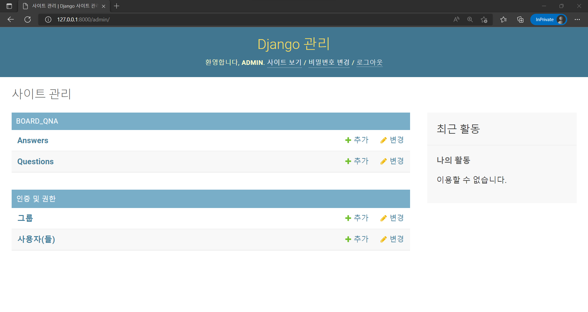
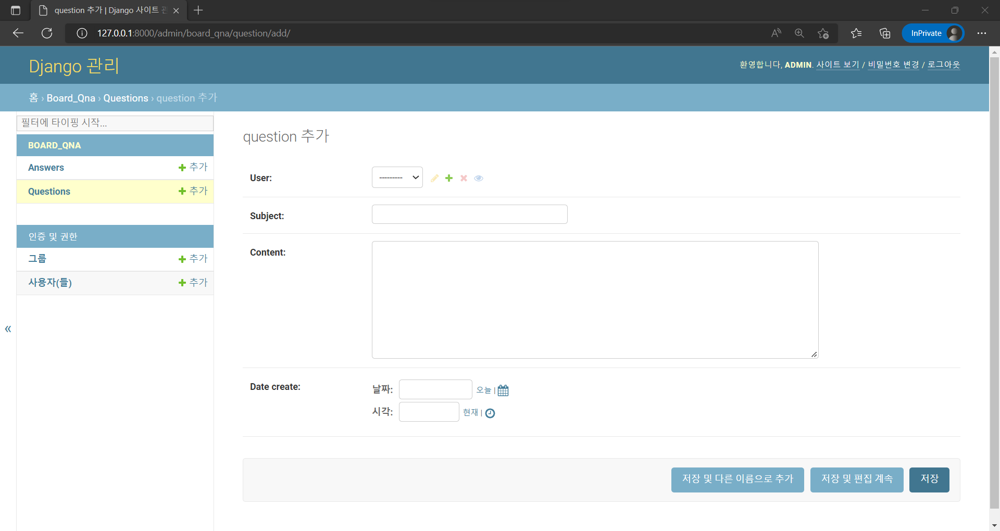

App 생성, view 생성, URL 매핑, 데이터 모델 생성 및 활성화, 관리자 계정 생성  

<!-- more -->

---

## 1. 기능 추가

### 1-1. App 생성

App(앱)은 **Application software/program**의 줄임말로, 운영체제가 아닌 모든 응용 프로그램을 말한다. Django 프로젝트에 기능을 추가하기 위해서는 앱을 생성해야 한다.  

```bat
django-admin startapp [app_name]
```

!!! note
    Django 공식 문서에서 말하는 [Project와 App의 차이](https://docs.djangoproject.com/en/4.1/intro/tutorial01/#creating-the-polls-app)

    - An app is a web application.
    - A project is a collection of configuration and apps for a particular website.
        - A project can contain multiple apps. An app can be in multiple projects.

```bat
django-admin startapp board_qna
```

terminal에 반응은 없지만, 프로젝트 디렉토리에 `board_qna` 디렉토리가 생성된 것을 확인할 수 있다.  

앱을 생성한 후에는 `config/settings.py`에 등록을 해줘야 한다. 해당 파일의 `INSTALLED_APPS` 리스트에 아래와 같이 `board_qna.apps.BoardQnaConfig` 항목을 추가하자.  

```python title="settings.py"
# Application definition

INSTALLED_APPS = [
    'board_qna.apps.BoardQnaConfig',
]
```

여기서 `board_qna.apps.BoardQnaConfig`는 `board_qna/apps.py`에 생성된 아래 클래스를 말한다.  

```python title="apps.py"
class BoardQnaConfig(AppConfig):
    default_auto_field = 'django.db.models.BigAutoField'
    name = 'board_qna'
```

### 1-2. view 생성

Django [공식 문서](https://docs.djangoproject.com/en/4.1/intro/tutorial03/#overview)에서는 view를 *특정한 기능을 제공하고 특정한 템플릿을 가진 Django 애플리케이션의 웹 페이지의 "type"*이라고 정의하고 있다.  

```python title="views.py"
from django.http import HttpResponse


def index(request):
    return HttpResponse("Hello World! Welcome to Q&A board.")
```

위와 같은 기초적인 view를 생성하였는데, `board_qna`에 접속할 경우 *Hello World! Welcome to Q&A board.*라고 화면에 띄우는 기능을 한다.  

Django는 HTTP 요청을 받을 경우 [HttpRequest](https://docs.djangoproject.com/en/4.1/ref/request-response/#django.http.HttpRequest) 객체로 변환해주는데, 자세한 내용은 [공식 문서](https://docs.djangoproject.com/en/4.1/ref/request-response/)를 참고하자.  

### 1-3. URL 매핑

생성한 기능을 사용하려면 사용자가 해당 기능을 요청할 수 있는 URL을 매핑해야 한다. Django 프로젝트에서는 `config/urls.py` 파일을 통해 URL을 관리한다. `urls.py` 파일은 페이지 요청이 발생하면 가장 먼저 호출되어 URL과 `views.py` 파일에 정의되는 뷰 함수 간의 매핑을 정의한다.  

나는 `board_qna`라는 이름으로 Q&A 게시판 앱을 생성했기 때문에 `config/urls.py` 파일의 `urlpatterns` 항목에 아래와 같이 추가하였다.  

```python title="urls.py"
from django.contrib import admin
from django.urls import path, include

urlpatterns = [  # include() is a function for including url file in each app
    path('admin/', admin.site.urls),
    path(route='board_qna/', view=include('board_qna.urls')),  # mapping URL and view
]
```

[`include`](https://docs.djangoproject.com/ko/4.1/ref/urls/#include)는 앱별로 URL을 관리하기 위해 사용하는 함수로, 위와 같이 코드를 작성하면 `board_qna/`로 시작하는 페이지에 대한 요청이 있을 경우 `board_qna/urls.py` 파일을 읽어서 처리하라는 뜻이다.  

```python
def _path(route, view, kwargs=None, name=None, Pattern=None):
    ...
```

`path`의 소스 코드를 보면 parameter는 위와 같은데, [공식 문서](https://docs.djangoproject.com/en/4.1/ref/urls/#django.urls.path)를 보면 각각의 의미는 다음과 같다.  

- `route`
    - URL 패턴을 가진 문자열로 프로젝트에서 사용할 URL 지정
- `view`
    - 호출할 view 함수 지정
- `kwargs`
    - 입력된 인수를 호출할 view에 `Dict` 자료형으로 전달
- `name`
    - URL에 이름을 부여해 템플릿 등 Django 프로젝트에서 이름을 통한 호출(call by name)이 가능

`board_qna` 앱과 관련된 주소들을 설정하는 `board_qna/urls.py` 파일은 아래와 같은 내용으로 생성해준다.  

```python title="urls.py"
from django.urls import path

from . import views

urlpatterns = [
    path('', views.index),
]
```

## 2. Database 설정

Django는 **ORM(Object Relational Mapping)**을 사용해서 데이터베이스를 처리한다. ORM을 사용하면 객체 간의 관계를 바탕으로 SQL을 자동으로 생성하기 때문에 DBMS에 대한 종속성이 줄어들고, 재사용 및 유지보수의 편리성이 증가하여 개발자가 객체 모델로 프로그래밍하고 비즈니스 로직에만 더 집중할 수 있다는 장점이 있다.  

Django에서 데이터 모델을 관리하기 위해 사용하는 명령어들에 대한 설명은 [공식 문서](https://docs.djangoproject.com/en/4.1/topics/migrations/)를 참고하자.  

### 2-1. 앱 migrate

Django의 서버를 호스팅하면 아래와 같이 18개의 적용되지 않은 migration이 있다고 뜬다.  

```bat
manage.py runserver
```
```
You have 18 unapplied migration(s). Your project may not work properly until you apply the migrations for app(s): admin, auth, contenttypes, sessions.
Run 'python manage.py migrate' to apply them.
```

아래와 같은 명령어를 통해 migration을 진행해주자.  

```bat
manage.py migrate
```
```
Operations to perform:
  Apply all migrations: admin, auth, contenttypes, sessions
Running migrations:
  Applying contenttypes.0001_initial... OK
  Applying auth.0001_initial... OK
  Applying admin.0001_initial... OK
  Applying admin.0002_logentry_remove_auto_add... OK
  Applying admin.0003_logentry_add_action_flag_choices... OK
  Applying contenttypes.0002_remove_content_type_name... OK
  Applying auth.0002_alter_permission_name_max_length... OK
  Applying auth.0003_alter_user_email_max_length... OK
  Applying auth.0004_alter_user_username_opts... OK
  Applying auth.0005_alter_user_last_login_null... OK
  Applying auth.0006_require_contenttypes_0002... OK
  Applying auth.0007_alter_validators_add_error_messages... OK
  Applying auth.0008_alter_user_username_max_length... OK
  Applying auth.0009_alter_user_last_name_max_length... OK
  Applying auth.0010_alter_group_name_max_length... OK
  Applying auth.0011_update_proxy_permissions... OK
  Applying auth.0012_alter_user_first_name_max_length... OK
  Applying sessions.0001_initial... OK
```

migration을 수행하면 위 경고문에서 표시된 `admin`, `auth`, `contenttypes`, `sessions` 앱들이 사용하는 테이블들이 생성된다. ORM을 사용하기 때문에 어떤 테이블들이 생성되는지는 지금 단계에서는 별로 신경 쓸 필요 없다.  

### 2-2. Database 설정

`config/settings.py` 파일에 보면 아래와 같이 Database에 대한 설정이 있다.  

```python title="settings.py"
# Database
# https://docs.djangoproject.com/en/4.1/ref/settings/#databases

DATABASES = {
    'default': {
        'ENGINE': 'django.db.backends.sqlite3',
        'NAME': BASE_DIR / 'db.sqlite3',
    }
}
```

Django가 지원하는 여러 가지 DB의 백엔드 엔진은 아래와 같다.  

- PostgreSQL
    - `django.db.backends.postgresql`
- MySQL/MariaDB
    - `django.db.backends.mysql`
- Oracle
    - `django.db.backends.oracle`
- SQLite[^1]
    - `django.db.backends.sqlite3`

[^1]: SQLite는 개발용이나 소규모 프로젝트에서 사용되는 가벼운 파일 기반의 데이터베이스로, 개발 시에는 SQLite를 사용하여 빠르게 개발하고 실제 운영에 들어가면 좀 더 규모있는 Database를 사용하는 것이 일반적이라고 한다.  

!!! info
    Django의 Database에 대한 자세한 설명은 [공식 문서](https://docs.djangoproject.com/en/4.1/ref/databases/)에서 확인할 수 있다.  

### 2-3. Model 생성

`board_qna/models.py` 파일에서 `board_qna` 앱이 사용할 데이터 모델을 설정할 수 있다. 기본적인 데이터 모델의 구상은 아래와 같다.  

{ loading=lazy }

위와 같이 구상한 데이터 모델을 구현하기 위해 아래와 같이 작성해준다.  

```python title="models.py"
from django.db import models
from django.contrib.auth.models import User

# Create your models here.


class Question(models.Model):
    """model for question"""

    user = models.ForeignKey(User, on_delete=models.SET_NULL, null=True)
    subject = models.CharField(max_length=200)
    content = models.TextField()
    date_create = models.DateTimeField()

    def __str__(self):
        return self.subject


class Answer(models.Model):
    """model for answer"""

    user = models.ForeignKey(User, on_delete=models.SET_NULL, null=True)
    question = models.ForeignKey(Question, on_delete=models.CASCADE)
    content = models.TextField()
    date_create = models.DateTimeField()

    def __str__(self):
        return self.content
```

데이터 모델의 구현을 위해 사용된 필드들은 아래와 같다. Django의 API가 제공하는 전체 모델 필드에 대한 설명은 [공식 문서](https://docs.djangoproject.com/en/4.1/ref/models/fields/)에서 확인할 수 있다.  

- [ForeignKey](https://docs.djangoproject.com/en/4.1/ref/models/fields/#foreignkey)
    - 이름 그대로 many-to-one 관계에서의 FK를 지칭
- [CharField](https://docs.djangoproject.com/en/4.1/ref/models/fields/#charfield)
    - 적당한 길이의 문자열 데이터를 입력하는 필드로 `max_length` parameter 지정 가능
- [TextField](https://docs.djangoproject.com/en/4.1/ref/models/fields/#textfield)
    - 길이 제한이 없는 대형 문자열 데이터가 입력 가능한 필드
- [DateTimeField](https://docs.djangoproject.com/en/4.1/ref/models/fields/#datetimefield)
    - 날짜와 시간을 모두 지정하는 필드. 만약 날짜만 필요하다면 [DateField](https://docs.djangoproject.com/en/4.1/ref/models/fields/#datefield)를 사용

참고로 [공식 문서](https://docs.djangoproject.com/en/4.1/topics/db/models/#automatic-primary-key-fields)를 보면, Django는 각각의 모델에 아래와 같이 id 필드를 자동으로 추가하고 Primary Key 속성을 부여해주기 때문에 `id` 속성은 생성하지 않았다.  

```python
id = models.BigAutoField(primary_key=True)
```

!!! tip
    Django에서 모든 모델은 반드시 Primary Key가 있어야 하는데, 만약 Primary Key 필드를 직접 지정하고 싶다면 해당 필드에 `primary_key=True` 옵션을 주면 되고, 이 경우에는 id 필드가 자동으로 생성되지 않는다.  

### 2-4. migrations 생성

생성/변경된 모델을 활성화 하기 위해선 우선 변화를 반영한 새로운 migrations를 생성해야 한다. 이를 위해 아래와 같이 `makemigrations` 명령어를 사용한다.  

```bat
manage.py makemigrations
```

특정 앱을 마이그레이션 하려면 아래와 같이 앱 이름을 지정해주면 된다.  

```bat
manage.py makemigrations [app_name]
```
```
Migrations for 'board_qna':
  board_qna\migrations\0001_initial.py
    - Create model Question
    - Create model Answer
```

`board_qna\migrations\0001_initial.py` 파일이 생성되면서 마이그레이션 된 것을 확인할 수 있다. 만약 실제 SQL Query를 확인하고 싶다면 아래와 같이 `sqlmigrate` 명령어를 쓰면 된다.  

```bat
manage.py sqlmigrate [app_name] [migrate_index]
```

```bat
manage.py sqlmigrate board_qna 0001
```
```
BEGIN;
--
-- Create model Question
--
CREATE TABLE "board_qna_question" ("id" integer NOT NULL PRIMARY KEY AUTOINCREMENT, "subject" varchar(200) NOT NULL, "content" text NOT NULL, "date_create" datetime NOT NULL, "author_id" integer NOT NULL REFERENCES "auth_user" ("id") DEFERRABLE INITIALLY DEFERRED);
--
-- Create model Answer
--
CREATE TABLE "board_qna_answer" ("id" integer NOT NULL PRIMARY KEY AUTOINCREMENT, "content" text NOT NULL, "date_create" datetime NOT NULL, "author_id" integer NOT NULL REFERENCES "auth_user" ("id") DEFERRABLE INITIALLY DEFERRED, "question_id" bigint NOT NULL REFERENCES "board_qna_question" ("id") DEFERRABLE INITIALLY DEFERRED);
CREATE INDEX "board_qna_question_author_id_fd70f4c1" ON "board_qna_question" ("author_id");
CREATE INDEX "board_qna_answer_author_id_62fd7f40" ON "board_qna_answer" ("author_id");
CREATE INDEX "board_qna_answer_question_id_0336aa3c" ON "board_qna_answer" ("question_id");
COMMIT;
```

SQL Query를 보면 모델에 `id`를 생성하지 않았음에도 불구하고 각 클래스에 `id`가 생성되었으며, `id`를 기준으로 테이블이 `join` 되어 있는 것을 확인할 수 있다.  

참고로 나는 최초에 `author` 속성을 사용했다가 `user`로 수정했다. 이 때도 `makemigrations`과 `migrate`를 다시 진행해주면 되고, `sqlmigrate` 명령어를 통해서 확인해보면 아래와 같이 SQL Query가 추가/변경 된 것을 확인할 수 있다.  

```bat
manage.py sqlmigrate board_qna 0002
```

??? quote "Standard Out"
    ```
    BEGIN;
    --
    -- Rename field author on answer to user
    --
    CREATE TABLE "new__board_qna_answer" ("id" integer NOT NULL PRIMARY KEY AUTOINCREMENT, "user_id" integer NOT NULL REFERENCES "auth_user" ("id") DEFERRABLE INITIALLY DEFERRED, "content" text NOT NULL, "date_create" datetime NOT NULL, "question_id" bigint NOT NULL REFERENCES "board_qna_question" ("id") DEFERRABLE INITIALLY DEFERRED);
    INSERT INTO "new__board_qna_answer" ("id", "content", "date_create", "question_id", "user_id") SELECT "id", "content", "date_create", "question_id", "author_id" FROM "board_qna_answer";
    DROP TABLE "board_qna_answer";
    ALTER TABLE "new__board_qna_answer" RENAME TO "board_qna_answer";
    CREATE INDEX "board_qna_answer_user_id_c374bc49" ON "board_qna_answer" ("user_id");
    CREATE INDEX "board_qna_answer_question_id_0336aa3c" ON "board_qna_answer" ("question_id");
    --
    -- Rename field author on question to user
    --
    CREATE TABLE "new__board_qna_question" ("id" integer NOT NULL PRIMARY KEY AUTOINCREMENT, "subject" varchar(200) NOT NULL, "content" text NOT NULL, "date_create" datetime NOT NULL, "user_id" integer NOT NULL REFERENCES "auth_user" ("id") DEFERRABLE INITIALLY DEFERRED);
    INSERT INTO "new__board_qna_question" ("id", "subject", "content", "date_create", "user_id") SELECT "id", "subject", "content", "date_create", "author_id" FROM "board_qna_question";
    DROP TABLE "board_qna_question";
    ALTER TABLE "new__board_qna_question" RENAME TO "board_qna_question";
    CREATE INDEX "board_qna_question_user_id_942b6691" ON "board_qna_question" ("user_id");
    COMMIT;
    ```

### 2-5. migrate

다음으로 `migrate` 명령어를 사용하여 실제로 테이블을 생성하면 된다.  

```bat
manage.py migrate
```
```
Operations to perform:
  Apply all migrations: admin, auth, board_qna, contenttypes, sessions
Running migrations:
  Applying board_qna.0001_initial... OK
```

`db.sqlite3`를 데이터베이스 관리 도구로 열어 보면 아래 그림과 같이 실제 ERD가 설계대로 생성된 것을 확인할 수 있다.  

{ loading=lazy }

### 2-6. Python shell로 API 접근하기

모델이 생성된 이후에는 아래와 같이 `shell` 명령어를 사용해서 Django의 API를 직접 다뤄볼 수 있다.  

```bat
manage.py shell
```

해당 내용과 관련된 튜토리얼은 [공식 문서](https://docs.djangoproject.com/en/4.1/intro/tutorial02/#playing-with-the-api)를 참고하자.  

## 3. 관리자 계정

### 3-1. 관리자 계정 생성

Django에서 관리자 계정을 생성하는 명령어는 아래와 같다.  

```bat
manage.py createsuperuser
```
```
Username (leave blank to use '****'): admin
Email address: djccnt15@gmail.com
Password:
Password (again):
The password is too similar to the username.
This password is too short. It must contain at least 8 characters.
This password is too common.
Bypass password validation and create user anyway? [y/N]: y
Superuser created successfully.
```

본 프로젝트에서 사용한 관리자 계정의 정보는 아래와 같다. 비밀번호 경고가 뜨는데, 연습용 프로젝트이니 무시하고 넘어가기로 한다.  

|속성|값|
|-|-|
|사용자 이름|admin|
|이메일 주소|djccnt15@gmail.com|
|Password|admin|

관리자 계정을 생성하면 아래 주소를 통해 관리자 페이지로 접속할 수 있다.  

[http://127.0.0.1:8000/admin/](http://127.0.0.1:8000/admin/)

접속하면 아래와 같이 관리자 로그인 화면이 뜬다.  

{ loading=lazy }

앞에서 설정한 이름과 비밀번호를 통해 접속하면 아래와 같이 관리자 화면이 나타난다.  

{ loading=lazy }

### 3-2. 모델 관리 권한 부여

아래와 같이 `board_qna/admin.py`에서 `django.contrib.admin` 모듈을 통해 관리자가 모델을 직접 관리할 수 있도록 등록 할 수 있다.  

```python title="admin.py"
from django.contrib import admin
from .models import Question, Answer

# Register your models here.

admin.site.register(Question)
admin.site.register(Answer)
```

로컬호스트 서버에서 아래와 같이 관리자가 글을 직접 관리할 수 있는 것을 확인할 수 있다.  

{ loading=lazy }

{ loading=lazy }

만약 관리자에게 검색 기능을 주고 싶다면 아래와 같이 작성하면 된다.  

```python title="models.py"
from django.contrib import admin
from .models import Question, Answer

# Register your models here.


class QuestionAdmin(admin.ModelAdmin):
    search_fields = ['subject']


class AnswerAdmin(admin.ModelAdmin):
    search_fields = ['subject']


admin.site.register(Question, QuestionAdmin)
admin.site.register(Answer, AnswerAdmin)
```

!!! info
    관리자와 관련된 기능에 대한 자세한 내용은 [공식 문서](https://docs.djangoproject.com/en/4.1/ref/contrib/admin/)를 참고  

---
## Reference
- [전체 실습 코드](https://github.com/djccnt15/study_django)
- [Writing your first Django app, part 2](https://docs.djangoproject.com/en/4.1/intro/tutorial02/)
- [점프 투 장고: 2-01 URL과 뷰](https://wikidocs.net/70649)
- [점프 투 장고: 2-02 모델](https://wikidocs.net/70650)
- [점프 투 장고: 2-03 장고 관리자](https://wikidocs.net/70718)