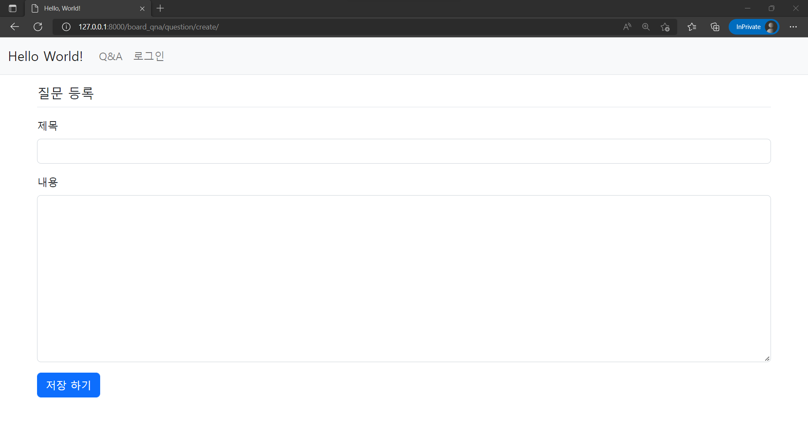
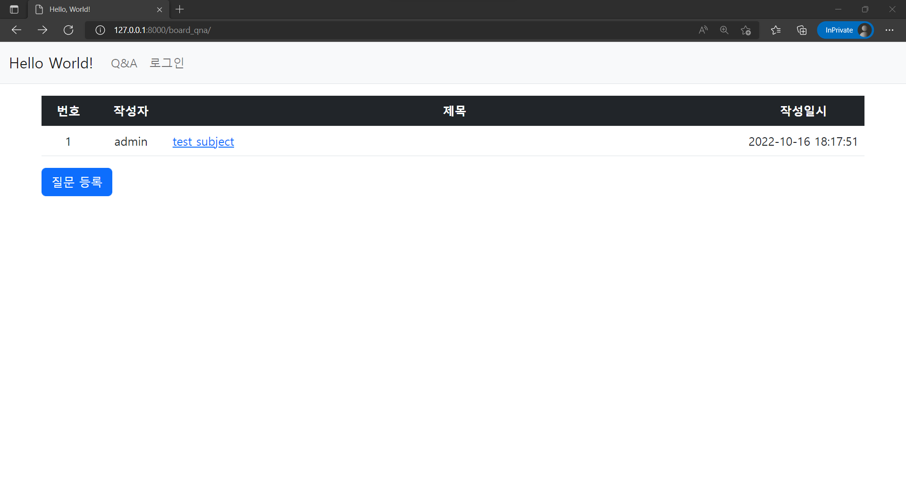
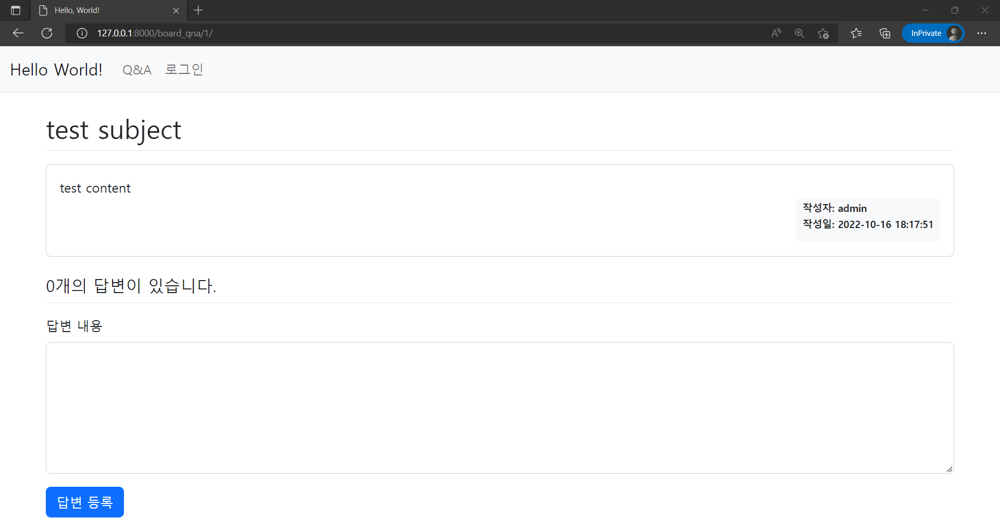

MTV 패턴과 form을 활용한 Create  

<!-- more -->

---

## 0. MTV 패턴

Django는 [MVC](https://en.wikipedia.org/wiki/Model%E2%80%93view%E2%80%93controller) 패턴 기반의 MTV 패턴을 사용한다.  

MVC(Model, View, Controller)와 MTV(Model, Template, View) 각각의 요소는 아래와 같은 기능을 한다.  

- Model
    - 모델은 데이터 모델을 가리키는 말로, 데이터베이스에 저장된 데이터를 가리킨다.
    - [App과 ORM](./2022-09-27-django_app_orm.md) 단계에서 생성한 [모델](./2022-09-27-django_app_orm.md/#2-3-model-생성)이 해당된다.
- View/Template
    - 뷰는 사용자에게 보여주는 화면과 정보를 가리키는 말로, 웹개발 관점에서는 프론트엔드를 가리킨다.
    - Django에서는 뷰 대신에 HTML 템플릿이라고 부른다.
- Controller/View
    - 콘트롤러는 사용자의 입력을 받아 모델이나 뷰의 정보를 조작하는 요소로, 웹개발 관점에서는 백엔드를 가리킨다.
    - Django에서는 콘트롤러 대신에 뷰라고 부른다.

## 1. 질문 등록 기능

### 1-1. form 생성

!!! note
    [form](https://docs.djangoproject.com/en/4.1/topics/forms/)은 말 그대로 일종의 양식으로, 사용자가 입력한 데이터를 서버로 전달할 때 사용자가 데이터를 입력할 양식을 정하는 기능을 한다. Django의 form의 사용에 대한 자세한 설명은 [여기](https://docs.djangoproject.com/en/4.1/ref/forms/api/)를 참고하자.  

`board_qna/forms.py` 파일에 아래와 같은 내용을 추가해준다.  

```python title="forms.py"
from django import forms
from .models import Question


class QuestionForm(forms.ModelForm):
    """form for create question"""

    class Meta:
        """class for set metadata to question model"""

        model = Question  # model to use
        fields = ['subject', 'content']  # field for QuestionForm from Question model
        labels = {
            'subject': '제목',
            'content': '내용'
        }
```

`QuestionForm`은 `ModelForm`을 상속해서 만들었는데, `ModelForm`은 모델(Model)과 연결된 폼으로 폼을 저장하면 연결된 모델의 데이터를 저장할 수 있는 폼이다. `ModelForm`에 대한 자세한 설명은 [공식 문서](https://docs.djangoproject.com/en/4.1/topics/forms/modelforms/)에서 볼 수 있다.  

폼 모델은 이너 클래스인 `Meta` class가 필수인데, `Meta` class를 통해 폼의 메타데이터, 즉 사용할 모델과 모델의 속성을 지정해야 하기 때문이다. `Meta` class에 대한 설명은 [공식 문서](https://docs.djangoproject.com/en/4.1/topics/db/models/#meta-options)를 참고하자.  

### 1-2. view 생성

매핑한 URL을 통해 보여줄 view를 아래와 같이 작성해준다.  

```python title="views.py"
from django.shortcuts import render, redirect
from django.utils import timezone
from .forms import QuestionForm

# Create your views here.


def question_create(request):
    """view for create question"""

    if request.method == 'POST':
        form = QuestionForm(request.POST)
        if form.is_valid():
            question = form.save(commit=False)  # temporal saving with commit=False option
            question.user = request.user  # 'request.user' returns current login user
            question.date_create = timezone.now()  # add time data to form
            question.save()
            return redirect('board_qna:index')
    else:
        form = QuestionForm()
    context = {'form': form}
    return render(request, 'board_qna/question_form.html', context)
```

html에서 `<a>`를 사용하면 무조건 GET 방식으로 요청이 요청되기 때문에 `질문 등록` 버튼을 누를 경우 `else`문이 수행되어 `QuestionForm`을 렌더링하고, `저장 하기` 버튼을 누르면 `<button>` 태그가 POST 방식으로 수행되어 해당 조건의 코드를 수행한다.  

### 1-3. URL 매핑

`board_qna/urls.py` 파일에 아래와 같이 질문 생성을 위한 URL을 매핑해준다.  

```python title="urls.py"
urlpatterns = [
    path('question/create/', views.question_create, name='question_create'),
]
```

### 1-4. 템플릿 생성

`board_qna/question_form.html` 파일을 아래 내용으로 생성하여 질문 등록을 위한 form 템플릿을 생성해준다.  

```html title="question_form.html"


  <div class="container">
    <h5 class="my-3 border-bottom pb-2">질문 등록</h5>
    <form method="POST">
      
      
      <div class="mb-3">
        <label for="subject" class="form-label">제목</label>
        <input
          type="text"
          class="form-control"
          name="subject"
          id="subject"
          value="{{ form.subject.value|default_if_none:'' }}">
      </div>
      <div class="mb-3">
        <label for="content" class="form-label">내용</label>
        <textarea
          class="form-control"
          name="content"
          id="content"
          rows="10">{{ form.content.value|default_if_none:'' }}
        </textarea>
      </div>
      <button type="submit" class="btn btn-primary">저장 하기</button>
    </form>
  </div>

```

!!! note
    ``은 보안 관련 항목으로 form으로 전송한 데이터가 실제 웹 페이지에서 작성한 데이터인지를 판단하는 역할을 한다. `<form>` 태그를 사용할 때는 반드시 같이 사용해줘야 한다.  

Django에서 프로젝트를 시작하면 아래와 같이 `MIDDLEWARE`의 기본 요소로 추가되어 있다.  

```python
MIDDLEWARE = [
    'django.middleware.csrf.CsrfViewMiddleware',
]
```

#### 템플릿 상속/확장

``는 템플릿의 [상속](https://docs.djangoproject.com/en/4.1/ref/templates/language/#template-inheritance)으로 지정된 부분을 확장하여 해당 파일에 넣으라는 뜻이다. 자세한 설명은 [여기](https://docs.djangoproject.com/en/4.1/ref/templates/builtins/#extends)를 참고하자.  

```liquid



```

아래와 같은 화면으로 생성된다.  

{ loading=lazy }

#### 템플릿 포함

form의 에러를 확인하는 `form_errors.html` 파일은 아래와 같다.  

```html title="form_errors.html"
<!-- alert field/non-field error -->

<div class="alert alert-danger">
  
    <!-- field error -->
    
      <div>
        <strong>{{ field.label }}</strong>
        {{ field.errors }}
      </div>
    
  
  <!-- non-field error -->
  
    <div>
      <strong>{{ error }}</strong>
    </div>
  
</div>

```

## 2. 질문 목록 화면 수정

`question_list.html` 파일을 아래와 같이 수정하여 질문 목록 화면을 만들어준다. 중간에 `question.answer_set`은 데이터 모델에서 작성하지 않았는데, 데이터 모델에서 관계된 모델이 있을 경우 모델에 사용자가 직접 지정하지 않더라도 Django가 연결된 객체에 자동으로 `{model}_set`라는 이름을 부여해준다. 자세한 내용은 [공식 문서](https://docs.djangoproject.com/en/4.1/topics/db/queries/#related-objects) 참고  

```html title="question_list.html"


  <div class="container my-3 text-nowrap">
    <table class="table">
      <thead>
      <tr class="table-dark text-center" >
        <th>번호</th>
        <th>작성자</th>
        <th>제목</th>
        <th>작성일시</th>
      </tr>
      </thead>
      <tbody>
      
        
          <tr>
            <td class="text-center">{{ question.id }}</td>
            <td class="text-center">{{ question.user }}</td>
            <td width="70%">
              <a href="">{{ question.subject }}</a>
              
                <span class="text-danger small mx-2">{{ question.answer_set.count }}</span>
              
            </td>
            <td class="text-center" width="5%">{{ question.date_create|date:'Y-m-d H:i:s' }}</td>
          </tr>
        
      
        <tr>
          <td colspan="3">질문이 없습니다.</td>
        </tr>
      
      </tbody>
    </table>
    <a href="" class="btn btn-primary">질문 등록</a>
  </div>

```

공통 부분은 `` 태그를 통해 앞서 만든 `base.html`을 상속 받아와서 처리하고, `` 태그와 `` 태그 사이에 본 페이지에 들어갈 내용을 넣어준다.  

`{{ question.date_create|date:'Y-m-d H:i:s' }}`에서 `|date:'Y-m-d H:i:s'`부분은 [템플릿 필터](https://docs.djangoproject.com/en/4.1/ref/templates/builtins/#filter)로 날짜 데이터의 형식을 바꿔주기 위해 사용했다. `date` 필터에 대한 내용은 [공식 문서](https://docs.djangoproject.com/en/4.1/ref/templates/builtins/#std-templatefilter-date)를 참고하자.  

아래와 같은 화면으로 생성된다.  

{ loading=lazy }

## 3. 답변 등록 화면

### 3-1. form 생성

`board_qna` 디렉토리에 `forms.py` 파일을 아래와 같은 내용으로 생성해준다.  

```python title="forms.py"
from django import forms
from .models import Answer


class AnswerForm(forms.ModelForm):
    """form for create answer"""

    class Meta:
        """class for set metadata to answer model"""

        model = Answer
        fields = ['content']
        labels = {
            'content': '답변 내용',
        }
```

### 3-2. view 생성

답변을 등록하는 `answer_create` view를 만들기 위해 `board_qna/views.py` 폴더에 아래 내용과 같이 추가해준다.  

```python title="views.py"
from django.shortcuts import render, get_object_or_404, redirect
from django.utils import timezone
from .forms import AnswerForm

# Create your views here.


def answer_create(request, question_id):
    """view for create answer"""

    question = get_object_or_404(Question, pk=question_id)
    if request.method == "POST":
        form = AnswerForm(request.POST)
        if form.is_valid():
            answer = form.save(commit=False)  # temporal saving with commit=False option
            answer.user = request.user  # 'request.user' returns current login user
            answer.date_create = timezone.now()  # add time data to form
            answer.question = question
            answer.save()
            return redirect('board_qna:detail', question_id=question.id)
    else:
        form = AnswerForm()
    context = {'question': question, 'form': form}
    return render(request, 'board_qna/question_detail.html', context)
```

`request.POST.get('content')`는 POST로 전송된 form의 데이터 항목 중 content 값을 읽는다는 뜻이며, `redirect` 함수를 사용했기 때문에 답변을 생성한 후 질문 상세 화면으로 다시 돌아간다.  

### 3-3. URL 매핑

답변 등록 시 데이터를 전송하기 위해 `board_qna/urls.py` 파일의 `urlpatterns`에 아래 내용과 같이 추가해주자.  

```python title="urls.py"
from django.urls import path
from . import views

app_name = 'board_qna'

urlpatterns = [
    path('answer/create/<int:question_id>/', views.answer_create, name='answer_create'),
]
```

### 3-4. 템플릿 생성

`templates/board_qna` 폴더의 `question_detail.html`을 아래 코드와 같이 생성하여 답변을 조회하는 동시에 새로운 답변을 입력할 수 있는 답변 조회 및 입력 템플릿을 만들어주자.  

```html title="question_detail.html"


  <div class="container my-3">
    <!-- question -->
    <h2 class="border-bottom py-2">{{ question.subject }}</h2>
    <div class="card my-3">
      <div class="card-body">
        <div class="card-text" style="white-space: pre-line;">{{ question.content }}</div>
        <div class="d-flex justify-content-end">
          <div class="badge bg-light text-dark p-2 text-start">
            <div class="mb-2">작성자: {{ question.user.username }}</div>
            <div class="mb-2">작성일: {{ question.date_create|date:'Y-m-d H:i:s' }}</div>
          </div>
        </div>
      </div>
    </div>
    <!-- answer -->
    <h5 class="border-bottom my-3 py-2">{{ question.answer_set.count }}개의 답변이 있습니다.</h5>
    
      <div class="card my-3">
        <div class="card-body">
          <div class="card-text" style="white-space: pre-line;">{{ answer.content }}</div>
          <div class="d-flex justify-content-end">
            <div class="badge bg-light text-dark p-2 text-start">
              <div class="mb-2">작성자: {{ answer.user.username }}</div>
              <div class="mb-2">작성일: {{ answer.date_create|date:'Y-m-d H:i:s' }}</div>
            </div>
          </div>
        </div>
      </div>
    
    <!-- answer create -->
    <form action="" method="post" class="my-3">
      
      
      <div class="mb-3">
        <label for="content" class="form-label">답변 내용</label>
        <textarea name="content" id="content" class="form-control" rows="10"></textarea>
      </div>
      <input type="submit" value="답변 등록" class="btn btn-primary">
    </form>
  </div>

```

아래와 같은 화면으로 생성된다.  

{ loading=lazy }

---
## Reference
- [전체 실습 코드](https://github.com/djccnt15/study_django)
- [점프 투 장고: 2-06 데이터 저장](https://wikidocs.net/73236)
- [점프 투 장고: 2-10 폼](https://wikidocs.net/70855)
- [점프 투 장고: 3-01 내비게이션바](https://wikidocs.net/71108)
- [점프 투 장고: 3-04 답변 개수 표시](https://wikidocs.net/71241)
- [점프 투 장고: 3-07 모델 변경](https://wikidocs.net/71306)
- [점프 투 장고: 3-08 글쓴이 표시](https://wikidocs.net/71307)