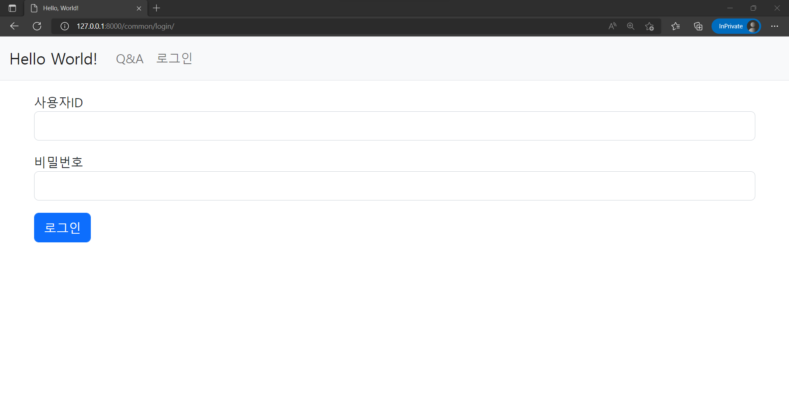
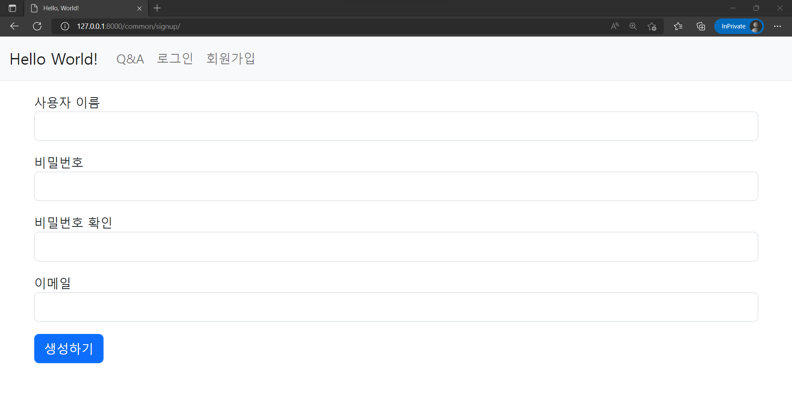
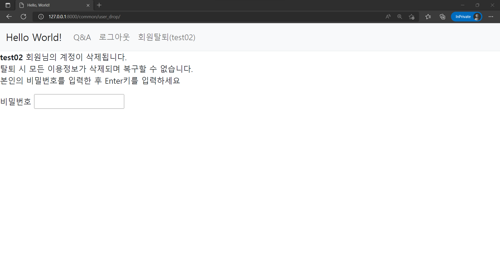

로그인/로그아웃, 회원가입 기능 만들기  

<!-- more -->

---

## 1. 로그인/로그아웃

Django에서는 기본 제공 모듈인 `django.contrib.auth`을 통해 로그인/로그아웃 기능을 쉽게 개발할 수 있다. 아래와 같이 프로젝트 생성 시에 기본적으로 적용되어 있다.  

```python title="settings.py"
INSTALLED_APPS = [
    'django.contrib.auth',
]
```

해당 앱에 대한 자세한 설명은 [공식 문서](https://docs.djangoproject.com/en/4.1/ref/contrib/auth/)를 참고하자.  

### 1-1. App 생성

로그인/로그아웃 기능은 전체 홈페이지에 공통으로 사용되는 기능이기 때문에 아래와 같이 `common` 앱을 생성해서 관리하는게 좋다.  

```bat
django-admin startapp common
```

생성한 앱은 아래와 같이 `config/settings.py` 파일의 `INSTALLED_APPS` 리스트에 등록하여 관리한다.  

```python title="settings.py"
INSTALLED_APPS = [
    'common.apps.CommonConfig',
]
```

### 1-2. view 생성

앞서 얘기한 바와 같이 Django가 제공하는 `django.contrib.auth`를 사용해서 로그인/로그아웃을 위한 view를 만들어준다. 

```python title="views.py"
from django.contrib.auth import views as auth_views

# Create your views here.

login_view = auth_views.LoginView.as_view(template_name='common/login.html')
logout_view = auth_views.LogoutView.as_view()
```

`django.contrib.auth`는 기본적으로 `registration/login.html`의 템플릿을 사용하지만, `common` 앱을 통해 관리할 예정이기 때문에 `template_name` 옵션을 통해 템플릿의 위치와 이름을 지정해준다.  

### 1-3. URL 매핑

로그인과 로그아웃 view를 보여줄 URL을 만들기 위해 `common/urls.py` 파일을 아래와 같이 생성해준다.  

```python title="urls.py"
from django.urls import path
from . import views

app_name = 'common'

urlpatterns = [
    path('login/', views.login_view, name='login'),
    path('logout/', views.logout_view, name='logout'),
]
```

기본 제공되는 모듈을 통해 기능을 만들기 때문에 아래와 같이 `urls.py`에서 바로 처리해도 되지만, 프로젝트의 일관성을 위해 위와 같이 분리하였다.  

```python title="settings.py"
from django.contrib.auth import views as auth_views

urlpatterns = [
    path('login/', auth_views.LoginView.as_view(template_name='common/login.html'), name='login'),
]
```

`common/urls.py` 파일을 통해 URL을 관리하기 위해 `config/settings.py` 파일의 `urlpatterns` 항목에 아래와 같이 추가한다.  

```python title="settings.py"
urlpatterns = [  # include() is a function for including url file in each app
    path('common/', include('common.urls')),
]
```

### 1-4. 템플릿 생성

내비게이션 바에서 `common` 앱의 로그인 view를 사용할 수 있도록 `template/navbar.html`의 로그인 메뉴 부분을 아래와 같이 수정한다.  

```html title="navbar.html"
<li class="nav-item">
  
    <a class="nav-link" href="">로그아웃</a>
  
    <a class="nav-link" href="">로그인</a>
  
</li>
```

사용자가 로그인 되어 있는지 아닌지에 따라 다른 기능을 제공하기 위해 `user.is_authenticated` 속성을 활용했다. `django.contrib.auth` 앱이 제공하는 `User`의 데이터 모델에 대한 설명은 [공식 문서](https://docs.djangoproject.com/en/4.1/ref/contrib/auth/#user-model)를 보자.  

사용자의 ID와 비밀번호를 받아 로그인으로 보내주는 템플릿 파일 `common/login.html`을 아래와 같이 생성한다.  

```html title="login.html"


<div class="container my-3">
  <form method="POST" action="">
    
    <input type="hidden" name="next" value="{{ next }}">  <!-- redirection URL after login -->
    
    <div class="mb-3">
      <label for="username">사용자ID</label>
      <input
        type="text"
        class="form-control"
        name="username"
        id="username"
        value="{{ form.username.value|default_if_none:'' }}">
    </div>
    <div class="mb-3">
      <label for="password">비밀번호</label>
      <input
        type="password"
        class="form-control"
        name="password"
        id="password"
        value="{{ form.password.value|default_if_none:'' }}">
    </div>
    <button type="submit" class="btn btn-primary">로그인</button>
  </form>
</div>

```

아래와 같은 화면으로 생성된다.  

{ loading=lazy }

### 1-5. 리다이렉트 지정

`django.contrib.auth` 패키지는 디폴트로 로그인이 성공하면 `/accounts/profile/`이라는 URL로, 로그아웃의 경우 관리 페이지의 로그아웃 URL로 이동시킨다. 이 부분을 홈페이지로 되돌아가는 것으로 변경하려면 `config/settings.py`에 아래 내용을 추가하면 된다.  

```python title="settings.py"
# redirection after login/logout
LOGIN_REDIRECT_URL = '/'
LOGOUT_REDIRECT_URL = '/'
```

## 2. 로그인 회원 전용 기능

### 2-1. 템플릿에서 막기

프론트 엔드에서 HTML의 `disabled` 속성을 이용하여 막아둘 수 있다. 아래는 `template/board_qna/question_detail.html`에서 답변 등록을 위한 `<textarea>` 태그에 적용시킨 모습이다.  

```html title="question_detail.html"
<!-- before -->
<textarea name="content" id="content" class="form-control" rows="10"></textarea>

<!-- after -->
<textarea
   disabled 
  name="content"
  id="content"
  class="form-control"
  rows="10"></textarea>
```

### 2-2. Django API 사용

아래와 같이 `login_required` 데코레이터를 이용하면 특정 view를 로그인 회원만 사용 가능하도록 제한하고, 비로그인 상태의 사용자가 해당 기능을 사용하려고 하면 로그인 페이지로 보낼 수 있다. 해당 데코레이터에 대한 자세한 설명은 [공식 문서](https://docs.djangoproject.com/en/4.1/topics/auth/default/#the-login-required-decorator)를 참고하자.  

```python
from django.contrib.auth.decorators import login_required

@login_required()
def question_create(request):
    ...
```

`login_required` 데코레이터가 부여해주는 `login_required` 함수는 기본적으로 로그인이 필요한 기능을 사용자가 사용하려고 하면 `settings.py`의 `LOGIN_URL` 옵션에 지정된 주소로 리다이렉트한다.  

[공식 문서](https://docs.djangoproject.com/en/4.1/ref/settings/#login-url)를 보면 `LOGIN_URL`은 기본값이 `/accounts/login/`으로 되어 있어 현재 개발 내용과 일치하지 않는데, 이를 바꿔주는 방법은 아래 두 가지가 있다.  

첫 번째로 아래와 같이 `settings.py`에서 `LOGIN_URL` 옵션을 추가/수정해주는 방법이 있다.  

```python title="settings.py"
# redirection for login_required()
LOGIN_URL = '/common/login/'
```

두 번째로 아래와 같이 `login_required` 데코레이터에 `login_url` 옵션을 주는 방법이 있다. 이 옵션은 `settings.py`의 `LOGIN_URL` 변수를 오버라이드한다.  

```python
@login_required(login_url='common:login')
def question_create(request):
    ...
```

!!! info
    Django에서 로그인 회원만 특정 기능을 사용할 수 있도록 제한하는 방법은 여러 가지가 있는데, 전체 내용은 [공식 문서](https://docs.djangoproject.com/en/4.1/topics/auth/default/#limiting-access-to-logged-in-users)를 참고하자.  

`template/common/login.html` 파일에 추가한 아래 코드는 `login_required` 데코레이터를 사용할 때, 로그인 후 이동할 페이지를 넘겨주는 역할을 한다.  

```html title="login.html"
<input type="hidden" name="next" value="{{ next }}">  <!-- redirection URL after login -->
```

## 3. 회원 가입

### 3-1. form 생성

회원가입 시 사용자 정보를 받기 위해 `common/forms.py` 파일을 생성하고, `django.contrib.auth.forms`의 `UserCreationForm`을 상속해 아래와 같이 `UserForm` 클래스를 만들어준다.  

```python title="forms.py"
from django import forms
from django.contrib.auth.forms import UserCreationForm
from django.contrib.auth.models import User


class UserForm(UserCreationForm):
    """
    form for creating user
    inherit UserCreationForm to add custom fields
    """

    email = forms.EmailField(label="이메일")

    class Meta:
        model = User
        fields = ("username", "password1", "password2", "email")
```

`UserCreationForm`을 바로 사용할 수도 있지만, `email` 필드와 같이 기본으로 제공하지 않는 요소를 사용하기 위해서는 위와 같이 상속을 받아와서 수정해야 한다. `UserCreationForm` 클래스에 대한 자세한 설명은 [공식 문서](https://docs.djangoproject.com/en/4.1/topics/auth/default/#django.contrib.auth.forms.UserCreationForm)를 보자.  

### 3-2. view 생성

회원 가입 기능을 만들기 위해 `common/views.py` 파일에 아래 내용을 추가한다.  

```python title="views.py"
from django.contrib.auth import authenticate, login
from django.shortcuts import render, redirect
from common.forms import UserForm

# Create your views here.


def user_signup(request):
    """function for sign up user"""

    if request.method == "POST":
        form = UserForm(request.POST)
        if form.is_valid():
            form.save()
            username = form.cleaned_data.get('username')
            raw_password = form.cleaned_data.get('password1')
            user = authenticate(username=username, password=raw_password)  # user authentication
            login(request, user)  # login(create user session)
            return redirect('/')  # redirection after sign up
    else:
        form = UserForm()
    context = {'form': form}
    return render(request, 'common/user_signup.html', context)
```

### 3-3. URL 매핑

`common/urls.py`에 아래와 같이 추가하여 사용자가 회원가입 페이지를 요청할 경우 `views.py`의 `user_signup`을 호출하도록 매핑해준다.  

```python title="urls.py"
urlpatterns = [
    path('signup/', views.user_signup, name='signup'),
]
```

### 3-4. 템플릿 작성

`template/common` 디렉토리에 회원 가입용 화면을 위한 템플릿 `user_signup.html`을 아래 내용으로 생성해준다.  

```html title="user_signup.html"


<div class="container my-3">
  <form method="POST" action="">
    
    
    <div class="mb-3">
      <label for="username">사용자 이름</label>
      <input
        type="text"
        class="form-control"
        name="username"
        id="username"
        value="{{ form.username.value|default_if_none:'' }}">
    </div>
    <div class="mb-3">
      <label for="password1">비밀번호</label>
      <input
        type="password"
        class="form-control"
        name="password1"
        id="password1"
        value="{{ form.password1.value|default_if_none:'' }}">
    </div>
    <div class="mb-3">
      <label for="password2">비밀번호 확인</label>
      <input
        type="password"
        class="form-control"
        name="password2"
        id="password2"
        value="{{ form.password2.value|default_if_none:'' }}">
    </div>
    <div class="mb-3">
      <label for="email">이메일</label>
      <input
        type="text"
        class="form-control"
        name="email"
        id="email"
        value="{{ form.email.value|default_if_none:'' }}">
    </div>
    <button type="submit" class="btn btn-primary">생성하기</button>
  </form>
</div>

```

`template/navbar.html`의 적당한 위치에 아래 내용을 추가하여 회원가입 및 탈퇴를 위한 메뉴를 만들어주자.  

```html title="navbar.html"
<li class="nav-item">
  
    <a class="nav-link" href="">회원가입</a>
  
    <a class="nav-link" href="">회원탈퇴({{ user.username }})</a>
  
</li>
```

아래와 같은 화면으로 생성된다.  

{ loading=lazy }

## 4. 회원 탈퇴

### 4-1. form 생성

`common/forms.py` 파일에 비밀번호 확인을 위한 form을 아래와 같이 추가하자.  

```python title="forms.py"
from django import forms
from django.contrib.auth.hashers import check_password


class CheckPasswordForm(forms.Form):
    """form for validation by checking password"""

    password = forms.CharField(label='비밀번호', widget=forms.PasswordInput())

    def __init__(self, user, *args, **kwargs):
        """inherit __init__ from base form and add self.user"""

        super().__init__(*args, **kwargs)
        self.user = user

    def clean(self):
        """
        clean() runs to_python(), validate(), run_validators() for checking
        field validation of input data and propagate errors from APIs

        if there is no field validation error, check_password() compares input
        password to the hashed password in the database
        """

        cleaned_data = super().clean()  # input data for validation
        password = cleaned_data.get('password')  # get password from input data
        confirm_password = self.user.password  # get password from user model

        if password:  # if input password get through validation APIs
            if not check_password(password, confirm_password):  # if input/hashed passwords are not equal
                self.add_error('password', '비밀번호가 일치하지 않습니다.')  # return error msg
```

주석에 적었듯이, 사용자로부터 비밀번호를 입력 받아서 해당 비밀번호가 데이터베이스에 저장된 비밀번호와 일치하는지 확인해주는 코드이다.  

`clean` 함수는 요약하자면 입력된 데이터가 form에서 요구하는 데이터와 일치하는 양식인지를 확인하는 함수로, 자세한 설명은 [공식 문서](https://docs.djangoproject.com/en/4.1/ref/forms/validation/)를 보자.  

`check_password` 함수는 입력된 비밀번호와 데이터베이스에서 가져온 사용자의 비밀번호가 일치하는지를 확인하는 함수로, 자세한 설명은 [공식 문서](https://docs.djangoproject.com/en/4.1/topics/auth/passwords/#django.contrib.auth.hashers.check_password)를 보자.  

### 4-2. view 생성

`common/views.py` 파일에 회원 탈퇴를 위한 view를 만들어준다.  

```python title="views.py"
from django.contrib.auth import logout
from django.shortcuts import render, redirect
from .forms import CheckPasswordForm

# Create your views here.


def user_drop(request):
    """function for drop user"""

    if request.method == 'POST':
        password_form = CheckPasswordForm(request.user, request.POST)
        if password_form.is_valid():
            request.user.delete()
            logout(request)
            return redirect('/common/login/')
    else:
        password_form = CheckPasswordForm(request.user)
    context = {'password_form': password_form}
    return render(request, 'common/user_drop.html', context)
```

### 4-3. URL 매핑

`common/urls.py`에 아래와 같이 추가하여 사용자가 회원탈퇴 페이지를 요청할 경우 `views.py`의 `user_drop`을 호출하도록 매핑해준다.  

```python title="urls.py"
urlpatterns = [
    path('user_drop/', views.user_drop, name='user_drop'),
]
```

### 4-4. 템플릿 생성

아래와 같은 내용으로 `templates/common` 디렉토리에 `user_drop.html` 파일을 생성하여 회원탈퇴 페이지를 위한 템플릿을 만들어준다.  

```html title="user_drop.html"


<form method="POST" novalidate>
  
  <p>
    <strong>{{ user.username }}</strong> 회원님의 계정이 삭제됩니다.<br>
    탈퇴 시 모든 이용정보가 삭제되며 복구할 수 없습니다.
    <br>본인의 비밀번호를 입력한 후 Enter키를 입력하세요
  </p>
  <div>
    <label name="label_password" for="{{ password_form.password.id_for_label }}">
      {{ password_form.password.label }}
    </label>
    {{ password_form.password }}
    
      
        {{ error }}
      
    
  </div>
</form>

```

아래와 같은 화면으로 생성된다.  

{ loading=lazy }

---
## Reference
- [전체 실습 코드](https://github.com/djccnt15/study_django)
- [점프 투 장고: 3-05 로그인과 로그아웃](https://wikidocs.net/71259)
- [점프 투 장고: 3-06 회원가입](https://wikidocs.net/71303)
- [점프 투 장고: 3-07 모델 변경](https://wikidocs.net/71306)
- [Django 15. 본인인증 후 회원탈퇴 구현](https://parkhyeonchae.github.io/2020/03/31/django-project-15/)
