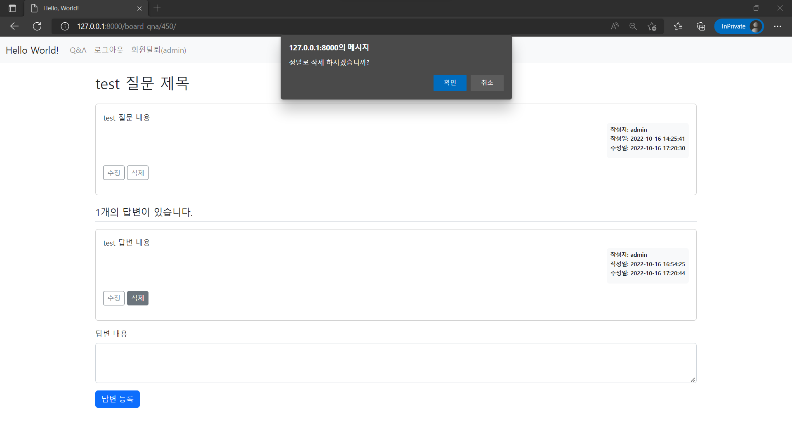

수정 및 삭제  

<!-- more -->

---

## 1. 질문/답변 수정

### 1-1. 데이터 모델 변경

게시글이 수정된 일시를 저장하기 위해 데이터 모델에 수정 일시 필드를 추가해야 한다. 수정된 모델은 아래와 같다.  

```python title="models.py"
from django.db import models
from django.contrib.auth.models import User

# Create your models here.


class Question(models.Model):
    """model for question"""

    user = models.ForeignKey(User, on_delete=models.SET_NULL, null=True)
    subject = models.CharField(max_length=200)
    content = models.TextField()
    date_create = models.DateTimeField()
    date_modify = models.DateTimeField(null=True, blank=True)  # null is for DB, blank is for validation

    def __str__(self):
        return self.subject


class Answer(models.Model):
    """model for answer"""

    user = models.ForeignKey(User, on_delete=models.SET_NULL, null=True)
    question = models.ForeignKey(Question, on_delete=models.CASCADE, related_name='question_answers')
    content = models.TextField()
    date_create = models.DateTimeField()
    date_modify = models.DateTimeField(null=True, blank=True)

    def __str__(self):
        return self.content
```

!!! note
    데이터 모델의 필드 옵션에 대한 설명은 [공식 문서](https://docs.djangoproject.com/en/4.1/ref/models/fields/#field-options)에서 볼 수 있는데, `null` 옵션은 데이터베이스에 관련된 옵션이고, `blank`는 데이터 검사에 관련된 옵션이다. 또한 데이터 모델에서 `related_name` 파라미터를 통해 관계 모델을 호출할 이름을 설정해줄 수 있다. 자세한 내용은 [공식 문서](https://docs.djangoproject.com/en/4.1/ref/models/fields/#django.db.models.ForeignKey.related_name) 참고  

모델을 변경한 후에는 데이터베이스에 적용하기 위한 마이그레이션을 진행해야한다.  

```bat
manage.py makemigrations
```

```bat
manage.py migrate
```

### 1-2. view 생성

질문과 답변 수정 기능을 위한 view들을 아래와 같이 생성한다.  

```python title="views.py"
from django.shortcuts import render, get_object_or_404, redirect
from django.utils import timezone
from django.contrib.auth.decorators import login_required
from django.core.paginator import Paginator
from django.contrib import messages
from .models import Question, Answer
from .forms import QuestionForm, AnswerForm

# Create your views here.


@login_required()
def question_modify(request, question_id):
    question = get_object_or_404(Question, pk=question_id)
    if request.user != question.user:  # blocking invalid approach
        messages.error(request, '수정 권한이 없습니다')
        return redirect('board_qna:detail', question_id=question.id)
    if request.method == "POST":
        form = QuestionForm(data=request.POST, instance=question)  # override instance with requested POST
        if form.is_valid():
            question = form.save(commit=False)
            question.date_modify = timezone.now()  # add current time to form
            question.save()
            return redirect('board_qna:detail', question_id=question.id)
    else:
        form = QuestionForm(instance=question)  # fill form with current context
    context = {'form': form}
    return render(request, 'board_qna/question_form.html', context)


@login_required()
def answer_modify(request, answer_id):
    answer = get_object_or_404(Answer, pk=answer_id)
    if request.user != answer.user:
        messages.error(request, '수정 권한이 없습니다')
        return redirect('board_qna:detail', question_id=answer.question.id)
    if request.method == "POST":
        form = AnswerForm(request.POST, instance=answer)
        if form.is_valid():
            answer = form.save(commit=False)
            answer.date_modify = timezone.now()
            answer.save()
            return redirect('board_qna:detail', question_id=answer.question.id)
    else:
        form = AnswerForm(instance=answer)
    context = {'answer': answer, 'form': form}
    return render(request, 'board_qna/answer_form.html', context)
```

### 1-3. URL 매핑

`board_qna/urls.py`에 아래 내용을 추가해 위에서 만든 수정 기능들의 URL을 매핑해준다.  

```python title="urls.py"
from django.urls import path
from . import views

app_name = 'board_qna'

urlpatterns = [
    path('question/modify/<int:question_id>/', views.question_modify, name='question_modify'),
    path('answer/modify/<int:answer_id>/', views.answer_modify, name='answer_modify'),
]
```

### 1-4. 보조 템플릿 생성

`template/board_qna` 디렉토리에 답변 수정 시에 사용할 보조 템플릿인 `answer_form.html`을 아래와 같이 만들어준다.  

```html title="answer_form.html"


<!-- modify answer -->
<div class="container my-3">
  <form method="POST">
    
    
    <div class="mb-3">
      <label for="content" class="form-label">답변 내용</label>
      <textarea
        class="form-control"
        name="content"
        id="content"
        rows="10">{{ form.content.value|default_if_none:'' }}</textarea>
    </div>
    <button type="submit" class="btn btn-primary">저장 하기</button>
  </form>
</div>

```

## 2. 질문/답변 삭제

### 2-1. view 생성

아래와 같이 삭제 기능을 위한 view들을 만들어준다.  

```python title="views.py"
from django.shortcuts import get_object_or_404, redirect
from django.contrib.auth.decorators import login_required
from django.contrib import messages

# Create your views here.


@login_required()
def question_delete(request, question_id):
    question = get_object_or_404(Question, pk=question_id)
    if request.user != question.user:
        messages.error(request, '삭제 권한이 없습니다')
        return redirect('board_qna:detail', question_id=question.id)
    else:
        question.delete()
        return redirect('board_qna:index')


@login_required()
def answer_delete(request, answer_id):
    answer = get_object_or_404(Answer, pk=answer_id)
    if request.user != answer.user:
        messages.error(request, '삭제 권한이 없습니다')
    else:
        answer.delete()
    return redirect('board_qna:detail', question_id=answer.question.id)
```

### 2-2. URL 매핑

삭제 기능을 불러올 URL을 아래와 같이 매핑해준다.  

```python title="urls.py"
from django.urls import path
from . import views

app_name = 'board_qna'

urlpatterns = [
    path('question/delete/<int:question_id>/', views.question_delete, name='question_delete'),
    path('answer/delete/<int:answer_id>/', views.answer_delete, name='answer_delete'),
]
```

### 2-3. 확인용 팝업 생성

`static` 디렉토리에 `delete.js` 파일을 만들어서 HTML 페이지에서 `delete` 클래스를 갖는 요소가 클릭 될 경우 삭제 여부 확인 팝업을 띄우는 JavaScript를 만들어준다.  

```javascript title="delete.js"
const delete_elements = document.getElementsByClassName("delete");
Array.from(delete_elements).forEach(function (element) {
  element.addEventListener(type='click', listener=function () {
    if (confirm(message="정말로 삭제하시겠습니까?")) {
      location.href = this.dataset.uri;
    };
  });
});
```

!!! note
    웹 개발 중에 사용자가 버튼을 눌렀을 때 JavaScript가 특정 동작을 하도록 하는 경우에 대해 아래 예시와 같이 `<a>` 태그를 `href=#`이나 `javascript:void(0)`으로 지정해 페이지 새로고침을 막고, click 이벤트 처리기를 등록해서 가짜 버튼을 만드는 경우가 종종 있다.  

    ```html
    <a href="javascript:void(0)" class="delete">삭제</a>
    ```

    모질라의 공식 웹사이트인 [MDN](https://developer.mozilla.org/)에서는 이런 가짜 `<a>` 태그보다는 `<button>` 태그를 사용할 것을 [권장](https://developer.mozilla.org/en-US/docs/Web/HTML/Element/a#onclick_events)하고 있다.  

## 3. 템플릿 수정

`template/board_qna/question_detail.html` 템플릿을 아래와 같이 수정하여 질문과 답변의 수정 및 삭제 버튼을 만들어주고, 수정될 경우 최종 수정 날짜를 표시하도록 만들어준다. 또한 앞서 데이터 모델을 수정하면서 `related_name` 파라미터를 설정해주었기 때문에 `question.answer_set` 대신에 `question.question_answers`를 사용해서 관계 모델을 호출해준다.  

```html title="question_detail.html"


  <div class="container my-3">
    <!-- message for invalid approach -->
    
      <div class="alert alert-danger my-3" role="alert">
        
          <strong>{{ message.tags }}</strong>
          <ul><li>{{ message.message }}</li></ul>
        
      </div>
    
    <!-- question -->
    <h2 class="border-bottom py-2">{{ question.subject }}</h2>
    <div class="card my-3">
      <div class="card-body">
        <div class="card-text" style="white-space: pre-line;">{{ question.content }}</div>
        <div class="d-flex justify-content-end">
          <div class="badge bg-light text-dark p-2 text-start">
            <div class="mb-2">작성자: {{ question.user.username }}</div>
            <div class="mb-2">작성일: {{ question.date_create|date:'Y-m-d H:i:s' }}</div>
            
              <div class="mb-2">수정일: {{ question.date_modify|date:'Y-m-d H:i:s' }}</div>
            
          </div>
        </div>
        <div class="my-3">
          
            <a
              href=""
              class="btn btn-sm btn-outline-secondary">수정</a>
            <button
              class="delete btn btn-sm btn-outline-secondary"
              data-uri="">삭제</button>
          
        </div>
      </div>
    </div>
    <!-- answer -->
    <h5 class="border-bottom my-3 py-2">{{ question.question_answers.count }}개의 답변이 있습니다.</h5>
    
      <div class="card my-3">
        <div class="card-body">
          <div class="card-text" style="white-space: pre-line;">{{ answer.content }}</div>
          <div class="d-flex justify-content-end">
            <div class="badge bg-light text-dark p-2 text-start">
              <div class="mb-2">작성자: {{ answer.user.username }}</div>
              <div class="mb-2">작성일: {{ answer.date_create|date:'Y-m-d H:i:s' }}</div>
              
                <div class="mb-2">수정일: {{ answer.date_modify|date:'Y-m-d H:i:s' }}</div>
              
            </div>
          </div>
          <div class="my-3">
            
            <a
              href=""
              class="btn btn-sm btn-outline-secondary">수정</a>
            <button
              class="delete btn btn-sm btn-outline-secondary"
              data-uri="">삭제</button>
            
          </div>
        </div>
      </div>
    
    <!-- answer create -->
    <form action="" method="POST" class="my-3">
      
      
      <div class="mb-3">
        <label for="content" class="form-label">답변 내용</label>
        <textarea
           disabled 
          name="content"
          id="content"
          class="form-control"
          rows="10"></textarea>
      </div>
      <input type="submit" value="답변 등록" class="btn btn-primary">
    </form>
  </div>


  
  <script type="text/javascript" src=""></script>

```

아래와 같이 페이지가 생성되고, 삭제 버튼을 누를 경우 확인창이 뜨는 것을 확인할 수 있다.  

{ loading=lazy }

---
## Reference
- [전체 실습 코드](https://github.com/djccnt15/study_django)
- [점프 투 장고: 3-09 수정과 삭제](https://wikidocs.net/71445)