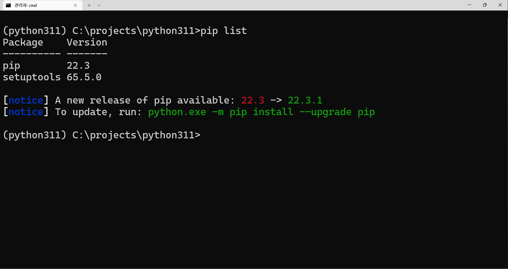

Python pip 관련 이슈 해결 기록  

<!-- more -->

---

## pip 업그레이드

Python으로 개발을 하다보면 아래와 같이 pip 버전이 오래되었다는 경고가 뜰 때가 있다.  

{ loading=lazy }

경고가 알려주는대로 복붙해서 업그레이드하면 된다.  

```bat
python.exe -m pip install --upgrade pip
```

간혹 아래와 같이 pip 버전이 제대로 체크되지 않아 에러만 띄우고 업그레이드 명령어를 알려주지 않는 경우가 있다. 경험상 정말 오랫동안 중지했던 프로젝트를 오랜만에 다룰 때 주로 발생했던 것 같다. 이 때도 동일하게 pip를 업그레이드 해주면 된다.  

```bat
WARNING: There was an error checking the latest version of pip
```

## pip 버전 체크 오류

pip 업그레이드 진행 후 아래와 같이 pip 버전을 확인할 수 없다는 경고가 뜰 때가 있다. 이미 고쳐진 문제라고 하는데, 아마 서버에서 사용하는 Python 버전이 너무 낮아서 발생한 것 같다.  

```
There was an error checking the latest version of pip
```

찾아보니 수동 업그레이드 등 몇 가지 해결책이 제시되는데, 아래와 같이 pip cache를 삭제해주니 원인 자체가 해결되었다.  

1. 사용중인 Python 환경에서 `python -m pip cache dir` 명령어를 통해 pip 설치 위치 확인
1. 위에서 확인한 위치 접근
1. `selfcheck` 폴더 삭제

## SSL 인증서 문제 해결

업무 중에 서버에 Python을 설치하다가 아래와 같이 SSL 인증서 문제로 설치가 되지 않는 문제를 겪었다.  

```
Could not fetch URL https://pypi.org/simple/pip/: There was a problem confirming the ssl certificate:
HTTPSConnectionPool(host='pypi.org', port=443): Max retries exceeded with url: /simple/pip/
(Caused by SSLError(SSLCertVerificationError(1, '[SSL: CERTIFICATE_VERIFY_FAILED] certificate verify failed:
self signed certificate in certificate chain (_ssl.c:997)'))) - skipping
```

아래와 같이 pip의 저장소 링크를 신뢰한다는 옵션을 추가하여 설치하면 정상적으로 설치가 가능하다.  

```bat
pip --trusted-host pypi.org --trusted-host files.pythonhosted.org install [package]
```

## ensurepip

pip 설치 상태에 문제가 생기면 아래와 같이 pip를 찾을 수 없다는 에러가 발생한다. 주로 pip을 업데이트 하는 과정에서 오류가 생겼을 때 발생한다.  

```
ModuleNotFoundError: No module named 'pip'
```

이 때는 아래 명령어로 해결할 수 있다.  

```bat
python -m ensurepip --upgrade
```

## pip 캐시 삭제

pip를 통해 패키지를 설치하면 해당 패키지가 pip 캐시 공간에 저장되고, 쌓이다 보면 엄청난 용량을 차지한다. 해당 캐시는 아래 명령어로 삭제 가능하다.  

```bat
pip cache purge
```

패키지 다운로드 및 설치 시에 캐시가 저장되지 않도록 하려면 아래와 같이 `--no-cache-dir` 옵션을 주면서 설치하면 된다.  

```bat
pip install [package] --no-cache-dir
```

## pip list

간혹 너무 오래된 레거시 프로그램의 경우 `pip list`로 패키지 목록을 호출하면 아래와 같이 이상한 양식으로 표기되는 경우가 있다.  

```
Jinja2 (2.10)
pandas (0.25.2)
pip (9.0.1)
pycrypto (2.6.1)
PyMySQL (0.9.3)
PyYAML (3.12)
requests (2.23.0)
setuptools (39.0.1)
SQLAlchemy (1.3.10)
```

이 경우 아래와 같이 `format`을 지정해서 호출하면 정상적인 양식으로 출력된다.  

```bat
pip list --format=columns
```

---
## Reference
- [There was an error checking the latest version of pip](https://stackoverflow.com/questions/72439001/there-was-an-error-checking-the-latest-version-of-pip)
- [[Python] 파이썬 pip 설치 시 SSL 인증서 문제 해결 (error: [SSL: CERTIFICATE_VERIFY_FAILED])](https://harryp.tistory.com/831)
- [ensurepip](https://docs.python.org/3/library/ensurepip.html)([한글](https://docs.python.org/ko/3/library/ensurepip.html))
- [Disabling caching](https://pip.pypa.io/en/stable/topics/caching/#disabling-caching)