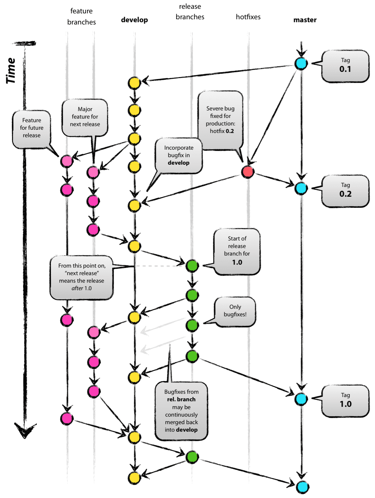

GitFlow 방식의 협업 방법론 정리  

<!-- more -->

---

> The information manager from Hell. - Linus Benedict Torvalds

## GitFlow

GitFlow는 아래 그림만 잘 봐도 이해할 수 있다.  

{ loading=lazy }  
^[출처: A successful Git branching model](https://nvie.com/posts/a-successful-git-branching-model/)^

부연 설명을 덧붙이자면, GitFlow 방법론에서는 Main, Develop의 핵심 브랜치 2개와 Release, Develop, Feature의 보조 브랜치 3개, 총 5개의 브랜치로 나누어서 소프트웨어 개발을 관리한다.  

- Main branch
    - 사용자에게 제공되고 있는 소프트웨어의 소스 코드, 즉 production-ready 상태인 소스 코드를 저장하는 브랜치
- Develop branch
    - 다음 출시를 위한 개발이 진행되고 있는 통합 브랜치
- Feature branch
    - 실제 기능 개발이 이루어지고 있는 브랜치
    - Develop 브랜치에서 갈라져 나오고 Develop 브랜치로 머지 되어야 함
- Release branch
    - 신제품 출시 준비를 보조하는 브랜치로 각종 버그 픽스, 메타데이터 관리가 이루어짐
    - Develop 브랜치에서 갈라져 나오고 Develop 브랜치와 Main 브랜치로 머지 되어야 함
- Hotfix branch
    - 출시된 제품에 버그 등이 발생했을 때, 긴급하게 대응하기 위한 브랜치
    - Main 브랜치에서 갈라져 나오고 Develop 브랜치와 Main 브랜치로 머지 되어야 함

---
## Reference
- [(알아두면 개발팀장가능) GitFlow vs Trunk-based 협업방식](https://youtu.be/EV3FZ3cWBp8)  
    <iframe src="https://www.youtube.com/embed/EV3FZ3cWBp8" title="(알아두면 개발팀장가능) GitFlow vs Trunk-based 협업방식" frameborder="0" allowfullscreen></iframe>
- [A successful Git branching model](https://nvie.com/posts/a-successful-git-branching-model/)