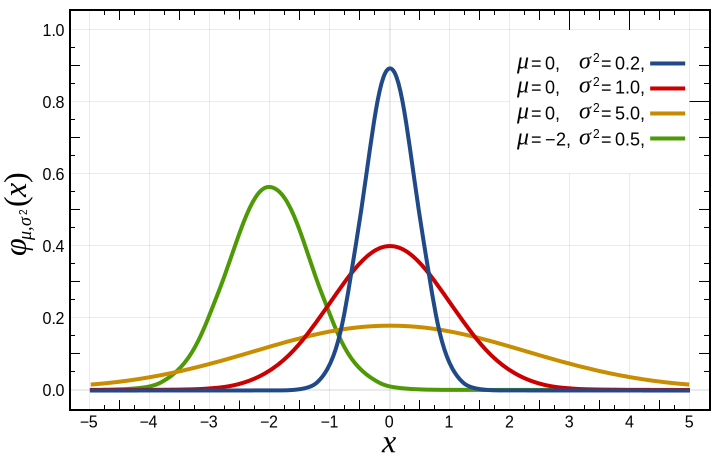

정규분포 개념 정리  

<!-- more -->

---

## 1. 정규분포

분포의 중심이 평균($\mu$)이고, 퍼져 있는 정도가 분산($\sigma^{2}$)인 **정규분포(normal distribution)**를 아래와 같이 표기한다.  

$$
X \sim N(\mu, \sigma^{2})
$$

{ loading=lazy }  
^[출처: wikipedia - Normal distribution](https://en.wikipedia.org/wiki/Normal_distribution)^

정규분포의 확률질량함수는 아래와 같다.  

$$
f(x) = \frac{1}{\sigma\sqrt{2\pi}}e^{-\frac{1}{2}\left(\frac{x - \mu}{\sigma}\right)^{2}}, \quad -\infty < x < \infty
$$

정규분포는 연속형 자료이기 때문에 특정 구간의 확률을 계산하기 위해서는 아래와 같이 적분을 사용해야 한다.  

$$
\begin{align*}
P(a < X < b) & = \int_{a}^{b}f(x)dx \\
\\
& = \int_{a}^{b}\frac{1}{\sigma\sqrt{2\pi}}e^{-\frac{1}{2}\left(\frac{x - \mu}{\sigma}\right)^{2}}dx
\end{align*}
$$

## 2. 표준 정규분포

정규분포의 확률 계산을 간편하게 수행하기 위해 $\mu = 0, \sigma^{2} = 1$로 변환하여 0이 중심인 대칭 형태의 확률분포로 변환 것을 **표준 정규분포(standard normal distribution)**라 하며 아래와 같이 표기한다.  

$$
Z \sim N(0, 1)
$$

표준 정규분포의 확률질량함수는 아래와 같다.  

$$
f(x) = \frac{1}{\sqrt{2\pi}}e^{-x^{2}/2}, \quad -\infty < x < \infty
$$

표준 정규분포도 마찬가지로 연속형 자료이기 때문에 특정 구간의 확률을 계산하기 위해서는 아래와 같이 적분을 사용해야 한다.  

$$
\begin{align*}
P(a < X < b) & = \int_{a}^{b}f(x)dx \\
\\
& = \int_{a}^{b}\frac{1}{\sqrt{2\pi}}e^{-x^{2}/2}dx
\end{align*}
$$

## 3. 정규분포와 확률

표준 정규분포의 확률을 계산할 때는 0을 중심으로 대칭이라는 사실을 이용해서 해결하게 되며, 주요 형태는 아래와 같다.  

$$
P(Z \leq a), \quad P(Z \geq a), \quad P(a < Z \leq b), \quad P(\vert Z \vert \leq a), \quad P(\vert Z \vert \geq a)
$$

통계학에서는 아래 두 경우의 확률을 주로 사용한다.  

$$
\begin{align*}
P(Z \leq 1.645) \simeq 0.9500 \\
\\
P(Z \leq 1.96) \simeq 0.9750
\end{align*}
$$

Python에서는 SciPy를 사용해서 정규분포의 확률을 계산할 수 있다. 이 때 `loc`은 분포의 평균, `scale`은 분포의 분산을 의미하기 때문에 아래와 같이 각각 0, 1로 입력한다면 표준 정규분포의 확률을 반환한다.  

=== "SciPy"

    ```python
    from scipy.stats import norm

    print(norm.pdf(x=1.645, loc=0, scale=1))
    print(norm.cdf(x=1.645, loc=0, scale=1))
    print(norm.pdf(x=1.96, loc=0, scale=1))
    print(norm.cdf(x=1.96, loc=0, scale=1))
    ```

## 4. 정규분포의 성질

정규분포는 아래와 같은 성질을 갖는다.  

- 선형 변환된 정규확률변수도 정규분포를 따름

$$
\begin{gathered}
X \sim N(\mu, \sigma^{2}) \ \Rightarrow \ aX + b \sim N(a\mu + b, a^{2}\sigma^{2}) \\
\\
\because E(aX + b) = a\mu + b, \quad Var(aX + b) = a^{2}\sigma^{2}
\end{gathered}
$$

$$
\begin{align*}
Z \sim N(0, 1) \ & \Rightarrow \ X = \sigma Z + \mu \sim N(\mu, \sigma^{2}) \\
\\
X \sim N(\mu, \sigma^{2}) \ & \Rightarrow \ Z = \frac{X - \mu}{\sigma} \sim N(0, 1)
\end{align*}
$$

- 정규확률변수의 선형 결합도 정규분포를 따름

$$
\begin{gathered}
X_{1} \sim N(\mu_{1}, \sigma_{1}^{2}), \quad X_{2} \sim N(\mu_{2}, \sigma_{2}^{2}) \\
\\
X_{1} \pm X_{2} \sim N(\mu_{1} \pm \mu_{2}, \sigma_{1}^{2} + \sigma_{2}^{2} \pm 2\sigma_{12})
\end{gathered}
$$

- 두 정규변수의 공분산이 0이면 두 변수는 독립

---
## Reference
- [구현한 함수 git repository](https://github.com/djccnt15/mathematics)