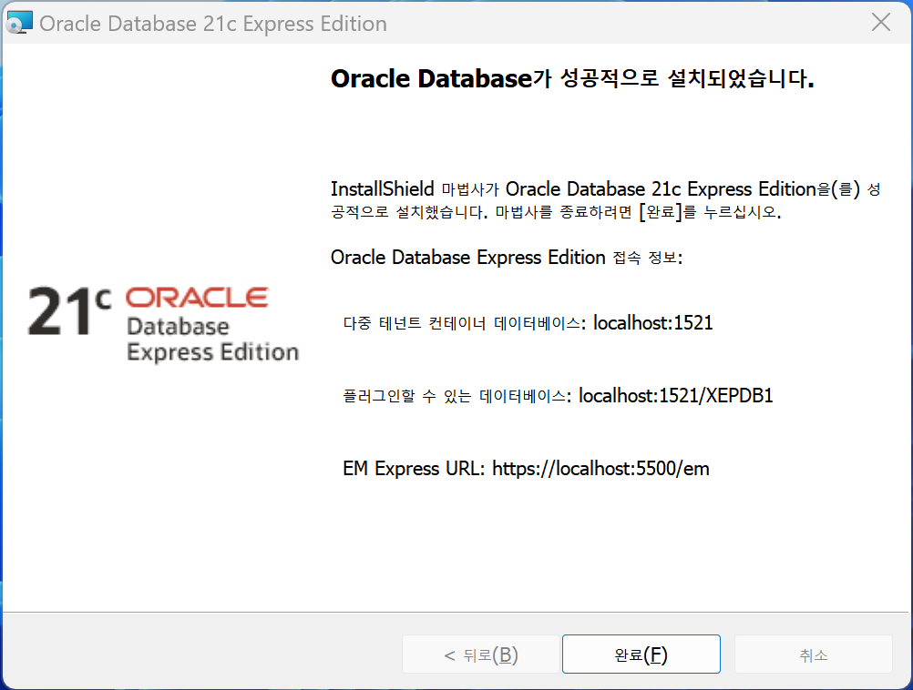
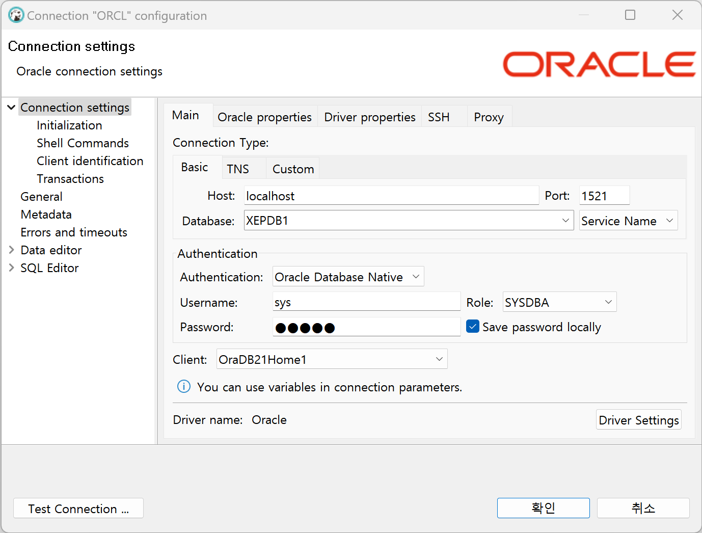

Oracle Database Express Edition 설치 및 사용 방법  

<!-- more -->

---

## 1. Oracle Database XE

**Oracle Database XE(Oracle Database Express Edition)**는 오라클에서도 제공하는 무료 데이터베이스인데, [여기](https://www.oracle.com/database/technologies/xe-downloads.html)에서 다운 받을 수 있다.  

다운 받은 파일의 `setup.exe` 파일을 실행해서 적당한 위치에 설치하면 되는데, 주의점은 아래와 같다.  

- 컴퓨터 이름이 영어일 것
- 사용자 계정이 영어일 것
- 설치 경로가 전부 영어일 것

설치 단계에서 데이터베이스 비밀번호를 물어보는데, `admin` 같이 적당히 쉽고 기억하기 좋은 것으로 정하자. 잊어버리면 매우 귀찮아진다.  

{ loading=lazy width="600px" }

## 3. DBeaver 연결

처음에 DBeaver로 설치된 Oracle XE에 접속하면 아래와 같이 listener에 관한 문제가 있다면서 연결이 안 된다.  

```
Listener refused the connection with the following error:
ORA-12514, TNS:listener does not currently know of service requested in connect descriptor
```

오라클 리스너는 클라이언트와 오라클 서버를 연결하는 일종의 네트워크 관리자인데, DBeaver에 기본 설정된 Oracle 접속 정보가 설치된 데이터베이스의 접속 정보와 일치하지 않아서 발생하는 에러이다.  

설치 완료 후 알려주는 접속 정보를 적어두었다가 참고해도 되고, 아래와 같이 terminal 명령어를 사용해서 접속 정보를 확인해도 된다.  

```bat
Lsnrctl services
```

아래와 같이 접속 정보를 맞게 설정해주면 정상적으로 접속된다.  

{ loading=lazy width="600px" }

---
## Reference
- [Oracle Database Express Edition](https://www.oracle.com/kr/database/technologies/appdev/xe.html)
- [Installation Guide for Microsoft Windows](https://docs.oracle.com/en/database/oracle/oracle-database/21/xeinw/index.html)
