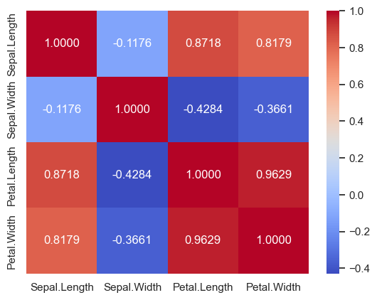
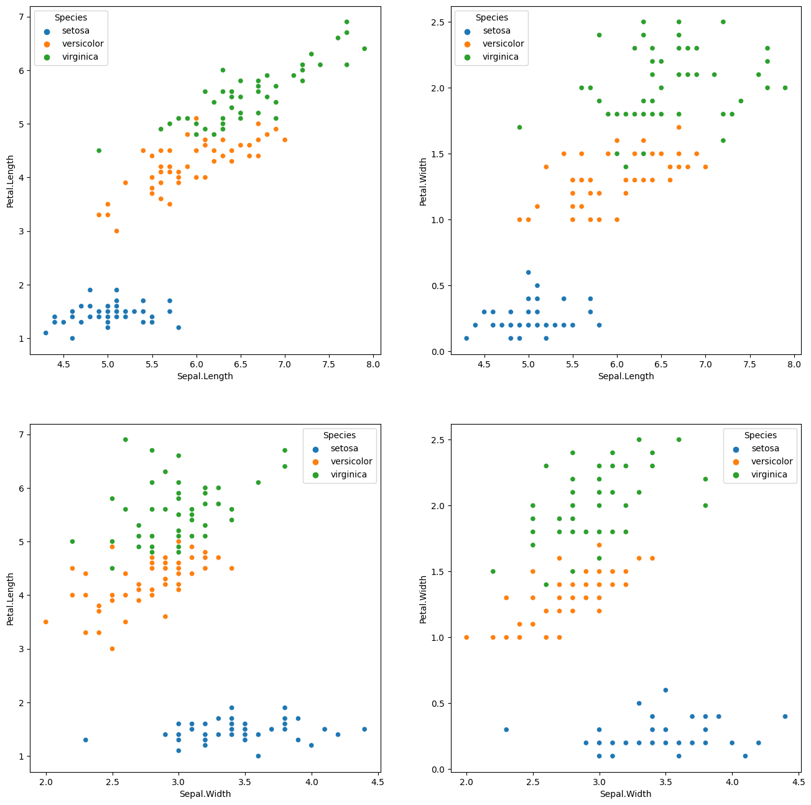

Python으로 상관분석 하는 방법  

<!-- more -->

---

## 간단한 상관분석 방법

**상관분석(correlation analysis)**은 한 변수의 변화에 따른 다른 변수의 변화 정도와 방향(상관관계)을 확인하는 분석기법으로, 두 변수 사이의 통계적 관계를 표현하기 위해 특정한 상관관계의 정도를 수치적으로 나타낸 수치인 **상관계수(correlation coefficient)**를 통해 상관의 정도를 파악한다.  

상관계수는 **-1에서 1 사이의 값**을 지니며, 부호는 상관관계의 방향, 수치는 상관의 정도를 나타낸다. 데이터 분석에 있어서 요구되는 상관계수의 수치는 분석 대상에 따라 달라지는데, 대체로 사회과학에서는 수치가 조금 낮아도 강력한 상관관계로 해석하며 오히려 너무 높은 상관관계는 데이터 조작을 의심하게 되지만, 반대로 공학계통에서는 높은 상관관계를 요구한다.  

### 상관계수 테이블

데이터 분석 과정에서 상관관계를 분석할 때, 아래와 같이 pandas의 [`corr` 메서드](https://pandas.pydata.org/docs/reference/api/pandas.DataFrame.corr.html)를 사용해서 간단하게 처리할 수 있다.  

해당 메서드는 `method` 파라미터를 통해 [피어슨 상관계수](https://en.wikipedia.org/wiki/Pearson_correlation_coefficient), [스피어만 상관계수](https://en.wikipedia.org/wiki/Spearman%27s_rank_correlation_coefficient), [켄달 타우](https://en.wikipedia.org/wiki/Kendall_rank_correlation_coefficient) 등을 골라서 계산할 수 있다.  

```python
import pydataset as pds

df = pds.data('iris').reset_index(drop=True)
corr = df[[x for x in df.columns if df[x].dtype != 'object']].corr(method='pearson')

print(corr)
```
```
              Sepal.Length  Sepal.Width  Petal.Length  Petal.Width
Sepal.Length      1.000000    -0.117570      0.871754     0.817941
Sepal.Width      -0.117570     1.000000     -0.428440    -0.366126
Petal.Length      0.871754    -0.428440      1.000000     0.962865
Petal.Width       0.817941    -0.366126      0.962865     1.000000
```

### 상관계수 시각화

아래와 같이 matplotlib 라이브러리와 seaborn 라이브러리를 사용하면 요약된 시각화도 간단하게 작성할 수 있다.  

```python
import matplotlib.pyplot as plt
import seaborn as sns

sns.set(font_scale=1)

fig, ax = plt.subplots()
ax = sns.heatmap(
    data=corr,
    cmap=plt.cm.coolwarm,
    annot=True,
    fmt='.4f',
)

plt.savefig(fname='iris_corr.png', bbox_inches='tight')
plt.show()
```

{ loading=lazy }

## 필요한 칼럼만 골라서 분석하기

### 간단한 함수를 사용한 계산

앞의 방법으로 상관분석을 진행하면 전체 칼럼의 전체 칼럼에 대한 상관계수를 분석을 진행하기 때문에 그다지 필요하지 않은 칼럼 간의 상관계수도 전부 계산되고, 칼럼이 많아지면 내용이 잘 보이지도 않는다.  

그래서 아래와 같이 필요한 칼럼만 골라서 테이블과 함께 입력하면 해당 칼럼들 간의 피어슨 상관계수를 계산해주는 함수를 만들어보았다.  

```python
import pandas as pd
from scipy import stats


def pearson_series(x: pd.Series, y: pd.Series) -> float:
    """returns pearson r correlation coefficient of two arrays"""

    df = pd.concat(objs=[x, y], axis=1).dropna()
    return stats.pearsonr(df.iloc[:, 0], df.iloc[:, 1])[0]


def pearson_df(df: pd.DataFrame, list_a: list, list_b: list) -> pd.DataFrame:
    """returns pearson r correlation coefficient of selected columns"""

    res = [{'a': a, 'b': b, 'pearson_r': pearson_series(df[a], df[b])} for a in list_a for b in list_b]
    return pd.DataFrame(res)
```

pandas의 `corr` 메서드와는 달리 데이터 타입이 numeric이 아닌 칼럼을 자동으로 제외해주지는 않지만, 어차피 분석가가 직접 칼럼을 고르기 때문에 별로 상관 없을 것 같다.  

실제 데이터프레임에 적용해보면 아래와 같다.  

```python
import math

data = {
    "a": [1, 2, math.nan, 3],
    "b": [3, 5, 8, 10],
    "c": [1, 2, 3, 4],
    "d": [5, 6, 7, 8]
}
```
```
     a   b  c  d
0  1.0   3  1  5
1  2.0   5  2  6
2  NaN   8  3  7
3  3.0  10  4  8
```

```python
print(pearson_series(df['a'], df['c']))
```
```
0.9819805060619656
```

```python
res = pearson_df(df=df, list_a=list(df.columns)[:2], list_b=list(df.columns)[2:])
# res['pearson_r'] = res['pearson_r'].map('{:,.10f}'.format)
res['pearson_r'] = [f'{x:,.10f}' for x in res['pearson_r']]
print(res)
```
```
   a  b     pearson_r
0  a  c  0.9819805061
1  a  d  0.9819805061
2  b  c  0.9965457582
3  b  d  0.9965457582
```

### 골라낸 칼럼만 시각화

상관분석 결과는 시각화로 제시하는 경우도 많은데, 히트맵은 프리젠테이션에 적합하지는 않아서 개인적으로는 필요한 칼럼만 골라내서 일일이 산점도로 시각화하는 것을 더 선호한다.  

골라낸 칼럼들의 상관분석을 산점도로 시각화 하는 코드는 아래와 같다.  

```python
import matplotlib.pyplot as plt
import seaborn as sns
import pydataset as pds

df = pds.data('iris').reset_index(drop=True)

list_x = list(df.columns)[:2]
list_y = list(df.columns)[2:-1]

fig, axes = plt.subplots(
    nrows=len(list_x),
    ncols=len(list_y),
    figsize=(16, 16),
)

for i, x in enumerate(list_x):
    for j, y in enumerate(list_y):
        sns.scatterplot(data=df, x=x, y=y, ax=axes[i][j], hue=df['Species'])

plt.savefig(fname='iris_corr_scatter.png', bbox_inches='tight')
plt.show()
```

{ loading=lazy }