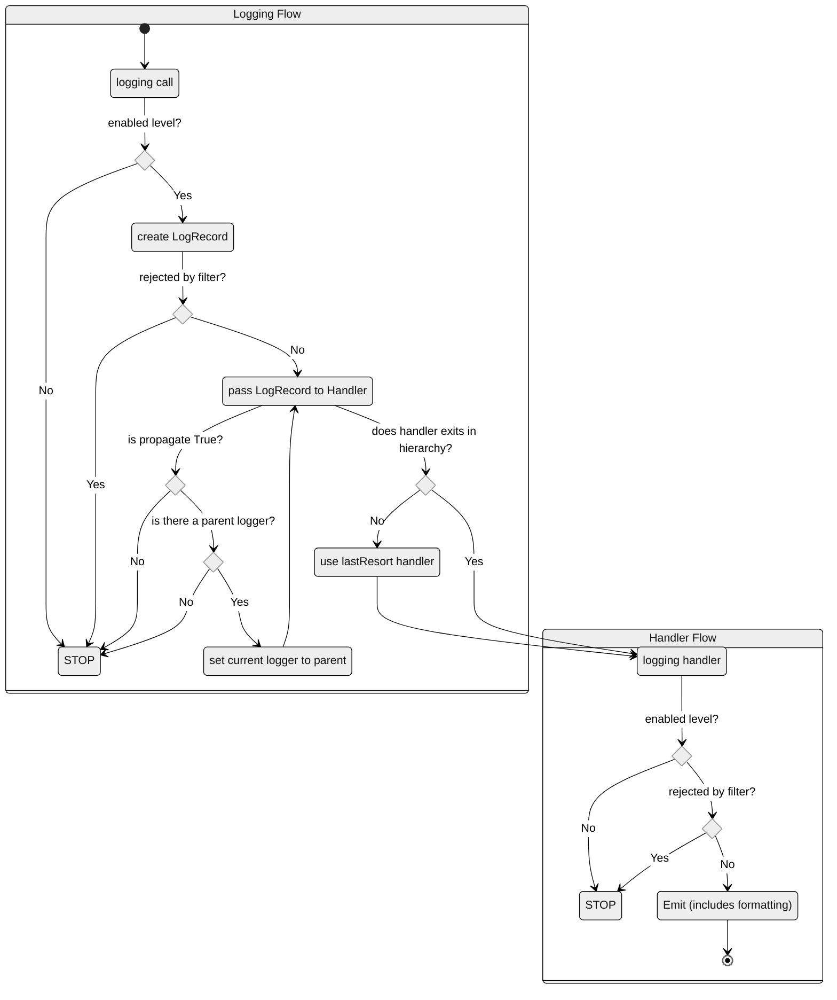

Python에서 기본 제공하는 로깅 모듈을 사용하면 시스템 로그를 아주 간편하게 남길 수 있는데, Python 로깅에 대한 정리와 Best Practice에 대해 정리하면 아래와 같다.  

<!-- more -->

---

## Python logging

Python 로깅의 workflow는 아래와 같다.  



^[출처: Python - Logging HOWTO](https://docs.python.org/3/howto/logging.html#logging-flow)^

### Logger

로거는 `logging` 모듈의 `getLogger` 함수를 통해 생성하고, 로깅을 위한 `LogRecord` 객체를 생성해주기 때문에 전체 로깅 과정에서 핵심적인 역할을 수행한다.  

로거의 이름, 해당 로거가 출력할 로그의 레벨, 로그의 `propagate` 여부 등을 설정할 수 있다.  

```python
import logging


logger = logging.getLogger(name="logger")
logger.setLevel(level=logging.DEBUG)
logger.propagate = True

logger.debug("debug message")
logger.info("info message")
logger.warning("warn message")
logger.error("error message")
logger.critical("critical message")
```

!!! warning
    `getLogger` 함수는 로거 객체를 생성할 때 기본 핸들러를 주입해주지 않기 때문에, 개발자가 직접 핸들러를 추가해주지 않으면 실제 로그는 출력되지 않는다.  

??? note "Logger의 주요 구조"

    === "Python 3.11"

        ```python
        class Logger(Filterer):
            ...

            def info(self, msg, *args, **kwargs):
                """
                Log 'msg % args' with severity 'INFO'.

                To pass exception information, use the keyword argument exc_info with
                a true value, e.g.

                logger.info("Houston, we have a %s", "interesting problem", exc_info=True)
                """
                if self.isEnabledFor(INFO):
                    self._log(INFO, msg, args, **kwargs)

            ...

            def makeRecord(self, name, level, fn, lno, msg, args, exc_info,
                        func=None, extra=None, sinfo=None):
                """
                A factory method which can be overridden in subclasses to create
                specialized LogRecords.
                """
                rv = _logRecordFactory(name, level, fn, lno, msg, args, exc_info, func,
                                    sinfo)
                if extra is not None:
                    for key in extra:
                        if (key in ["message", "asctime"]) or (key in rv.__dict__):
                            raise KeyError("Attempt to overwrite %r in LogRecord" % key)
                        rv.__dict__[key] = extra[key]
                return rv

            def _log(self, level, msg, args, exc_info=None, extra=None, stack_info=False,
                    stacklevel=1):
                """
                Low-level logging routine which creates a LogRecord and then calls
                all the handlers of this logger to handle the record.
                """
                sinfo = None
                if _srcfile:
                    #IronPython doesn't track Python frames, so findCaller raises an
                    #exception on some versions of IronPython. We trap it here so that
                    #IronPython can use logging.
                    try:
                        fn, lno, func, sinfo = self.findCaller(stack_info, stacklevel)
                    except ValueError: # pragma: no cover
                        fn, lno, func = "(unknown file)", 0, "(unknown function)"
                else: # pragma: no cover
                    fn, lno, func = "(unknown file)", 0, "(unknown function)"
                if exc_info:
                    if isinstance(exc_info, BaseException):
                        exc_info = (type(exc_info), exc_info, exc_info.__traceback__)
                    elif not isinstance(exc_info, tuple):
                        exc_info = sys.exc_info()
                record = self.makeRecord(self.name, level, fn, lno, msg, args,
                                        exc_info, func, extra, sinfo)
                self.handle(record)

            def handle(self, record):
                """
                Call the handlers for the specified record.

                This method is used for unpickled records received from a socket, as
                well as those created locally. Logger-level filtering is applied.
                """
                if (not self.disabled) and self.filter(record):
                    self.callHandlers(record)


            def callHandlers(self, record):
                """
                Pass a record to all relevant handlers.

                Loop through all handlers for this logger and its parents in the
                logger hierarchy. If no handler was found, output a one-off error
                message to sys.stderr. Stop searching up the hierarchy whenever a
                logger with the "propagate" attribute set to zero is found - that
                will be the last logger whose handlers are called.
                """
                c = self
                found = 0
                while c:
                    for hdlr in c.handlers:
                        found = found + 1
                        if record.levelno >= hdlr.level:
                            hdlr.handle(record)
                    if not c.propagate:
                        c = None    #break out
                    else:
                        c = c.parent
                if (found == 0):
                    if lastResort:
                        if record.levelno >= lastResort.level:
                            lastResort.handle(record)
                    elif raiseExceptions and not self.manager.emittedNoHandlerWarning:
                        sys.stderr.write("No handlers could be found for logger"
                                        " \"%s\"\n" % self.name)
                        self.manager.emittedNoHandlerWarning = True
        ```

아래와 같이 로거의 이름에 `.`을 사용해서 로거 간의 계층 구조를 설정할 수 있다. 로거의 `propagate` 필드는 하위 로거에서 생성한 로그가 상위 로그로 전달되어 출력될지 여부를 설정한다.  

```python
import logging

main_logger = logging.getLogger("main")
sub_logger = logging.getLogger("main.sub")
sub_logger.propagate = True
```

!!! warning
    계층 관계에 있는 로거가 각자 핸들러를 가지고 있다면 `propagate` 된 로그는 각각의 핸들러에서 모두 출력된다.  

### Handler

핸들러는 로그를 어디에 출력 할지를 설정하기 위해 사용된다.  

#### StreamHandler

`StreamHandler`는 콘솔에 로그를 출력해주는 핸들러로, 다른 설정이 없다면 아래와 같이 `sys.stderr`로 로그를 출력한다.  

```python
import sys


class StreamHandler(Handler):

    def __init__(self, stream=None):
        """
        Initialize the handler.

        If stream is not specified, sys.stderr is used.
        """
        Handler.__init__(self)
        if stream is None:
            stream = sys.stderr
        self.stream = stream
```

따라서 아래와 같이 프로그램을 실행시킬 경우 `print`로 출력하는 내용과 달리 `StreamHandler`가 출력하는 로그는 파일에 저장되지 않는다.  

```bat
main.py >> log.txt
```

!!! note
    `StreamHandler`를 통해 출력되는 로그를 파일로 저장하고 싶다면 아래와 같이 `stderr`의 출력을 `stdout`으로 바꿔줘야 한다.  

    ```bat
    main.py >> log.txt 2>&1
    ```

#### TimedRotatingFileHandler

Python이 기본 제공하는 다양한 Log Handler 중에 [`TimedRotatingFileHandler`](https://docs.python.org/3/library/logging.handlers.html#timedrotatingfilehandler)를 사용하면 일정한 시간 간격으로 로그가 새로운 파일로 나뉘어서 생성되도록 관리할 수 있다.  

- `when`: time rotate의 기준 시점
- `backupCount`: 로그를 남길 파일 개수, 로그 파일이 해당 설정의 수보다 많을 경우 자동 삭제

| `when` 값 |            interval 유형             |       `atTime` 입력 시       |
| :-------: | :----------------------------------: | :--------------------------: |
|     S     |                  초                  |          영향 없음           |
|     M     |                  분                  |          영향 없음           |
|     H     |                 시간                 |          영향 없음           |
|     D     |                  일                  |          영향 없음           |
|  W0 - W6  |           요일 (0=월요일)            | 최초 롤오버 시간 계산에 사용 |
| midnight  | `atTime` 미입력 시 자정에 롤오버[^1] | 최초 롤오버 시간 계산에 사용 |

[^1]: `atTime` 입력 시 해당 시간에 롤오버  

!!! tip
    `file_handler.suffix = "%Y%m%d.log"`와 같이 `suffix` 속성을 설정할 경우 롤오버 시 생성되는 파일의 파일명 규칙을 수정할 수 있지만, 이 경우 `backupCount` 속성이 제대로 작동하지 않게 된다.  

#### QueueHandler

로깅을 위한 IO는 프로그램의 속도를 저하시키는 원인이 되기 때문에 웹 서비스와 같이 빠른 속도가 중요한 프로그램을 만들 때에는 로깅을 메인 쓰레드와 분리된 새로운 쓰레드에서 수행해 줄 필요가 있는데, 이를 위해서 [`QueueHandler`](https://docs.python.org/3/library/logging.handlers.html#queuehandler)와 [`QueueListener`](https://docs.python.org/3/library/logging.handlers.html#queuelistener)를 사용한다.  

> Along with the [QueueListener](https://docs.python.org/3/library/logging.handlers.html#logging.handlers.QueueListener) class, [QueueHandler](https://docs.python.org/3/library/logging.handlers.html#logging.handlers.QueueHandler) can be used to let handlers do their work on a separate thread from the one which does the logging.

#### NullHandler

`NullHandler`는 아래와 같이 아무것도 하지 않는 핸들러로, 자체적인 로거를 갖는 패키지의 객체들을 다룰 때 해당 로거가 로그를 생성만 하고 출력은 하지 않도록 하고 싶을 때 사용한다.  

```python
class NullHandler(Handler):
    ...

    def handle(self, record):
        """Stub."""

    def emit(self, record):
        """Stub."""
    ...
```

### LogRecord

로그가 출력될 때 실제로는 `LogRecord` 클래스의 인스턴스가 생성되고, 해당 인스턴스에 각종 정보들이 담긴 후 사용자가 설정한 내용들만 추려서 출력된다.  

`LogRecord` 클래스의 요소들은 [공식 문서](https://docs.python.org/3/library/logging.html#logrecord-attributes)에서 확인할 수 있는데, 주로 사용할만한 속성들은 아래와 같다.  

| Attribute name |     Format      |              Description               |
| :------------: | :-------------: | :------------------------------------: |
|    asctime     |   %(asctime)s   |           로그가 생성된 시간           |
|    filename    |  %(filename)s   |      로그를 발생시킨 파일의 이름       |
|    funcName    |  %(funcName)s   |      로그를 발생시킨 함수의 이름       |
|   levelname    |  %(levelname)s  |             로그 레벨 이름             |
|     lineno     |   %(lineno)d    | 소스코드에서 로그를 발생시킨 라인 넘버 |
|    message     |   %(message)s   |              로그 메세지               |
|     module     |   %(module)s    |       로그를 발생시킨 모듈 이름        |
|     msecs      |    %(msecs)d    |    로그가 생성된 시간의 밀리세컨드     |
|      name      |    %(name)s     |              로거의 이름               |
|    process     |   %(process)d   |      프로세스 ID(가능할 경우에만)      |
|  processName   | %(processName)s |     프로세스 이름(가능할 경우에만)     |
|     thread     |   %(thread)d    |       쓰레드 ID(가능할 경우에만)       |
|   threadName   | %(threadName)s  |      쓰레드 이름(가능할 경우에만)      |

???+ note "Python Log의 asctime"
    엄밀히 말하면 `asctime`은 `LogRecord` 객체의 요소는 아니다. `LogRecord` 객체는 `time.time()`[^2]으로 생성시간을 저장한 후, [`Formatter`](#formatter)가 생성시간을 [`time.strftime`](./2022-12-03-python_datetime.md/#strftime)을 사용해서 입력받은 포맷대로 생성해준다.  

    === "Python 3.11"

        ```python
        class LogRecord(object):
            ...

            def __init__(self, name, level, pathname, lineno,
                        msg, args, exc_info, func=None, sinfo=None, **kwargs):
                ...

                ct = time.time()

                ...

                self.created = ct

                ...
        ```

        ```python hl_lines="4 13"
        class Formatter(object):
            ...

            converter = time.localtime

            def __init__(self, fmt=None, datefmt=None, style='%', validate=True, *,
                        defaults=None):
                ...

            def formatTime(self, record, datefmt=None):
                ...

                ct = self.converter(record.created)
                if datefmt:
                    s = time.strftime(datefmt, ct)
                else:
                    s = time.strftime(self.default_time_format, ct)
                    if self.default_msec_format:
                        s = self.default_msec_format % (s, record.msecs)
                return s
            
            ...
        ```

    `Formatter`는 시간 표시를 위해 `time.time()`을 통해 생성된 `LogRecord`의 `created`를 `time.localtime`로 컨버팅 해서 사용하는데, `time.localtime`는 milliseconds를 다루지 않는 `time.struct_time` 객체로 시간 데이터를 변환하기 때문에 milliseconds를 출력하려면 매우 귀찮아진다.  

[^2]: 시간의 시작점인 *epoch*[^3] 로부터의 초를 반환한다.  
[^3]: January 1, 1970, 00:00:00 (UTC)  

### Filter

필터는 로그의 출력을 필터링해주는 역할로, `LogRecord` 인스턴스를 필터링하는 규칙을 직접 만들 수 있다.  

`logging` 모듈의 기본 필터는 로그 레벨로 필터링하고, 그 중에서도 **지정된 레벨보다 상위 레벨 전체의 로그**를 필터링한다.  

로그 필터를 직접 만들어 주입해주면 **특정 정보의 로그**만 필터링 해줄 수 있다.  

```python title="src/log/filter.py"
from logging import Filter, LogRecord


class MyFilter(Filter):  # (1)!
    def __init__(self, levels: list[int]):
        self.__level = levels

    def filter(self, logRecord: LogRecord):
        return logRecord.levelno in self.__level
```

1. 아래 note에 작성했듯이 `class MyFilter(object)`로 만들어도 전혀 문제 없다.

???+ note "Filterer"
    참고로 Python 공식 문서 [Logging facility for Python](https://docs.python.org/3/library/logging.html#filter-objects)에서는 필터는 굳이 표준 라이브러리의 클래스를 상속해서 만들 필요 없이, 단순히 `filter` 메서드를 가진 객체는 아무 것이나 사용해도 된다고 한다.  

    > You don’t actually need to subclass `Filter`: you can pass any instance which has a `filter` method with the same semantics.

    실제로 `logging.Logger`, `logging.Handler` 클래스가 상속하고 있는 `logging.Filterer` 클래스를 살펴보면 아래와 같이 `addFilter` 메서드는 `filters` 리스트에 필터 객체를 추가해주기만 하며, `filter` 메서드는 `filters` 리스트에 속한 필터들의 `filter` 메서드를 호출하는 역할만 한다.  

    === "Python 3.11"
    
        ```python hl_lines="35-36"
        class Filterer(object):
            ...

            def __init__(self):
                ...

                self.filters = []

            def addFilter(self, filter):
                ...

                if not (filter in self.filters):
                    self.filters.append(filter)

            ...

            def filter(self, record):
                ...

                rv = True
                for f in self.filters:
                    if hasattr(f, 'filter'):
                        result = f.filter(record)
                    else:
                        result = f(record) # assume callable - will raise if not
                    if not result:
                        rv = False
                        break
                return rv

            ...
        ```

### Formatter

포매터는 로그를 어떤 형태로 출력할지를 정하는 역할로, `Formatter` 클래스를 직접 만들어 사용한다면, 로그를 `jsonl`과 같이 특이한 형태의 파일로도 출력 만들 수 있다.  

=== "Python 3.11"

    ```python title="src/log/formatter.py"
    import datetime as dt
    import json
    from logging import Formatter, LogRecord

    KST = dt.timezone(offset=dt.timedelta(hours=9))


    class JsonFormatter(Formatter):
        def __init__(
            self,
            *,
            fmt_keys: dict[str, str] | None = None,
        ) -> None:
            super().__init__()
            self.fmt_keys = fmt_keys if fmt_keys is not None else {}

        # override
        def format(self, record: LogRecord) -> str:
            message = self._prepare_log(record=record)
            return json.dumps(obj=message, default=str)

        def _prepare_log(self, record: LogRecord):
            always_fields = {
                "message": record.getMessage(),
                "timestamp": (
                    dt.datetime.fromtimestamp(record.created, tz=KST)  # (1)!
                ).isoformat(),
            }

            if record.exc_info is not None:
                always_fields["exc_info"] = self.formatException(record.exc_info)

            if record.stack_info is not None:
                always_fields["stack_info"] = self.formatStack(record.stack_info)

            message = {
                key: (
                    msg_val
                    if (msg_val := always_fields.pop(val, None)) is not None
                    else getattr(record, val)
                )
                for key, val in self.fmt_keys.items()
            }
            message.update(always_fields)

            return message
    ```

    1. UTC 기준으로 로그를 생성하고 싶다면 `dt.datetime.fromtimestamp(record.created, tz=dt.timezone.utc)`으로 만들면 된다.

=== "Python 3.12+"

    ```python title="src/log/formatter.py"
    import datetime as dt
    import json
    from logging import Formatter, LogRecord
    from typing import override

    KST = dt.timezone(dt.timedelta(hours=9))


    class JsonFormatter(Formatter):
        def __init__(
            self,
            *,
            fmt_keys: dict[str, str] | None = None,
        ) -> None:
            super().__init__()
            self.fmt_keys = fmt_keys if fmt_keys is not None else {}

        @override
        def format(self, record: LogRecord) -> str:
            message = self._prepare_log(record=record)
            return json.dumps(message, default=str)

        def _prepare_log(self, record: LogRecord):
            always_fields = {
                "message": record.getMessage(),
                "timestamp": (
                    dt.datetime.fromtimestamp(timestamp=record.created, tz=KST)  # (1)!
                ).isoformat(),
            }

            if record.exc_info is not None:
                always_fields["exc_info"] = self.formatException(record.exc_info)

            if record.stack_info is not None:
                always_fields["stack_info"] = self.formatStack(record.stack_info)

            message = {
                key: (
                    msg_val
                    if (msg_val := always_fields.pop(val, None)) is not None
                    else getattr(record, val)
                )
                for key, val in self.fmt_keys.items()
            }
            message.update(always_fields)

            return message
    ```

    1. UTC 기준으로 로그를 생성하고 싶다면 `dt.datetime.fromtimestamp(timestamp=record.created, tz=dt.timezone.utc)`으로 만들면 된다.

## Best Practice

### Code를 통한 로그 설정

```python title="src/log/__init__.py"
import logging
import queue
from datetime import datetime
from logging.handlers import QueueHandler, QueueListener, TimedRotatingFileHandler
from pathlib import Path

from src.log import filter, formatter


# override formatTime method of Formatter
def formatTime(self, record, datefmt=None):
    return (
        datetime.fromtimestamp(record.created)
        .astimezone()
        .isoformat(timespec="milliseconds")
    )


logging.Formatter.formatTime = formatTime  # (1)!

# set log directory
log_dir = Path("logs")
try:
    log_dir.mkdir()
except FileExistsError:
    ...

# create Logger instance
logger = logging.getLogger(name="logger")
logger.setLevel(level=logging.DEBUG)

# set log format
simple_formatter = logging.Formatter(
    fmt="%(asctime)s - %(levelname)s - %(message)s",
)
detailed_formatter = logging.Formatter(
    fmt="%(asctime)s - %(levelname)s - [%(module)s:%(funcName)s:%(lineno)d] %(message)s",
)

# StreamHandler
stream_handler = logging.StreamHandler()
stream_handler.setFormatter(fmt=simple_formatter)

# TimedRotatingFileHandler
file_handler = TimedRotatingFileHandler(
    filename=log_dir / "app.log",
    when="midnight",  # rotate at every midnight
    backupCount=3,  # define number of log files, 0 to save all log files
    encoding="utf-8",
)
file_handler.setFormatter(fmt=detailed_formatter)

# JsonlHandler
json_handler = TimedRotatingFileHandler(
    filename=log_dir / "app.log.jsonl",
    when="midnight",
    backupCount=3,
    encoding="utf-8",
)
fmt_keys = {
    "level": "levelname",
    "message": "message",
    "logger": "name",
    "module": "module",
    "function": "funcName",
    "line": "lineno",
}
json_handler.setFormatter(fmt=formatter.JsonFormatter(fmt_keys=fmt_keys))

# DebugHandler
debug_handler = TimedRotatingFileHandler(
    filename=log_dir / "debug.log",
    when="midnight",
    backupCount=3,
    encoding="utf-8",
)
debug_handler.setFormatter(fmt=detailed_formatter)
debug_handler.addFilter(
    filter=filter.MyFilter(
        levels=[
            logging.DEBUG,
            logging.ERROR,
            logging.CRITICAL,
        ]
    )
)

# QueueHandler
log_queue = queue.Queue()  # (2)!
queue_handler = QueueHandler(queue=log_queue)
logger.addHandler(hdlr=queue_handler)

# QueueListener
log_listener = QueueListener(
    log_queue,
    stream_handler,
    file_handler,
    json_handler,
    debug_handler,
)
```

1. **ISO8601** 형식으로 로그 생성 시간을 출력하기 위한 `Formatter.formatTime` 메서드 오버라이드
1. 멀티프로세싱 환경에서 QueueHandler를 사용할 경우 [multiprocessing.Queue](https://docs.python.org/3/library/multiprocessing.html#multiprocessing.Queue)를 사용해야 한다.  

??? note "`formatTime` 메서드 오버라이딩 대안"
    위 코드 예시에서 사용한 `formatTime` 메서드의 오버라이딩은 아래와 같다.  

    ```python
    import logging

    def formatTime(self, record, datefmt=None): ...


    logging.Formatter.formatTime = formatTime
    ```

    위와 같이 메서드를 오버라이드 하는 방식이 익숙하지 않다면 아래와 같이 `Formatter`를 상속받는 `MyFormatter`를 만들어서 사용해도 된다.  

    ```python
    import datetime as dt
    from logging import Formatter


    class MyFormatter(Formatter):
        def formatTime(self, record, datefmt=None):
            return (
                dt.datetime.fromtimestamp(record.created)
                .astimezone()
                .isoformat(timespec="milliseconds")
            )
    ```

실제 애플리케이션에서의 로그 활용  

```python title="main.py"
from src.log import log_listener, logger


def main():
    logger.debug("debug message")
    logger.info("info message")
    logger.warning("warn message")
    logger.error("error message")
    logger.critical("critical message")

    try:
        raise Exception
    except Exception as e:
        logger.exception("exception")  # logging error traceback
        logger.error("error", exc_info=True)


if __name__ == "__main__":
    log_listener.start()
    main()
    log_listener.stop()
```

??? tip "`dictConfig`를 통한 로그 설정"
    로그 설정을 위한 실제 config 파일로 로그 설정을 JSON이나 YAML 등 외부 파일로 다루면 추후 사용자가 로그 기능을 쉽게 수정할 수 있다는 장점이 있다. ~~사용자를 믿을 수 있는지는 모르겠지만..~~  

    ```json title="log_config.json"
    {
        "version": 1,
        "disable_existing_loggers": false,
        "formatters": {
            "simple": {
                "format": "%(asctime)s.%(msecs)03d - %(levelname)s - %(message)s",
                "datefmt": "%Y-%m-%dT%H:%M:%S"
            },
            "detailed": {
                "format": "%(asctime)s.%(msecs)03d - %(levelname)s - [%(module)s:%(funcName)s:%(lineno)d] %(message)s",
                "datefmt": "%Y-%m-%dT%H:%M:%S"
            },
            "json": {
                "()": "src.log.formatter.JsonFormatter",  // (1)!
                "fmt_keys": {
                    "level": "levelname",
                    "message": "message",
                    "logger": "name",
                    "module": "module",
                    "function": "funcName",
                    "line": "lineno"
                }
            }
        },
        "handlers": {
            "stream": {
                "class": "logging.StreamHandler",
                "level": "DEBUG",
                "formatter": "simple",
                "stream": "ext://sys.stderr"
            },
            "rotating_file": {
                "class": "logging.handlers.TimedRotatingFileHandler",
                "level": "DEBUG",
                "formatter": "detailed",
                "filename": "logs/app.log",
                "when": "midnight",
                "backupCount": 3,
                "encoding": "utf-8"
            },
            "rotating_json": {
                "class": "logging.handlers.TimedRotatingFileHandler",
                "level": "DEBUG",
                "formatter": "json",
                "filename": "logs/app.log.jsonl",
                "when": "midnight",
                "backupCount": 3,
                "encoding": "utf-8"
            },
            "debug_handler": {
                "class": "logging.handlers.TimedRotatingFileHandler",
                "level": "DEBUG",
                "formatter": "detailed",
                "filename": "logs/debug.log",
                "when": "midnight",
                "backupCount": 3,
                "encoding": "utf-8"
            },
            "queue_handler": {
                "class": "logging.handlers.QueueHandler",
                "handlers": [
                    "stream",
                    "rotating_file",
                    "rotating_json",
                    "debug_handler"
                ],
                "respect_handler_level": true
            }
        },
        "loggers": {
            "root": {
                "level": "DEBUG",
                "handlers": ["queue_handler"]
            }
        }
    }
    ```

    1. 사용자 class를 사용할 때는 키 값을 `()`으로 설정하지 않으면 key 들이 하드코딩으로 주입된다.

    `log_config.json`에서 입력받은 로그 설정을 애플리케이션에 주입하기 위한 코드  

    ```python title="src/log/__init__.py"
    import atexit
    import json
    import logging
    import logging.config
    from pathlib import Path

    from src.log import filter

    logger = logging.getLogger(name="logger")


    def set_logger():
        log_config_file = Path(r"config\log_config.json")
        with open(file=log_config_file, encoding="utf-8") as f:
            log_config = json.load(fp=f)
        logging.config.dictConfig(config=log_config)

        queue_handler = logging.getHandlerByName(name="queue_handler")
        if queue_handler is not None:
            queue_handler.listener.start()
            atexit.register(func=queue_handler.listener.stop)

        debug_handler = logging.getHandlerByName(name="debug_handler")
        if debug_handler is not None:
            debug_handler.addFilter(
                filter=filter.MyFilter(
                    levels=[
                        logging.DEBUG,
                        logging.ERROR,
                        logging.CRITICAL,
                    ]
                )
            )
    ```

    실제 애플리케이션에서의 로그 활용  

    ```python title="main.py"
    from src.log import log_listener, logger


    def main():
        set_logger()

        logger.debug("debug message")
        logger.info("info message")
        logger.warning("warn message")
        logger.error("error message")
        logger.critical("critical message")

        try:
            raise Exception
        except Exception as e:
            logger.exception("exception")  # logging error traceback
            logger.error("error", exc_info=True)


    if __name__ == "__main__":
        main()
    ```

    !!! info
        3.11 버전까지는 `QueueHandler`와 `QueueListener`의 설정이 `dictConfig`를 통해 쉽게 주입하기 어렵다는 문제가 있었으나, 3.12 버전부터는 `QueueHandler`에 로그 Queue를 자동으로 주입받고, `QueueListener` 역시 `dictConfig`를 통해 `handlers`를 주입받을 수 있도록 하는 내부적인 변경이 생겨 `dictConfig`를 통해 `QueueHandler`도 쉽게 다룰 수 있게 되었다.  

### 로그 출력 결과

아래와 같이 로그들을 출력해준다.   

```log title="standard out"
2025-03-14T23:31:25.303+09:00 - DEBUG - debug message
2025-03-14T23:31:25.303+09:00 - INFO - info message
2025-03-14T23:31:25.303+09:00 - WARNING - warn message
2025-03-14T23:31:25.303+09:00 - ERROR - error message
2025-03-14T23:31:25.303+09:00 - CRITICAL - critical message
2025-03-14T23:31:25.303+09:00 - ERROR - exception
Traceback (most recent call last):
  File "C:\projects\python311\main.py", line 14, in main
    raise Exception
Exception
2025-03-14T23:31:25.303+09:00 - ERROR - error
Traceback (most recent call last):
  File "C:\projects\python311\main.py", line 14, in main
    raise Exception
Exception
```

```log title="app.log"
2025-03-14T23:31:25.303+09:00 - DEBUG - [main:main:7] debug message
2025-03-14T23:31:25.303+09:00 - INFO - [main:main:8] info message
2025-03-14T23:31:25.303+09:00 - WARNING - [main:main:9] warn message
2025-03-14T23:31:25.303+09:00 - ERROR - [main:main:10] error message
2025-03-14T23:31:25.303+09:00 - CRITICAL - [main:main:11] critical message
2025-03-14T23:31:25.303+09:00 - ERROR - [main:main:16] exception
Traceback (most recent call last):
  File "C:\projects\python311\main.py", line 14, in main
    raise Exception
Exception
2025-03-14T23:31:25.303+09:00 - ERROR - [main:main:16] error
Traceback (most recent call last):
  File "C:\projects\python311\main.py", line 14, in main
    raise Exception
Exception
```

```json title="app.log.jsonl"
{"level": "DEBUG", "message": "debug message", "logger": "logger", "module": "main", "function": "main", "line": 7, "timestamp": "2025-03-14T23:31:25.303853+09:00"}
{"level": "INFO", "message": "info message", "logger": "logger", "module": "main", "function": "main", "line": 8, "timestamp": "2025-03-14T23:31:25.303853+09:00"}
{"level": "WARNING", "message": "warn message", "logger": "logger", "module": "main", "function": "main", "line": 9, "timestamp": "2025-03-14T23:31:25.303853+09:00"}
{"level": "ERROR", "message": "error message", "logger": "logger", "module": "main", "function": "main", "line": 10, "timestamp": "2025-03-14T23:31:25.303853+09:00"}
{"level": "CRITICAL", "message": "critical message", "logger": "logger", "module": "main", "function": "main", "line": 11, "timestamp": "2025-03-14T23:31:25.303853+09:00"}
{"level": "ERROR", "message": "exception\nTraceback (most recent call last):\n  File \"C:\\projects\\python311\\main.py\", line 14, in main\n    raise Exception\nException", "logger": "logger", "module": "main", "function": "main", "line": 16, "timestamp": "2025-03-14T23:31:25.303853+09:00"}
{"level": "ERROR", "message": "error\nTraceback (most recent call last):\n  File \"C:\\projects\\python311\\main.py\", line 14, in main\n    raise Exception\nException", "logger": "logger", "module": "main", "function": "main", "line": 16, "timestamp": "2025-03-14T23:31:25.303853+09:00"}
```

```log title="debug.log"
2025-03-14T23:31:25.303+09:00 - DEBUG - [main:main:7] debug message
2025-03-14T23:31:25.303+09:00 - ERROR - [main:main:10] error message
2025-03-14T23:31:25.303+09:00 - CRITICAL - [main:main:11] critical message
2025-03-14T23:31:25.303+09:00 - ERROR - [main:main:16] exception
Traceback (most recent call last):
  File "C:\projects\python311\main.py", line 14, in main
    raise Exception
Exception
2025-03-14T23:31:25.303+09:00 - ERROR - [main:main:16] error
Traceback (most recent call last):
  File "C:\projects\python311\main.py", line 14, in main
    raise Exception
Exception
```

## 로거 프리셋

??? note "기초 콘솔 로거"

    ```python title="src/log/__init__.py"
    import logging
    from datetime import datetime


    # override formatTime method of Formatter
    def formatTime(self, record, datefmt=None):
        return (
            datetime.fromtimestamp(record.created)
            .astimezone()
            .isoformat(timespec="milliseconds")
        )


    logging.Formatter.formatTime = formatTime

    # set log format
    formatter = logging.Formatter(
        fmt="%(asctime)s - %(levelname)s - [%(module)s:%(funcName)s:%(lineno)d] %(message)s",
    )

    handler = logging.StreamHandler()
    handler.setFormatter(fmt=formatter)

    logger = logging.getLogger(name="logger")
    logger.setLevel(level=logging.DEBUG)
    logger.addHandler(handler)
    ```

??? note "디버그용 로거 설정"
    프로그램 디버깅만을 위한 디버그 전용 로거 설정 방법  

    ```python title="src/log/__init__.py"
    import logging
    import queue
    from datetime import datetime
    from logging.handlers import QueueHandler, QueueListener, TimedRotatingFileHandler
    from pathlib import Path

    from src.log import filter


    # override formatTime method of Formatter
    def formatTime(self, record, datefmt=None):
        return (
            datetime.fromtimestamp(record.created)
            .astimezone()
            .isoformat(timespec="milliseconds")
        )


    logging.Formatter.formatTime = formatTime

    # set log directory
    log_dir = Path("logs")
    try:
        log_dir.mkdir()
    except FileExistsError:
        ...

    # create Logger instance
    logger = logging.getLogger("logger")
    logger.setLevel(logging.DEBUG)

    # set log format
    detailed_formatter = logging.Formatter(
        fmt="%(asctime)s.%(msecs)03d - %(levelname)s - [%(module)s:%(funcName)s:%(lineno)d] %(message)s",
    )

    # DebugHandler
    debug_handler = TimedRotatingFileHandler(
        filename=log_dir / "debug.log",
        when="midnight",
        backupCount=3,
        encoding="utf-8",
    )
    debug_handler.setFormatter(detailed_formatter)
    debug_handler.addFilter(
        filter.MyFilter(
            levels=[
                logging.DEBUG,
                logging.ERROR,
                logging.CRITICAL,
            ]
        )
    )

    # QueueHandler
    log_queue = queue.Queue()
    queue_handler = QueueHandler(log_queue)
    logger.addHandler(queue_handler)

    # QueueListener
    log_listener = QueueListener(log_queue, debug_handler)
    ```

??? note "간단한 로거 설정"

    ```python title="src/log/__init__.py"
    import logging
    from datetime import datetime
    from logging.handlers import TimedRotatingFileHandler
    from pathlib import Path


    # override formatTime method of Formatter
    def formatTime(self, record, datefmt=None):
        return (
            datetime.fromtimestamp(record.created)
            .astimezone()
            .isoformat(timespec="milliseconds")
        )


    logging.Formatter.formatTime = formatTime

    # set log directory
    log_dir = Path("logs")
    try:
        log_dir.mkdir()
    except FileExistsError:
        ...

    # create Logger instance
    logger = logging.getLogger("logger")
    logger.setLevel(logging.DEBUG)

    # set log format
    formatter = logging.Formatter(
        fmt="%(asctime)s - %(levelname)s - [%(module)s:%(funcName)s:%(lineno)d] %(message)s",
    )

    # StreamHandler
    stream_handler = logging.StreamHandler()
    stream_handler.setFormatter(fmt=formatter)
    logger.addHandler(stream_handler)

    # TimedRotatingFileHandler
    file_handler = TimedRotatingFileHandler(
        filename=log_dir / "app.log",
        when="midnight",  # rotate at every midnight
        backupCount=3,  # define number of log files, 0 to save all log files
        encoding="utf-8",
    )
    file_handler.setFormatter(formatter)
    logger.addHandler(file_handler)
    ```

---
## Reference
- [logging — Logging facility for Python](https://docs.python.org/3/library/logging.html)
- [logging.handlers — Logging handlers](https://docs.python.org/3/library/logging.handlers.html)
- [logging — LogRecord Objects](https://docs.python.org/3/library/logging.html#logrecord-objects)
- [mCoding](https://www.youtube.com/@mCoding): [Modern Python logging](https://youtu.be/9L77QExPmI0?si=uoS9br7Bv_8Ba9NK)  
    <iframe src="https://www.youtube.com/embed/9L77QExPmI0" title="Modern Python logging" frameborder="0" allowfullscreen></iframe>
- [stackoverflow - Python logging: use milliseconds in time format](https://stackoverflow.com/questions/6290739/python-logging-use-milliseconds-in-time-format)
