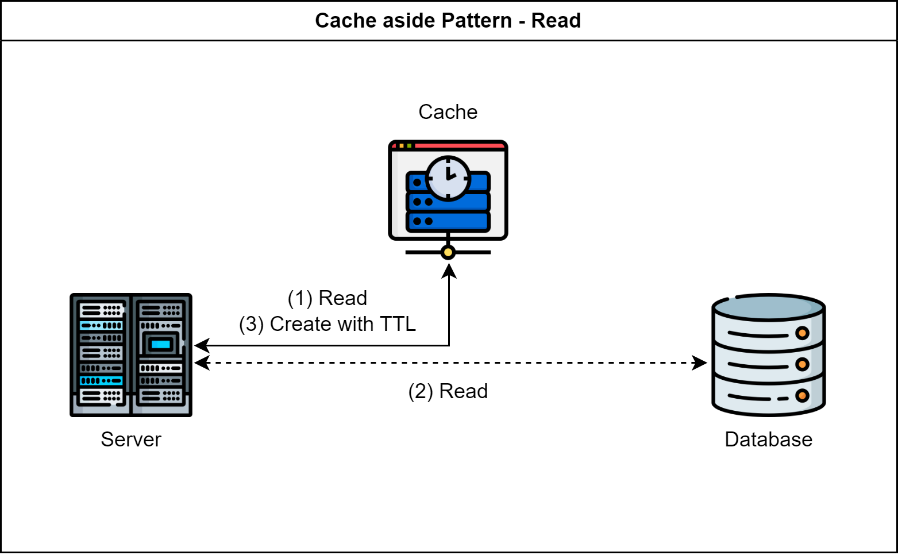
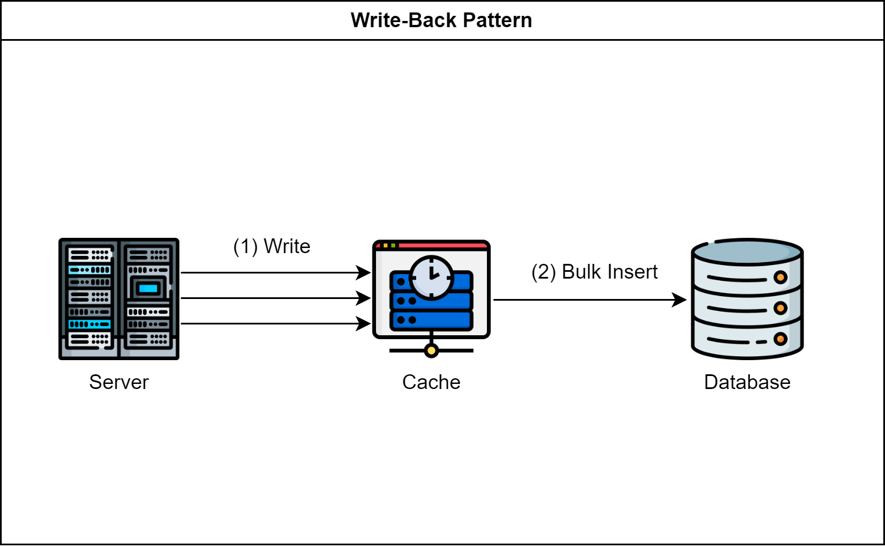

데이터 캐싱을 위한 디자인 패턴 정리  

<!-- more -->

---

## Cache의 위치

패턴은 패턴일 뿐이기 때문에 사용하는 Cache 위치는 상관없다.  

어플리케이션 서버의 로컬 Cache를 사용할수도 있고, Redis와 같은 분산 캐시를 활용할 수도 있으며, 두 위치의 Cache를 모두 활용할 수도 있다.  

## Cache aside Pattern

Read 관점에서 많이 활용되는 패턴  

{ loading=lazy }

1. Cache Query
1. Cache에 데이터 없을 경우 Database Query
1. Database의 응답을 Cache에 저장
    - TTL 옵션 지정을 통해 Cache 메모리 관리
    - 데이터의 특성에 따라 적절한 TTL 지정 필요

{ loading=lazy }

1. Database Create
1. Invalidate Cache Data
    - 데이터 일관성 확보

## Write-Back Pattern

Write 관점에서 많이 활용되는 패턴  

{ loading=lazy }

1. 서버는 다수의 쓰기 작업을 Cache로 전송
1. Cache에서 다수의 쓰기 작업을 모아 Database로 Bulk Insert 함
1. Cache의 가용성에 따라 데이터 유실의 위험성 존재
1. 엔티티의 복잡도가 높을수록 Pattern 구현 난이도 상승

---
## Reference
- [Redis와 FastAPI를 사용한 Python 서버](https://github.com/djccnt15/fastapi_msa)
- [Redis와 Spring을 사용한 Java 서버](https://github.com/djccnt15/spring_redis)