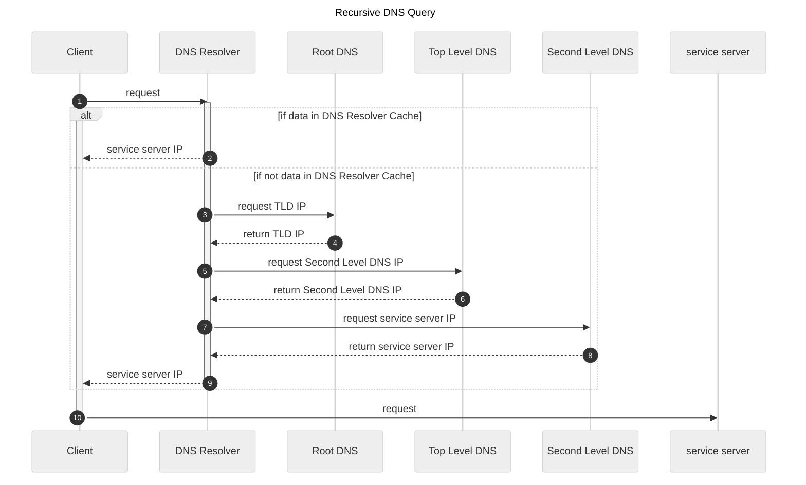
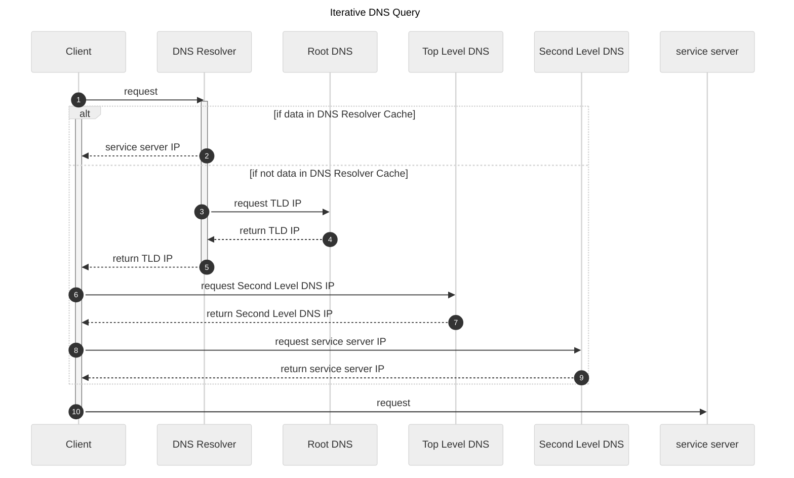
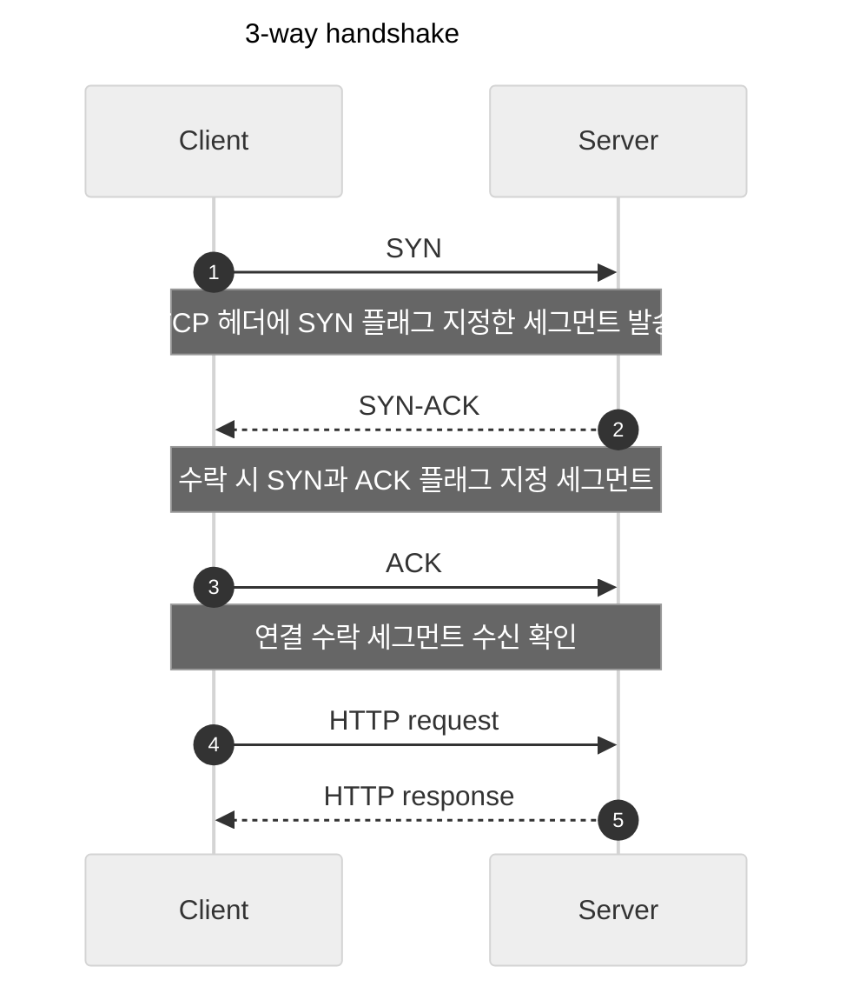
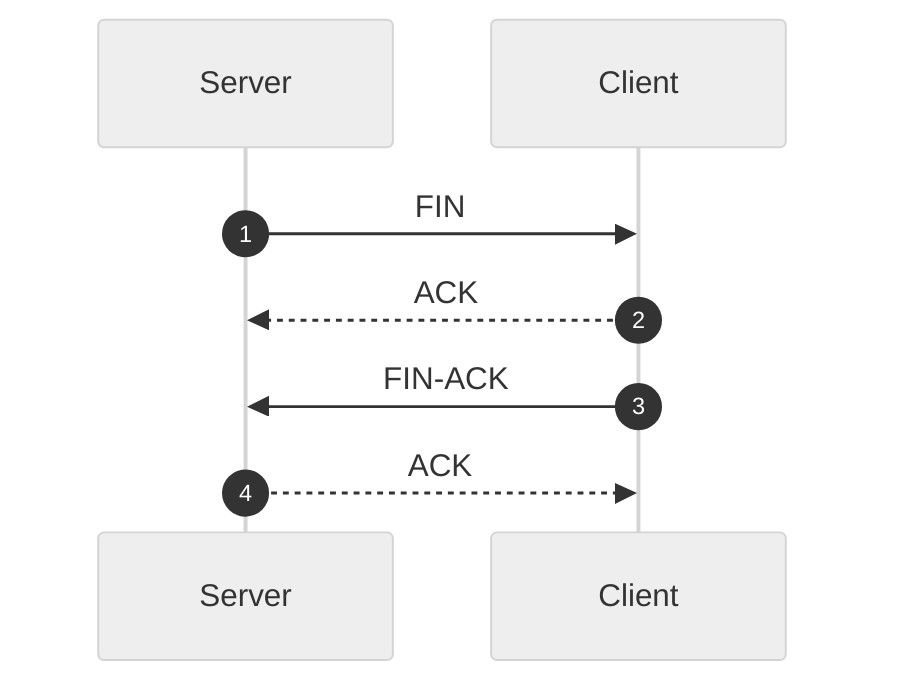
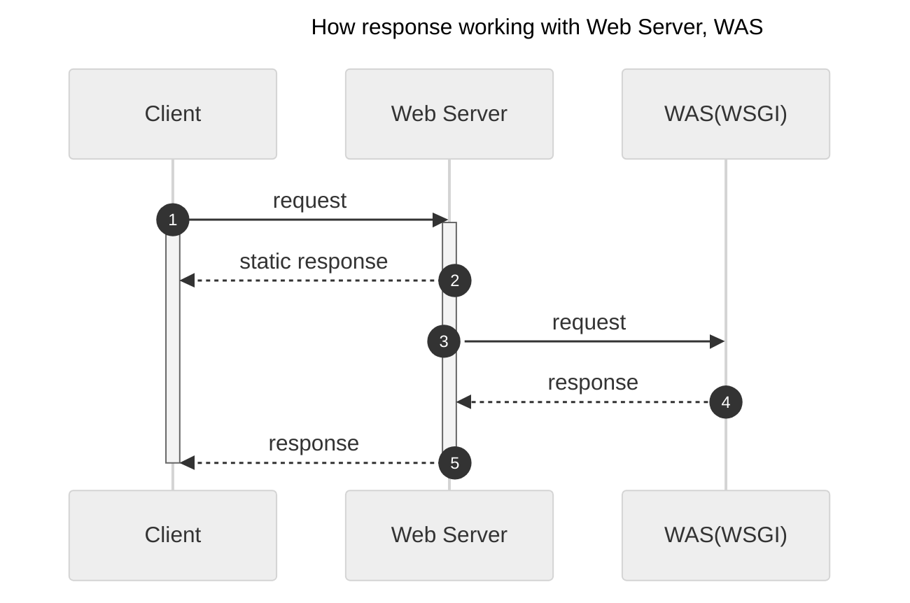

웹 환경에서 클라이언트와 서버의 통신 과정 정리  

<!-- more -->

---

## 1. DNS(Domain Name System)

### DNS Query

클라이언트가 DNS Resolver로 검색 요청을 보내고 DNS Resolver가 실제 서비스 서버의 IP를 탐색해서 알려주는 과정을 **DNS Query**라고 하며, 수행 방식에 따라 **Iterative**, **Recursive** 두 가지 방식이 있다.  

DNS 시스템을 구성하는 요소들은 아래와 같다.  

- Root DNS: 전 세계 영역을 다루는 DNS, 현재는 전 세계에 13개 존재
- Top Level DNS, TLD name server: `.kr`, `.com` 수준의 DNS
- Second Level DNS: `.co` 수준의 DNS
- DNS Resolver
    - 클라이언트 사이드의 DNS 역할 수행
    - DNS 쿼리 시작 및 수행 관리

#### Recursive DNS Query



!!! tip
    Iterative DNS Query 방식에 비해 응답 속도가 빠르다는 장점이 있으나, 부하가 심해 공격에 취약한 단점이 있다.  

#### Iterative DNS Query



### DNS Caching

대부분의 경우 IP 주소는 일정하게 유지되기 때문에, 확인한 IP 주소를 재활용할 수 있다. DNS Caching은 아래와 같은 단계 및 경우에 따라 사용된다.  

1. Browser DNS 캐싱
1. OS level DNS 캐싱
1. Recursive Resolver 캐싱
    1. Resolver가 IP 주소를 캐싱하고 있는 경우
    1. Resolver가 IP 주소를 캐싱하고 있지는 않지만, 해당 IP 주소를 아는 DNS를 아는 경우
    1. Resolver가 IP 주소를 캐싱하지도 않고, 해당 IP 주소를 아는 DNS도 모르는 경우


## 2. HTTP/HTTPS

### 3-way handshake

HTTP 통신을 시작하기 위해 TCP 헤더에 있는 SYN, ACK 비트를 통해 연결을 확인하는 과정을 **3-way handshake**라고 한다.  



- SYN: SYNchronize
- SYN-ACK: SYNchronize-ACKnowledgement
- ACK: ACKnowledgement

??? note "SSL handshake"
    HTTPS 통신을 위해서는 보안 절차(HTTP Secure)가 포함된 **SSL handshake** 절차를 진행해야 한다.  

    ```mermaid
    ---
    title: SSL handshake
    config:
        theme: 'neutral'
    ---
    sequenceDiagram
        autonumber
        Client ->> Server : Client Hello
        Note over Client, Server : 사용할 암호화 알고리즘 목록(cipher sweet)과 난수, 세션 ID 등을 전송
        Server -->> Client : Server Hello
        Note over Client, Server : 암호화 알고리즘 중 사용할 알고리즘 선택 결과, 난수, 세션 ID 등을 전송
        Server -->> Client : Certificate
        Note over Client, Server : 인증서를 전송하며 암호화에 사용할 공개키 전송
        Server -->> Client : Server Key Exchange
        opt
            Server -->> Client : Certificate Request
        end
        Server -->> Client : Server Hello Done
        opt
            Client ->> Server : Certificate
        end
        Client ->> Server : Client Key Exchange
        opt
            Client ->> Server : Certificate Verify
        end
        Client ->> Server : Change Cipher spec
        Client ->> Server : Finished
        Server -->> Client : Change Cipher spec
        Server -->> Client : Finished
        Client ->> Server : HTTPS request
        Server -->> Client : HTTPS response
    ```

HTTP 통신을 정상적으로 종료할 때는 아래와 같이 **4-way handshake**를 통해 종료하게 된다.  



TCP 연결 중에 문제가 발생해서 강제 종료를 하게 될 경우 아래와 같이 `RST` 패킷이 반환된다.  


## 3. Web Server/WAS

클라이언트가 서버로 요청을 보낼 경우 웹서버가 정적 요청을 처리하고, Web Application Server와 TCP/IP 통신을 통해 복잡한 로직을 처리하여 처리 결과를 회신함  



!!! note
    과거에는 웹서버가 클라이언트의 요청을 접수한 후에 복잡한 로직을 처리하기 위해 Common Gateway Interface(CGI)를 통해 고급언어로 작성된 프로그램을 실행하고 출력 결과를 회신하였다.  

    그러나 가상 머신을 기반으로 실행되는 언어로 작성된 프로그램을 매 요청마다 새롭게 실행하는 것은 처리속도가 너무 느리기 때문에 해당 언어로 개발된 애플리케이션을 상시 실행해두는 Web Application Server(WAS), Web Server Gateway Interface(WSGI) 등의 방식이 개발되었다.  
