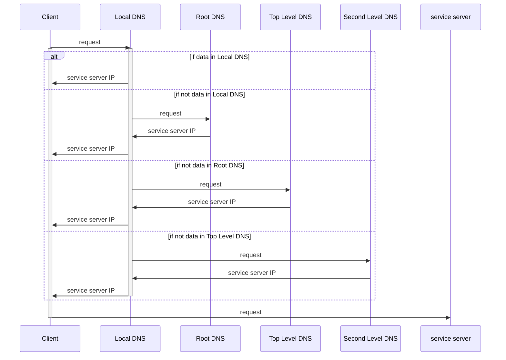
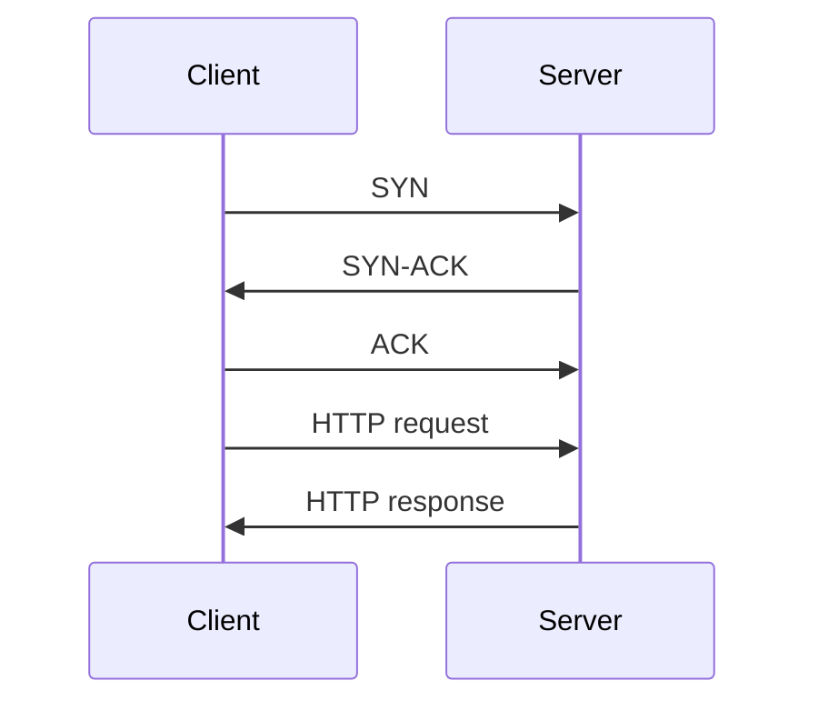
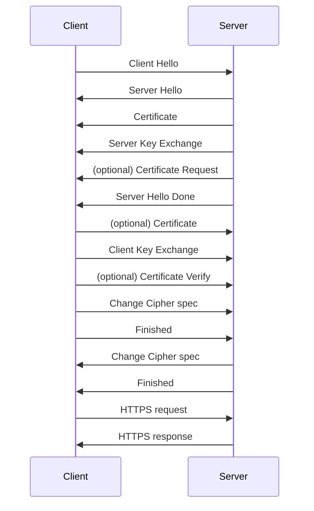
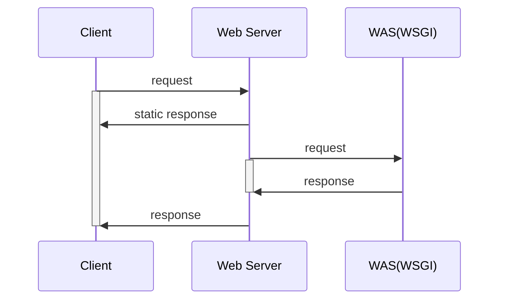

웹 환경에서 클라이언트와 서버의 통신 과정

<!-- more -->

---

## 1. DNS Recursive Query

클라이언트는 Local DNS로 검색 요청을 보내고, Local DNS 서버가 실제 서비스 서버의 IP를 탐색해서 알려주는 과정을 **DNS Recursive Query**라고 함

- Root DNS: 전 세계 영역을 다루는 DNS
- Top Level DNS: *.kr* 수준의 DNS
- Second Level DNS: *.co* 수준의 DNS

## 2. HTTP/HTTPS

HTTP 통신을 위해 TCP 헤더에 있는 SYN, ACK 비트를 통해 연결을 확인하는 과정을 **3-way handshake**라고 함

HTTPS 통신을 위해서는 보안 절차(HTTP Secure)가 포함된 **SSL handshake** 절차를 진행해야 함

- Client Hello: 사용할 암호화 알고리즘 목록(cipher sweet)과 난수, 세션 ID 등을 전송
- Server Hello: 암호화 알고리즘 중 사용할 알고리즘 선택 결과, 난수, 세션 ID 등을 전송
- Certificate: 인증서를 전송하며 암호화에 사용할 공개키 전송

## 3. Web Server/WAS

클라이언트가 서버로 요청을 보낼 경우 웹서버가 정적 요청을 처리하고, Web Application Server와 TCP/IP 통신을 통해 복잡한 로직을 처리하여 처리 결과를 회신함  

!!! note
    과거에는 웹서버가 클라이언트의 요청을 접수한 후에 복잡한 로직을 처리하기 위해 Common Gateway Interface(CGI)를 통해 고급언어로 작성된 프로그램을 실행하고 출력 결과를 회신하였음  
    그러나 가상 머신을 기반으로 실행되는 언어로 작성된 프로그램을 매 요청마다 새롭게 실행하는 것은 처리속도가 너무 느리기 때문에 해당 언어로 개발된 애플리케이션을 상시 실행해두는 Web Application Server(WAS), Web Server Gateway Interface(WSGI) 등의 방식이 개발됨  
