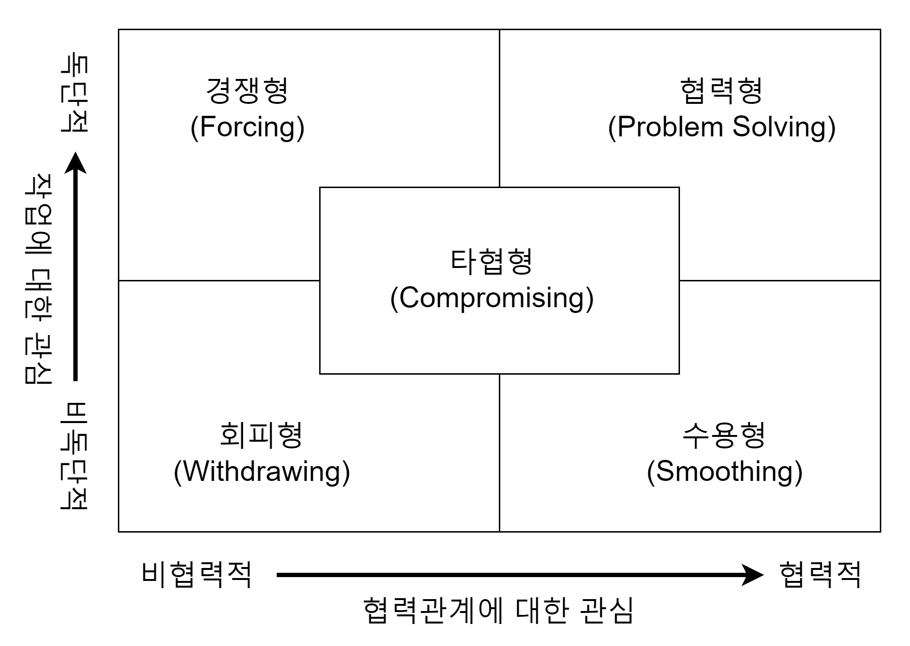

프로젝트 관리 방법 기초 정리  

<!-- more -->

---

## 1. 프로젝트 관리 영역

IT 프로젝트 관리는 기초적으로 아래 10개 영역에 대한 산출물을 통해 이루어진다.  

1. 통합관리
    - 프로젝트 총괄 관리
    - 각 영역의 계획과 활동이 유기적으로 결합되도록 조정
    - 프로젝트 헌장, 프로젝트 관리 계획서
1. 범위관리
    - 프로젝트 완료를 위한 작업 범위 확정
    - WBS(Work Breakdown Structure), 사업수행계획서, 요구사항 정의서, 요구사항 추적 매트릭스
1. 일정 관리
    - 납기준수를 위한 일정 관리
    - 프로젝트를 단위작업으로 분할하고 단위작업 별 일정산정
    - 일정 관리 계획서
1. 원가관리
    - 프로젝트 수행에 필요한 비용을 각 단위작업 별 할당 및 관리
    - 비용관리 계획서
1. 품질관리
    - 산출물이 요구사항을 충족하도록 기준을 설정하고 적합성 여부 관리
    - 품질보증 계획서, 관리/개발 산출표준양식, 형상관리 계획서, 검토결과서
1. 조달관리
    - 프로젝트 수행에 필요한 자원(인력, 장비, 자재 등) 확보 및 관리
    - 구매 및 조달방안 수립, RFI 및 RFP 작성, 제안서 검토
    - 제안 요청서(RFP), 입찰 안내서(RFI)
1. 자원관리
    - 프로젝트 투입 인력을 조직하고 업무를 할당하여 관리, 팀 구성, 개발 및 관리
    - 일정 관리 계획서
1. 의사소통관리
    - 이해당사자 간 효율적인 정보 전달체계를 계획, 조직 및 관리
    - 팀/고객과의 의사소통 관리
    - 착수 보고서, 주간/월간 업무 보고서, 단계 말 검토 보고서, 완료 보고서
1. 위험 관리
    - 발생 가능한 위험요인을 발견하고 분석하여 대책수립
    - 위험식별 및 통제방안 수립
    - 리스크 관리대장, 리스크 평가/대체 계획서
1. 이해관계자(Stakeholder) 관리
    - 팀/고객과의 프로젝트 성공을 위한 이해관계자 식별 및 관리, 참여 전략
    - 이해관계자 기록부

## 2. 갈등관리 전략

갈등관리 전략은 아래와 같은 5개 영역이 있다.  

{ loading=lazy }

- 경쟁형(Forcing)
    - 긴급하게 결정해야 할 경우, 최후의 수단
    - 인기가 없는 주요정책의 집행 시
    - 옳다고 믿는 주요안건의 집행 시
- 협력형(Problem Solving/confrontation)
    - 시간이 가장 많이 걸리는 갈등 해결 방법
    - 가장 좋은 방법 선택, 사소한 갈등, 원거리 팀원 사이 갈등이 있을 때
    - 매우 중요한 통합된 의견을 도출할 때
    - 남들의 의견을 들을 필요가 있을 때
    - 공감대를 형성하여 지속적인 관계유지의 필요가 있을 경우
- 회피형(Withdrawing)
    - 이슈가 사소할 경우
    - 자기의 의견을 관철할 가능성이 낮다고 판단될 때
    - 분위기를 식힐 필요가 있을 때
    - 추가정보의 수집이 필요할 때
    - 다른 그룹이 보다 효과적으로 갈등을 풀 수 있다고 느낄 때
    - 이슈가 다른 이슈의 징후라고 보여질 때
- 수용형(Smoothing)
    - 자기의 의견이 틀렸다고 느끼고 합리성이 있다는 것을 보여 줄 때
    - 이슈가 타 그룹에게 보다 중요한 사안일 때
    - 나중을 위하여 신용을 얻고자 할 때
    - 조화와 안정성이 매우 중요할 때
    - 상대가 실패를 통하여 배우는 것을 느끼게 할 때
- 타협형(Compromising)
    - 목표는 중요하나 더 이상 설득이 힘들다고 느낄 경우
    - 상호 배타적인 목표를 가진 집단들이 비슷한 파워를 가질 때
    - 복잡한 문제에 대하여 잠정적인 해결책을 도출할 때
    - 위의 두 가지가 실패할 경우의 백업,시간이 없을 때

## 3. 일정 관리 전략

### 3-1. 일정 관리 단계별 활동

일정 관리는 일반적으로 아래와 같은 단계 및 산출물을 통해 이루어진다.  

1. 일정 관리 계획수립
    - 프로젝트 일정을 기획/개발/관리/실행/통제하기 위한 방침과 절차를 수립하고 문서화하는 프로세스
    - 일정 관리 계획서
1. 활동 정의
    - 프로젝트 인도물을 산출하기 위해 수행할 활동들을 파악하는 프로세스
    - 활동 목록, 활동 속성, 마일스톤 목록
1. 활동순서배열
    - 프로젝트 활동 사이의 관계를 파악하여 문서화하는 프로세스
    - 일정 네트워크 다이어그램
1. 활동자원산정
    - 각 활동을 수행하는 데 필요한 자재, 사람, 장비, 공급품의 종류와 수량을 산정하는 프로세스
    - 활동자원 요구사항, 자원분류체계(RBS)
1. 활동기간산정
    - 산정된 자원으로 개별활동을 완료하는 데 필요한 작업기간 수를 산정하는 프로세스
    - 활동기간 산정치
1. 일정 개발
    - 활동 순서, 기간, 자원요구사항 및 일정 제약사항을 분석하여 프로젝트 일정 모델을 수립
    - 프로젝트 일정, 일정기준선, 프로젝트 역일표
1. 일정 통제
    - 프로젝트 상태를 감시, 프로젝트의 진척상황을 갱신, 일정 기준선에 대한 변경 관리
    - 작업성과정보, 일정예측치, 변경요청

!!! note
    활동자원산정, 활동기간산정은 활동 순서 배열과 동시기에 진행된다.  

### 3-2. 활동기간 산정 방법

- 전문가 판단
    - 충분한 정보가 없을 때 과거 유사 경험 근거 산정
    - 유사산정(Analogous estimating), 하향식 산정(Top-Down) 이라고도 함
- 유사산정
    - 과거 유사 프로젝트의 기간과 예산 실적을 근거로 산정
    - 프로젝트 초기 정보가 부족한 경우 사용
- 모수산정
    - 과거 실적 데이터를 기반으로 함수식을 만들어 산정
        ```
        활동기간 = (업무량 / 인당 생산성) / 투입인원
        ```
    - 정확성 향상 유의사항 : 모델 수립시 데이터의 품질 중요, 객관적 변수 측정, 일정한 신뢰성(규모, 유형별 차이 없어야함)
- PERT(3점 추정)
    - Program Evaluation and Review Technique
    - 3점 추정 방식으로 비관치, 낙관치, 실제 가능치 고려 공수산정
    - 산정에 대한 경험 부족, 개인적 요소 보정 하고자 할 때 사용
    - 액티비티 수행 기간 산정에 확률개념을 반영
    - 위험을 고려한 일정추정 기법
    - 평균공수
        ```
        T = {낙관치 + (4 * 실제 가능치) + 비관치} / 6
        ```
    - 개별공수 표준편차
        ```
        S = (비관치 - 낙관치) / 6
        ```
- CPM(1점 추정)
    - Critical Path Method
    - 이전 프로젝트 수행경험이 있거나, 경험적 자료가 있을 때 사용

### 3-3. 일정 지연의 원인

일반적인 일정 지연의 원인은 아래 종류들로 분류된다.  

- 학생 증후군
    - 시험이 코앞에 다가와야 열심히 공부함
- 파킨슨 법칙
    - 모든 작업은 주어진 기간을 모두 사용
    - 역설적으로 빨리 끝낼 수 있는 일도 먼저 완료하지 않음
- 자기 방어
    - 작업을 일찍 완료하면 다른 작업을 추가 시기키 때문에 작업 완료를 숨김
- 후행공정 작업준비 미흡
    - 일찍 작업을 완료하였어도 후속 작업이 준비가 되어 있지 않아 진행 불가

### 3-4. 일정 단축 기법

지연된 일정을 캐치업 방안으로는 **Crashing**과 **Fast tracking** 방법이 존재한다.  

- Crashing
    - 자원을 CP(Critical Path)상의 추가 투입하여 기간단축
    - CP중 비용 대비 효과가 높은 활동에 우선적 투입
    - 비용이 증가될 수 있음
- Fast tracking
    - 활동 혹은 단계(Phase)의 연관관계를 재조정하는 방법(병행 수행)
    - 완료된 세부적인 정보 없이 작업들이 수행될 수 있으므로 재작업(Rework)이 발행하여 위험이 증가 할 수 있음
- Resourcing Leveling
    - 특정 기간에 과부하된 자원(over-loaded resource)를 활용범위 안에 분포하도록 분산(load balancing)하는 작업

!!! info
    Resourcing Leveling은 일정 단축 기법은 아니지만, 실행 시 Fast tracking과 유사한 효과를 볼 수 있다.  

## 4. 위험 관리 전략

위험은 프로젝트의 정상적인 납기, 품질, 원가에 영향을 줄 수 있는 사건을 말한다. 위험 관리 목표는 프로젝트 위험의 조기 발견 및 대응과 프로젝트 위험을 최소화 시키며 위험을 회피하는 것으로, 총 위험 정도는 아래와 같이 산정한다.  

```
총 위험 = 위험발생 가능성 x 취약성 x 자산가치
```

위험과 이슈는 아래와 같은 차이로 구분된다.  

|   구분    | 위험                                                             | 이슈                                                            |
| :-------: | ---------------------------------------------------------------- | --------------------------------------------------------------- |
|   정의    | 원치 않는 결과를 초래하게 될 미래의 불확실한 사건이나 상황       | 현재 프로젝트에 장애나 영향을 끼치는 문제                       |
| 발견 시점 | 프로젝트 시작 전에 발견해서 관리하는 것을 목표(진행 중에도 발견) | 프로젝트 진행 도중에 발견                                       |
| 처리 시점 | 발견 후 당장 해결하지 않아도 프로젝트 진행                       | 발견되면 즉시 처리, 해결하지 못하면 프로젝트 진행에 차질 발생생 |

### 4-1. 위험 관리의 원칙

프로젝트 관리를 위한 위험 관리의 원칙은 아래와 같다.  

- 일관성(Consistency)
    - 위험 관리 체계에 대한 관점 통일
    - 관리방법의 일치
    - 감독주기/방법의 동일
- 개별성(Individuality)
    - 위험 관리 전략의 개별성 인정
    - 리스크 정도 차이에 따른 차별화 접근
    - 특화된 개별 방법론 존중
- 형평성(Balance)
    - 업종 간의 감독 방법 표준화
    - 감독 비율의 평준화
    - 도입기간 설정의 형평성

### 4-2. 위험 관리의 절차

위험 관리는 아래와 같은 절차로 이루어진다.  

1. 위험 관리 계획 수립
    - 프로젝트 전 단계에 걸친 위험 관리 활동의 접근 및 기획 방법을 결정
1. 위험 식별
    - 어떤 위험이 프로젝트에 영향을 미치는지 결정하고 각 위험의 특성을 문서화
1. 위험 분석의 계량화
    1. 정성적 위험 분석 수행
        - 식별된 위험이 프로젝트에 미치는 영향과 발생가능성을 정성적으로 평가하여 위험의 우선순위 결정
        - 위험의 영향 분석(Impact scale)은 프로젝트 목표에 대한 심각성을 반영
    1. 정량적 위험 분석 수행
        - 프로젝트 목표에 대한 위험의 확률 및 결과를 측정하고 이들의 연관관계(implication) 추정
        - 도구/기법: 민감도 분석, 인터뷰(원가산정치/범위), 시뮬레이션
1. 위험 대응 계획 수립
    - 프로젝트 목표에 대한 기회를 증진시키고 위협을 감소시키기 위한 절차 및 기술 개발
1. 위험 통제
    - 프로젝트 전반에서 위험대응 계획을 실행하고, 식별된 위험을 추적하고 잔존 위험을 감시하며 새로운 위험을 식별, 감소 계획 수행 및 영향 평가

### 4-3. 위험 분석 계량화 방법

위험 분석 계량화 중 정성적 위험 분석 방법은 아래와 같다.  

- 위험확률-영향평가
    - 위험 확률 평가에서는 특정 위험별 발생확률을 조사
- 확률-영향 매트릭스
    - 위험 등급에 따라 추가 정량적 분석 및 대응
- 위험 자료의 품질평가
    - 신뢰할 수 있는 정성적 위험 분석이 되려면, 정확하고 공정한 자료가 필요
- 위험범주분류
    - 프로젝트 위험을 위험의 근원 영향을 받는 프로젝트 또는 기타 유용한 범주
- 위험 긴급성평가
    - 우선순위 지표에는 위험 대응이 영향을 미치는 시간, 징후, 경고신호, 위험 등급이 포함
- 전문가판단
    - 각 위험의 확률 및 영향을 평가하여 매트릭스에서 해당 위치를 결정하는데 전문가 판단이 필요

위험 분석 계량화 중 정량적 위험 분석 방법은 아래와 같다.  

- 데이터 수집 및 표현 기법
    - 인터뷰
        - 경험 및 선례 자료에 의존
    - 확률분포
        - 프로젝트 구성요소의 원가 등의 값에서 불확실성을 표현
        - 베타분포, 삼각분포
- 위험 분석 및 모델링 기법
    - 민감도 분석
        - 민감도 분석은 프로젝트에 잠재적 영향력이 가장 큰 위험을 결정
    - 금전적 기대값 분석
        - 향후 발생할지 여부를 알 수 없는 시나리오가 수반될 때 평균적인 결과 산출
        - 기회는 양수, 위험의 EMV는 음수
    - 모델링 및 시뮬레이션
        - 상세한 수준에서 지정된 프로젝트 불확실성을 프로젝트 목표에 대한 잠재적 영향으로 환산하는 모델
        - 몬테 카를로(Monte Carlo) 시뮬레이션
    - 전문가 판단
        - 원가 및 일정에 대한 잠재적 영향 식별, 확률 평가, 투입물(확률분포 등) 정의하는데 전문가 판단

### 4-4. 위험 대응 계획

위험 대응은 아래와 같이 우선순위 맵을 활용하여 위험의 영향력과 발생 가능성을 기준으로 위험에 대한 대응 계획을 수립 한다.  

| 영향력\발생가능성 |         저         |     고     |
| :---------------: | :----------------: | :--------: |
|        고         | Analysis & Inspect |  Control   |
|        저         |     Assessment     | Monitoring |

### 4-5. 위험 대응 전략

- 부정적 위험/위협 대응 전략
    - 회피(Avoidance): 위험이 너무 커서 계획 변경을 통해 위험을 회피
    - 전가(Transference): 리스크 발생 결과 및 대응의 주체를 제 3자에게 이전(보험)
    - 완화(Mitigation): 위험의 가능성 혹은 크기를 낮추어 노출도 관리
    - 수용(Acceptance): 프로젝트로부터 모든 리스크를 제거할 수 없으므로 수용 전략 대응(수동적 전략)
- 긍정적 위험/기회 대응
    - 활용(Exploitation): 기회요소가 절대적으로 발생하도록 좋은 면의 리스크와 연관된 불확실성을 제거
    - 공유(Share): 그 기회를 잘 포착할 수 있는 제 3자에게 소유권 확장
    - 강화(Enhancement): 긍정적 영향/확률 증가, 기회의 원인을 촉진/강화하는 방안 모색, 상황을 유발하는 요인(Trigger)의 강화

### 4-6. 위험 관리 고려 사항

- 위험관리 시기: 프로젝트 **전 공정(Life-Cycle)** 기간(**초기 식별**이 중요)
- 위험이 살아있으므로 지속적인 관리가 필요
- 복합적인 위험은 나누어서 관리(Divide & Conquer)
- 초기에 위험이 많지만 영향이 적고, 말기에는 개수는 적지만 영향이 큼
- 조직 정책에 의해 수행되고, 문서화 및 계획이 필요
- 위험관리는 책임 있고 훈련된 요원에 의해 수행되어야 하며, 적절한 교정활동이 필요
- 위험은 대응 계획에 따라 효과적으로 해결하고, 파생위험(Secondary Risks)과 같은 부수 위험을 동반하므로 지속적인 관리필요
- Contingency Reserve는 프로젝트 예산에 포함되지만 Management Reserve(예비비)는 프로젝트 예산 버퍼를 이용하여 해결
- 모든 위험은 제거를 목표로 하는 것이 아니므로, 대응계획 수립 이후에도 줄어들지 않은 **잔여 위험(Residual Risk)**에 대한 지속적인 관리 필요