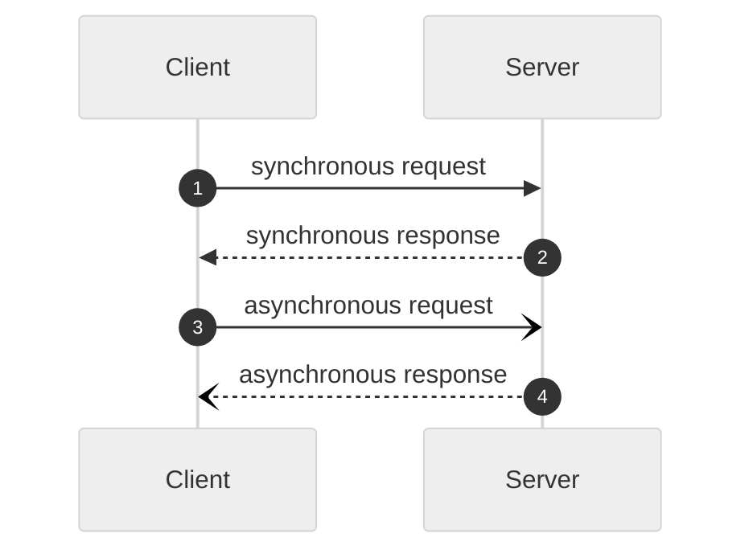
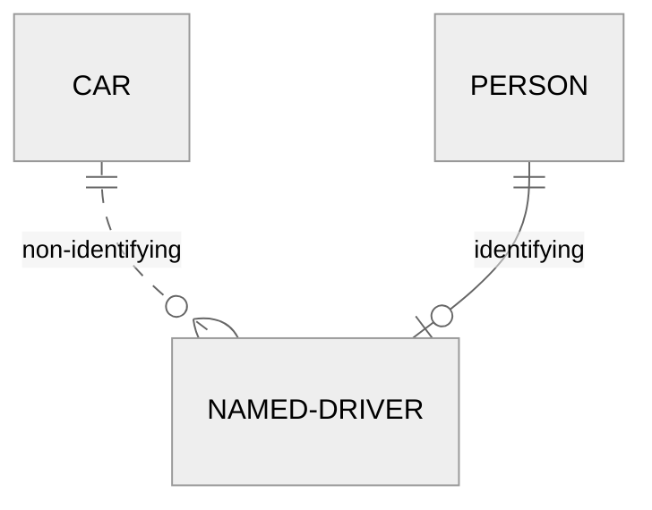
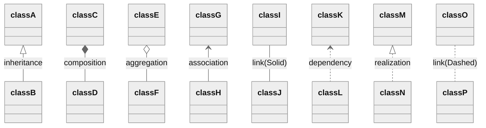

헷갈리는 UML 표기법 정리  

<!-- more -->

---

## Sequence Diagram

시퀀스 다이어그램의 경우 화살표 및 연결선의 모양에 따라 의미가 달라진다.  

- 화살표: 동기/비동기 여부
    - 일반 화살표: 동기 처리
    - 열린 화살표: 비동기 처리
- 연결선: 호출/응답 관계
    - 점선: 호출
    - 실선: 응답



## ER Diagram

ERD의 경우 연결선의 형태로 [식별자관계와 비식별자관계](./2022-08-06-entity_relationship_model.md/#4-5-식별자관계와-비식별자관계)를 구분할 수 있다.  

- 실선: 식별자관계
- 점선: 비식별자관계



## Class Diagram

클래스 다이어그램의 경우 연결선 및 연결점의 형태에 따라 상속(Inheritance), 조합(Composition), 의존(Dependency), 구현(Realization/Implementation) 등의 관계를 구분할 수 있다.  



??? note "Java로 작성한 실제 예시"

    ```mermaid
    ---
    config:
        theme: 'neutral'
    ---
    classDiagram
        House *-- Room : composition
        class House

        class Room
        
        class Engine
        
        Car --> Engine : association
        class Car
        
        Garage o-- Car : aggregation
        class Garage

        Driver ..> Car : dependency
        Vehicle <|.. Car : realization
        class Driver
        
        class Vehicle
        
        class Animal
        
        Animal <|-- Dog : inheritance
        class Dog
    ```

    각 기호별 실제 코드 예시는 아래와 같다.(헤드 위치 주의)  

    ```java
    public abstract class Animal {
        
        public abstract void makeSound();
    }
    ```

    ```java
    public class Dog extends Animal {  // Inheritance: Dog extends Animal
        
        @Override
        public void makeSound() {
            System.out.println("Woof!");
        }
    }
    ```

    ```java
    @Data
    @AllArgsConstructor
    public class Room {

        private String name;
    }
    ```

    ```java
    public class House {
        
        private List<Room> rooms = new ArrayList<>();  // Composition: rooms die with house
        
        public House() {
            rooms.add(new Room("Living Room"));
            rooms.add(new Room("Bedroom"));
        }
        
        public void showRooms() {
            rooms.forEach(it -> System.out.println("Room: " + it.getName()));
        }
    }
    ```

    ```java
    public interface Vehicle {

        void drive();
    }
    ```

    ```java
    public class Engine {
        
        public void start() {
            System.out.println("Engine starting...");
        }
    }
    ```

    ```java
    @AllArgsConstructor
    public class Car implements Vehicle {  // Realization: Car implements Vehicle
        
        private Engine engine;  // Association: Car has Engine
        
        public void drive() {
            engine.start();
            System.out.println("Car is driving...");
        }
    }
    ```

    ```java
    @AllArgsConstructor
    public class Garage {
        
        private List<Car> cars;  // Aggregation: cars can exist without garage
        
        public void showCars() {
            cars.forEach(Car::drive);
        }
    }
    ```

    ```java
    public class Driver {
        
        public void testDrive(Car car) {  // Dependency: Driver uses Car temporarily
            car.drive();
        }
    }
    ```

!!! info "의존관계 비교"
    - Association: 단순 참조 관계
    - Aggregation: 객체가 삭제되더라도 구성 객체는 삭제되지 않음
    - Composition: 객체가 삭제될 때 구성 객체들도 같이 삭제 됨
    - Dependency: 객체가 다른 객체를 임시로 이용함

    다만 Association/Aggregation은 의미적인 차이이지 명확한 구분이 있는 것이 아니기 때문에 아래와 같이 Association 이면서 Aggregation인 관계도 있을 수 있다.  

    ```mermaid
    ---
    config:
        theme: 'neutral'
    ---
    classDiagram
        direction LR
        Whole *--> Part : aggregation/association
        class Whole

        class Part
    ```

접근제한자의 경우 아래와 같은 규칙에 따라 표기한다.  

- `+`: `public`
- `-`: `private`
- `#`: `protected`
- `~`: `default`

---
## Reference
- [OMG (2011). OMG Unified Modeling Language (OMG UML), Superstructure, V2.4.1, p. 507.](https://www.omg.org/spec/UML/2.4.1/Superstructure/PDF)
