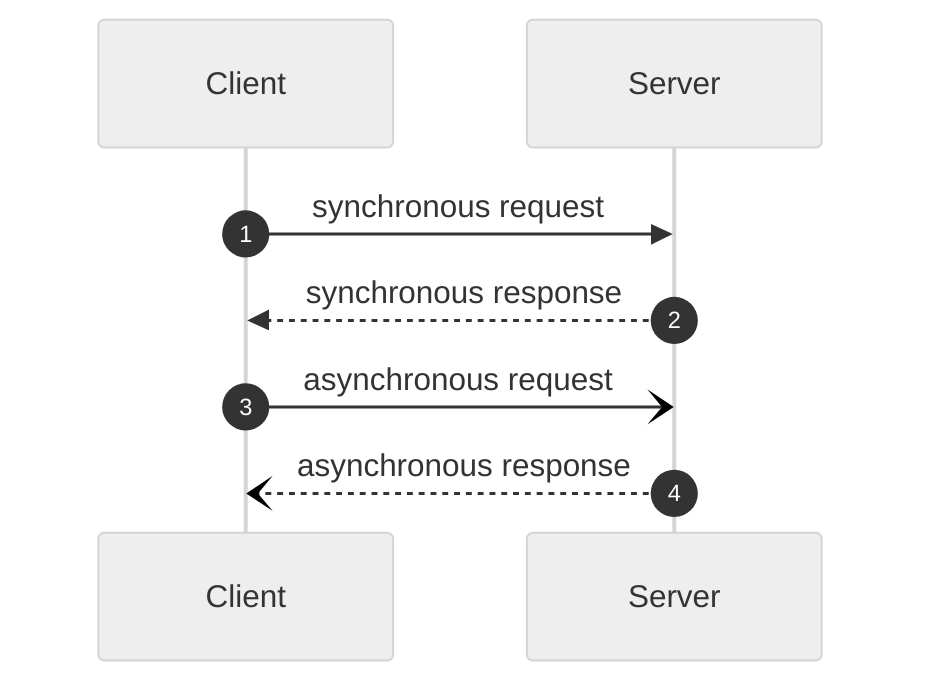
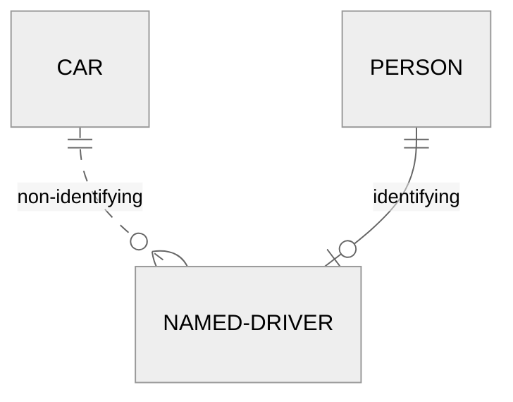
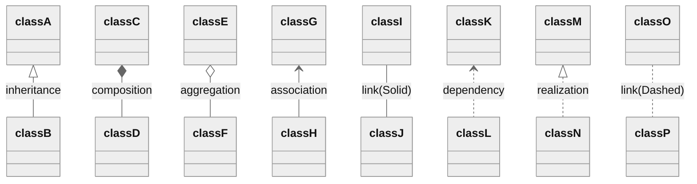

헷갈리는 UML 표기법 정리  

<!-- more -->

---

## Sequence Diagram

시퀀스 다이어그램의 경우 화살표 및 연결선의 모양에 따라 의미가 달라진다.  

- 화살표: 동기/비동기 여부
    - 일반 화살표: 동기 처리
    - 열린 화살표: 비동기 처리
- 연결선: 호출/응답 관계
    - 점선: 호출
    - 실선: 응답

## ER Diagram

ERD의 경우 연결선의 형태로 [식별자관계와 비식별자관계](./2022-08-06-entity_relationship_model.md/#4-5-식별자관계와-비식별자관계)를 구분할 수 있다.  

- 실선: 식별자관계
- 점선: 비식별자관계

## Class Diagram

클래스 다이어그램의 경우 연결선 및 연결점의 형태에 따라 상속(Inheritance), 조합(Composition), 의존(Dependency), 구현(Realization) 등의 관계를 구분할 수 있다.  

접근제한자의 경우 아래와 같은 규칙에 따라 표기한다.  

- `+`: `public`
- `#`: `protected`
- `~`: `default`
- `-`: `private`

---
## Reference
- [OMG (2011). OMG Unified Modeling Language (OMG UML), Superstructure, V2.4.1, p. 507.](https://www.omg.org/spec/UML/2.4.1/Superstructure/PDF)
