Java Throwable 커스텀 방법  

<!-- more -->

---

## Java 에러 기초

자바의 에러는 크게 Error와 Exception, Checked Error와 UnChecked Error로 나누어진다.  

- Error / Exception
    - Error는 애플리케이션에서 처리하려고 할 필요가 없는 심각한 수준의 에러를 의미
    - Exception는 애플리케이션에서 처리를 고려해야 하는 수준의 예외 상황을 의미
- Checked / Unchecked
    - Checked Error: 초록색으로 표시. 컴파일 타임에서 처리 여부 검사
    - UnChecked Error: 빨간색으로 표시. 컴파일 타임에서 처리 여부 미검사

Java의 에러는 기초적으로 아래와 같은 구조로 설계되어 있다.[^1]  

[^1]: 당연한 말이지만, 아래 그림에 표시되지 않은 다양한 에러들이 많다.  

```mermaid
---
title: Java Throwable Hierarchy
config:
    class:
        hideEmptyMembersBox: true
    theme: 'neutral'
---
classDiagram
    class Object
    style Object fill:#fff

    Object <|-- Throwable
    class Throwable
    style Throwable fill:#cfc,stroke:#fff

    Throwable <|-- Error
    class Error
    style Error fill:#fcc,stroke:#fff

    Error <|-- ThreadDeath
    class ThreadDeath
    style ThreadDeath fill:#fcc,stroke:#fff

    Error <|-- VirtualMachineError
    class VirtualMachineError
    style VirtualMachineError fill:#fcc,stroke:#fff

    VirtualMachineError <|-- OutOfMemoryError
    class OutOfMemoryError
    style OutOfMemoryError fill:#fcc,stroke:#fff

    VirtualMachineError <|-- StackOverFlowError
    class StackOverFlowError
    style StackOverFlowError fill:#fcc,stroke:#fff

    Error <|-- IOError
    class IOError
    style IOError fill:#fcc,stroke:#fff
    
    Throwable <|-- Exception
    class Exception
    style Exception fill:#cfc,stroke:#fff

    Exception <|-- RunTimeException
    class RunTimeException
    style RunTimeException fill:#fcc,stroke:#fff
    
    RunTimeException <|-- NullPointException
    class NullPointException
    style NullPointException fill:#fcc,stroke:#fff
    
    RunTimeException <|-- ArithmeticException
    class ArithmeticException
    style ArithmeticException fill:#fcc,stroke:#fff
    
    RunTimeException <|-- ClassCastException
    class ClassCastException
    style ClassCastException fill:#fcc,stroke:#fff
    
    RunTimeException <|-- IllegalArgumentException
    class IllegalArgumentException
    style IllegalArgumentException fill:#fcc,stroke:#fff
    
    IllegalArgumentException <|-- NumberFormatException
    class NumberFormatException
    style NumberFormatException fill:#fcc,stroke:#fff
    
    RunTimeException <|-- IndexOutOfBoundsException
    class IndexOutOfBoundsException
    style IndexOutOfBoundsException fill:#fcc,stroke:#fff
    
    IndexOutOfBoundsException <|-- ArrayIndexOutOfBoundsException
    class ArrayIndexOutOfBoundsException
    style ArrayIndexOutOfBoundsException fill:#fcc,stroke:#fff

    Exception <|-- SQLException
    class SQLException
    style SQLException fill:#cfc,stroke:#fff

    Exception <|-- ClassNotFoundException
    class ClassNotFoundException
    style ClassNotFoundException fill:#cfc,stroke:#fff

    Exception <|-- ClassNotSupportedException
    class ClassNotSupportedException
    style ClassNotSupportedException fill:#cfc,stroke:#fff

    Exception <|-- IOException
    class IOException
    style IOException fill:#cfc,stroke:#fff

    IOException <|-- EOFException
    class EOFException
    style EOFException fill:#cfc,stroke:#fff

    IOException <|-- FileNotFoundException
    class FileNotFoundException
    style FileNotFoundException fill:#cfc,stroke:#fff

    IOException <|-- MalformedURLException
    class MalformedURLException
    style MalformedURLException fill:#cfc,stroke:#fff

    IOException <|-- UnknownHostException
    class UnknownHostException
    style UnknownHostException fill:#cfc,stroke:#fff
```



## 에러 메세지 추가 방법

에러에 특정 메세지가 출력되도록 하고 싶을 경우 아래와 같이 원하는 문구를 넣어주면 된다.  

```java
public class Main {
    public static void main(String[] args) {
        throw new RuntimeException("My Error Message");
    }
}
```
```
Exception in thread "main" java.lang.RuntimeException: My Error Message
```

참고로 아래와 같이 `getMessage` 메서드를 통해 에러 메세지만 출력할 수 있다.  

```java
public class Main {
    public static void main(String[] args) {
        try {
            throw new RuntimeException("My Error Message");
        } catch (RuntimeException e) {
            System.out.println(e.getMessage());
        }
    }
}
```
```
> Task :com.example.Main.main()
My Error Message
```

스택 트레이스를 출력하고 싶을 경우 아래와 같이 `printStackTrace()` 메서드를 사용하면 된다.  

```java
public class Main {
    public static void main(String[] args) {
        try {
            throw new RuntimeException("My Error Message");
        } catch (RuntimeException e) {
            e.printStackTrace(System.err);
        }
    }
}
```
```
java.lang.RuntimeException: My Error Message
    at com.example.Main.main(Main.java:8)
```

## 커스텀 에러 만들기

개발을 하다보면 특정 상황에 대해 에러를 일으켜야 할 경우가 있다. 이 때 아래와 같이 커스텀 에러를 만들어 사용한다면 다양한 상황에 대해 유연하게 대처할 수 있다.  

```java
public class CustomException extends RuntimeException {
    public CustomException(String message) {
        super(message);
    }
    
    public CustomException(String message, Throwable cause) {
        super(message, cause);
    }
}
```
```java
public class Main {
    public static void main(String[] args) {
        try {
            throw new CustomException("My Custom Error");
        } catch (CustomException e) {
            System.out.println(e.getMessage());
        }
    }
}
```
```
> Task :com.example.Main.main()
My Custom Error
```

```java
public class Main {
    public static void main(String[] args) {
        try {
            throw new CustomException("My Custom Error", new RuntimeException());
        } catch (CustomException e) {
            System.out.println("cause: %s".formatted(e.getCause()));
            System.out.println("message: %s".formatted(e.getMessage()));
        }
    }
}
```
```
cause: java.lang.RuntimeException
message: My Custom Error
```
