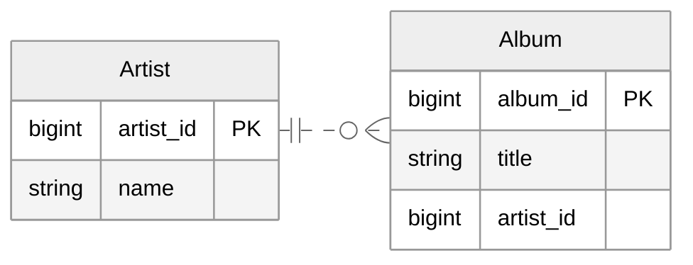

[SQL JOIN](./2022-08-14-sql_join.md)의 주의점과 활용

<!-- more -->

---

## `JOIN` 시 주의점

1:N 관계의 테이블을 `JOIN`한 결과 테이블은 1쪽의 테이블 데이터에 중복 행이 발생하게 된다. 가령 아래와 같은 1:N 관계의 테이블을 예시로 들어보자.



이런 관계에서 아래와 같이 `JOIN` 하게 되면, 결과 테이블에는 `Artist` 테이블의 데이터가 중복되서 출력된다.  

```sql
SELECT *
FROM Artist a 
INNER JOIN Album a2 ON a.artist_id = a2.artist_id;
```
```
artist_id|name           |album_id|title                                  |
---------+---------------+--------+---------------------------------------+
        1|AC/DC          |       1|For Those About To Rock We Salute You  |
        1|AC/DC          |       4|Let There Be Rock                      |
        2|Accept         |       2|Balls to the Wall                      |
        2|Accept         |       3|Restless and Wild                      |
       22|Led Zeppelin   |      30|BBC Sessions [Disc 1] [Live]           |
       22|Led Zeppelin   |      44|Physical Graffiti [Disc 1]             |
       22|Led Zeppelin   |     127|BBC Sessions [Disc 2] [Live]           |
       22|Led Zeppelin   |     128|Coda                                   |
       22|Led Zeppelin   |     129|Houses Of The Holy                     |
       22|Led Zeppelin   |     130|In Through The Out Door                |
       22|Led Zeppelin   |     131|IV                                     |
       22|Led Zeppelin   |     132|Led Zeppelin I                         |
       22|Led Zeppelin   |     133|Led Zeppelin II                        |
       22|Led Zeppelin   |     134|Led Zeppelin III                       |
       22|Led Zeppelin   |     135|Physical Graffiti [Disc 2]             |
       22|Led Zeppelin   |     136|Presence                               |
       22|Led Zeppelin   |     137|The Song Remains The Same (Disc 1)     |
       22|Led Zeppelin   |     138|The Song Remains The Same (Disc 2)     |
       50|Metallica      |      35|Garage Inc. (Disc 1)                   |
       50|Metallica      |     148|Black Album                            |
       50|Metallica      |     149|Garage Inc. (Disc 2)                   |
       50|Metallica      |     150|Kill 'Em All                           |
       50|Metallica      |     151|Load                                   |
       50|Metallica      |     152|Master Of Puppets                      |
       50|Metallica      |     153|ReLoad                                 |
       50|Metallica      |     154|Ride The Lightning                     |
       50|Metallica      |     155|St. Anger                              |
       50|Metallica      |     156|...And Justice For All                 |
       51|Queen          |      36|Greatest Hits II                       |
       51|Queen          |     185|Greatest Hits I                        |
       51|Queen          |     186|News Of The World                      |
       52|Kiss           |      37|Greatest Kiss                          |
       52|Kiss           |     126|Unplugged [Live]                       |
       53|Spyro Gyra     |      38|Heart of the Night                     |
       53|Spyro Gyra     |     204|Morning Dance                          |
       54|Green Day      |      39|International Superhits                |
       54|Green Day      |      89|American Idiot                         |
```

!!! warning
    `OUTER JOIN`에서 `LEFT`, `RIGHT`로 기준 테이블을 설정하는 것은 **다른 한 쪽에 매칭되는 행이 없을 경우 행을 보존할 테이블을 설정**하는 것 뿐이지 기준 테이블에 다른 테이블을 붙이는 엑셀의 `VLOOKUP`을 생각하면 안 된다.  

이를 활용하면 아래와 같이 N쪽 관계에 있는 테이블의 정보를 활용해서 1쪽 테이블의 행을 추출할 수 있다.  

```sql
SELECT DISTINCT a.artist_id, a.name
FROM Artist a 
INNER JOIN Album a2 ON a.artist_id = a2.artist_id 
WHERE a2.title LIKE '%greatest%';
```
```
artist_id|name             |
---------+-----------------+
       51|Queen            |
       52|Kiss             |
       78|Def Leppard      |
      100|Lenny Kravitz    |
      109|Mötley Crüe      |
      131|Smashing Pumpkins|
      141|The Police       |
```
