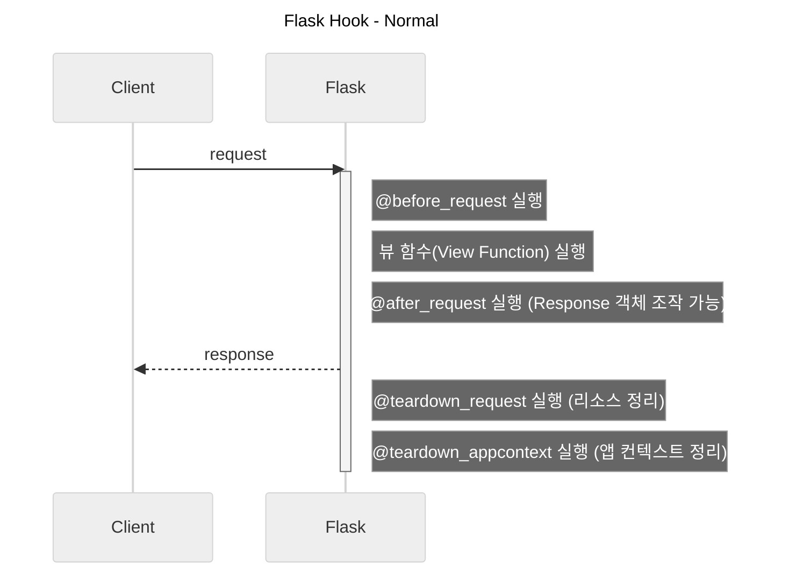
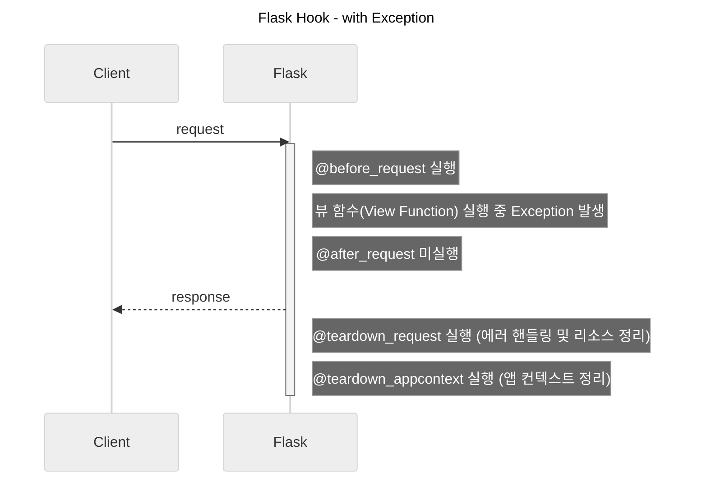

Flask에서 [FastAPI](/blog/category/fastapi/)의 `middleware`나 [Spring](/blog/category/spring/)의 `Filter`, `Interceptor`처럼 애플리케이션의 횡단 관심사에 대한 처리를 일괄적으로 적용해 관점 지향 프로그래밍(Aspect Oriented Programming)을 할 수 있도록 도와주는 Hook에 대해 정리해보았다.  

<!-- more -->

---

사실 FastAPI가 등장한 이후로 Python 서비스 개발에 Flask를 잘 사용하지는 않는데, 업무상 FastAPI가 등장하기 전에 개발되고 Python 버전업이 불가능한 프로그램을 다룰 일이 있어 어쩔 수 없이 Flask를 사용하는 경우가 있다.  

## Hook 비교

### `before_request`

- 시점: 매 요청이 들어올 때 **뷰 함수(`Route`)가 실행되기 직전**에 호출
- 특징: 만약 `@before_request` 함수가 `None`이 아닌 특정 응답(예: `redirect`나 `jsonify`)을 반환하면, 그 즉시 요청 처리를 중단하고 해당 응답을 클라이언트에 회신하고 실제 뷰 함수 미실행
- 주의: `@after_request`는 이 단계에서 응답 리턴하더라도 정상 실행됨
- 주요 용도: 인증/인가 체크, 요청 로깅, DB 커넥션 오픈

### `after_request`

- 시점: 뷰 함수가 **에러 없이 정상적으로 응답을 생성한 직후**에 실행
- 특징: 반드시 매개변수로 `response` 객체를 받아야 하며, 최종적으로 `response` 객체를 반환해야 함. 응답 헤더를 추가하거나 세션을 수정할 수 있음
- 주의: 뷰 함수나 `@before_request`에서 에러(`Exception`)가 발생하면 실행되지 않음
- 주요 용도: 헤더 추가(CORS 등), 쿠키 설정, 응답 로깅

### `teardown_request`

- 시점: 요청 컨텍스트(`Request Context`)[^1]가 해제되는 가장 마지막 순간에 실행
- 특징: 이미 **클라이언트에게 응답이 전송된 후**이기 때문에 응답을 조작할 수 없음. 에러 발생 여부와 상관없이 무조건 실행되므로, 안전하게 리소스를 정리(Clean-up)할 때 사용
- 인자: 함수의 인자로 에러 객체(`exception`)을 받음. 에러 없이 정상 종료되었다면 `None`이 전달됨
- 주요 용도: DB 커넥션 반환(Close), 리소스 해제

[^1]: '단 하나의 HTTP 요청'을 처리하는 동안만 유지되는 scope. 특정 요청의 URL, HTTP 메서드(GET/POST), 헤더, 세션, 쿠키 등 웹 요청과 직접적으로 관련된 데이터를 관리. 요청이 들어올 때 생성되고 응답이 나가면 해제

### `teardown_appcontext`

- 시점: 애플리케이션 컨텍스트(`Application Context`)[^2]가 해제될 때 실행
- 특징: `teardown_request`와 유사하지만 범위가 다름. Flask에서 `Request`가 처리될 때는 `Request Context`와 `App Context`가 모두 생성되는데, 요청이 끝나면 둘 다 해제됨. 따라서 일반적인 웹 요청 프로세스에서는 `teardown_request` 직후에 실행
- 차이점: 웹 요청 프로세스 외에 CLI 명령(flask run이 아닌 커스텀 명령어)이나 스크립트 실행 환경처럼 '요청은 없지만 Flask `App Context`만 켜졌다 꺼지는 상황'에서도 무조건 실행됨
- 주요 용도: 전역 리소스 해제, 확장 플러그인 정리

[^2]: 애플리케이션 수준의 전역 데이터를 저장하는 scope. Flask 앱이 구동되는 모든 순간에 필요한 전역 정보(설정값, DB 커넥션 등) 관리

## 실행 순서

정상적인 `Request` 처리 시 실행 흐름은 아래와 같다.  



뷰 함수에서 `Exception` 발생 시 실행 흐름은 아래와 같다.  



## 예시

Flask에서 `hook`을 사용해서 logging에 `TraceId`를 부여하는 예시 코드는 아래와 같다.  

```python title="log.py"
import logging
from logging import Filter, LogRecord

from flask import g


class TraceIdFilter(Filter):
    def filter(self, record: LogRecord):
        # g 객체에 trace_id가 있으면 사용하고, 없으면 'N/A' 표기
        record.trace_id = getattr(g, "trace_id", "N/A")
        return True


logging.basicConfig(
    level=logging.INFO,
    format="[%(asctime)s] [%(levelname)s] [%(trace_id)s] %(message)s"
)
logger = logging.getLogger(name="logger")
logger.addFilter(TraceIdFilter())
```

```python title="hook.py"
from uuid import uuid4

from flask import Flask, request, g

from log import logger

app = Flask(__name__)


# Before Request Hook: 요청이 들어올 때 고유 ID 생성 및 로깅
@app.before_request
def start_request():
    # 클라이언트가 헤더에 X-Trace-Id를 보냈다면 재사용, 없다면 새로 생성 (MSA 구조에서 유용)
    trace_id = request.headers.get("X-Trace-Id", uuid4().hex[:8])
    
    # Flask g 객체에 저장하여 요청이 끝날 때까지 유지
    g.trace_id = trace_id
    
    # 요청 시작 로그
    logger.info(f"Started {request.method} {request.path} from {request.remote_addr}")


# After Request Hook: 요청이 정상 종료될 때 로그 남기기 및 헤더에 Trace-Id 첨부
@app.after_request
def end_request(response):
    # 요청 종료 로그 (상태 코드 포함)
    logger.info(f"Finished {request.method} {request.path} - Status: {response.status_code}")
    
    # 클라이언트 응답 헤더에도 Trace-Id를 내려주어 추적을 용이하게 함
    response.headers["X-Trace-Id"] = getattr(g, "trace_id", "N/A")
    return response
```

---
## Reference
- [Flask API](https://flask.palletsprojects.com/en/stable/api/)
