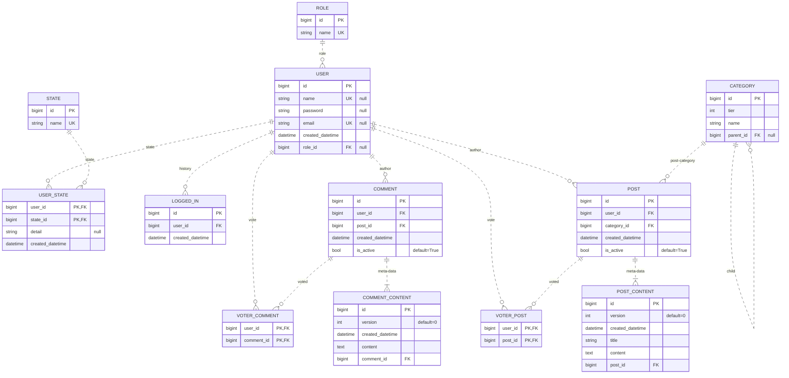
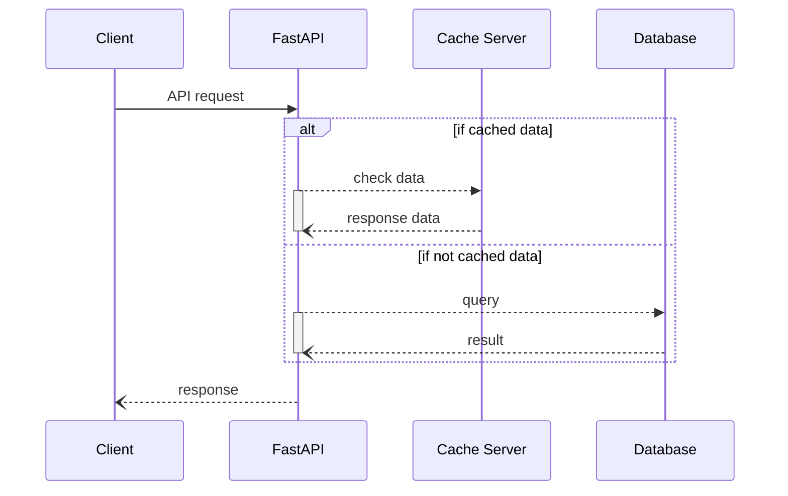

## FastAPI

[Github 저장소 링크](https://github.com/djccnt15/fastapi_board)

### 기술 스택

- 백엔드 서버 구성: 
{ loading=lazy }
{ loading=lazy }
{ loading=lazy }
- 데이터베이스: 
{ loading=lazy }
- 캐시 서버: 
{ loading=lazy }
- 모니터링: 
{ loading=lazy }
{ loading=lazy }
- 배포: 
{ loading=lazy }

### 서비스 설명

- 서버 가용성 확보를 위한 비동기 처리 적용
- 유지보수 용이성 및 기능 확장성 확보를 위한 설계 적용
    - 도메인 주도의 레이어드 아키텍처
    - 헥사고날 아키텍처(port - adapter 패턴)
- JWT 기반 로그인 기능
- 데이터베이스 부하를 줄이기 위한 캐시 서버(cache aside 패턴) 활용
- 서버 상태 측정을 위한 Prometheus, API 호출과 처리 결과 로깅을 위한 ELK 스택 적용
- 배포를 위한 docker 컨테이너화

## 아키텍처

### 시스템 아키텍처

### DB 설계

### 캐시 패턴

DB 호출 빈도가 가장 높은 API에 [Cache Aside 패턴](../blog/posts/2023-12-23-cache_pattern.md/#cache-aside-pattern)을 활용한 캐싱 적용

- 유저 정보 API
- 게시글 내용 API

