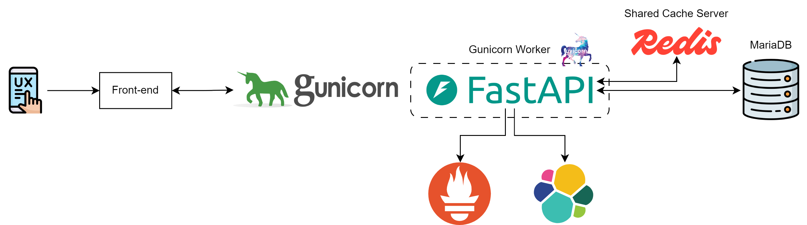
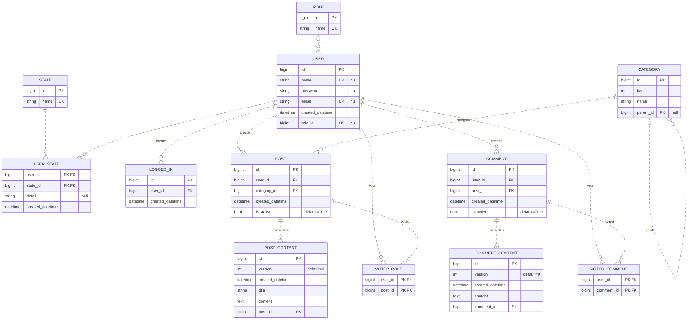
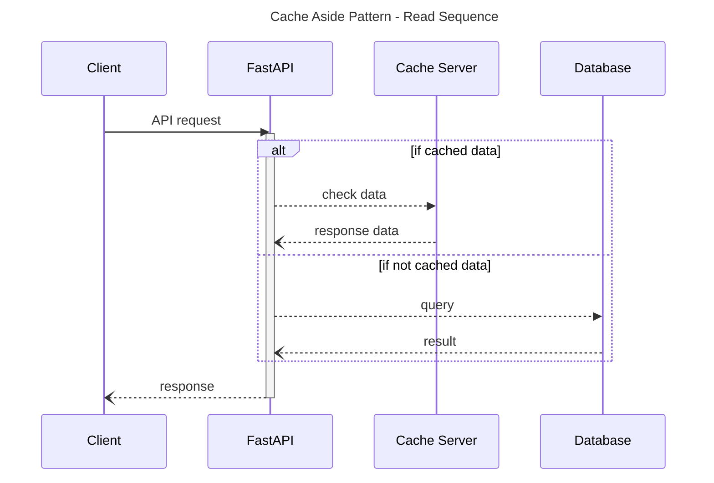

## FastAPI

[GitHub 저장소 링크](https://github.com/djccnt15/fastapi_board)

### 기술 스택

- 백엔드 서버 구성: 
{ loading=lazy }
{ loading=lazy }
{ loading=lazy }
- 데이터베이스: 
{ loading=lazy }
- 캐시 서버: 
{ loading=lazy }
- 모니터링: 
{ loading=lazy }
{ loading=lazy }
- 배포: 
{ loading=lazy }

### 서비스 설명

- 절차적 프로그래밍을 기반으로 한 도메인 주도의 레이어드 아키텍처 구성을 통해 코드 가독성 확보

    ??? note "레이어드 아키텍처 기반의 API 코드 설계 샘플"

        ```python title="user_controller.py"
        from typing import Annotated

        from fastapi import APIRouter, Body, Depends
        from fastapi.security import OAuth2PasswordRequestForm

        router = APIRouter(prefix="/user")


        @router.post(path="", status_code=status.HTTP_201_CREATED)
        async def create_user(
            repo: dependency.UserRepo,
            body: Annotated[user_request.UserCreateRequest, Body()],
        ) -> ResponseEnum:
            """
            - one email can be used by only one user
            - username cannot be used if one is occupied
            - PW1 and PW2 mush be same
            """
            await user_process.create_user(repo=repo, data=body)
            return ResponseEnum.CREATE
        ```

        ```python title="user_process.py"
        async def create_user(
            *,
            repo: ports.UserRepository,
            data: user_request.UserCreateRequest,
        ) -> None:
            await verify_logic.verify_user_create(repo=repo, data=data)
            await user_logic.create_user(repo=repo, data=data)
        ```

        ```python title="verify_logic.py"
        async def verify_user_create(
            *,
            repo: ports.UserRepository,
            data: user_request.UserCreateRequest,
        ) -> None:
            user_list = await repo.read_user_by_name_email(name=data.name, email=data.email)

            username_conflict = [u for u in user_list if data.name == u.name]
            if username_conflict:
                raise NotUniqueError(field=data.name)

            email_conflict = [u for u in user_list if data.email == u.email]
            if email_conflict:
                raise NotUniqueError(field=data.email)
        ```

        ```python title="user_logic.py"
        async def create_user(
            *,
            repo: ports.UserRepository,
            data: user_request.UserCreateRequest,
        ) -> None:
            await repo.create_user(
                name=data.name,
                password=security.pwd_context.hash(secret=data.password1),
                email=data.email,
                created_datetime=datetime.now(configs.KST),
            )
        ```

- 객체 지향적 프로그래밍 기반의 헥사고날 아키텍처(port - adapter 패턴) 적용을 통해 설계 유연성 확보

    ??? note "헥사고날 아키텍처 DB CRUD 코드 샘플"

        ```python title="ports/user.py"
        from abc import ABC, abstractmethod


        class UserRepository(ABC):

            @abstractmethod
            async def create_user(
                self,
                *,
                name: str,
                password: str,
                email: str,
                created_datetime: datetime,
            ) -> None: ...
        ```


        ```python title="adapters/user.py"
        class RdbUserRepository(UserRepository):
            def __init__(self, *, db: AsyncSession):
                self.db = db

            async def create_user(
                self,
                *,
                name: str,
                password: str,
                email: str,
                created_datetime: datetime,
            ) -> None:
                q = insert(UserEntity).values(
                    name=name,
                    password=password,
                    email=email,
                    created_datetime=created_datetime,
                )
                await self.db.execute(statement=q)
                await self.db.commit()
        ```

- 배열 데이터의 일괄 처리 시 가독성 향상을 위해 comprehension 문법을 사용한 함수형 프로그래밍 적용
- `bcrypt` 알고리즘을 사용한 JWT 로그인 기능
- 서버 상태 측정을 위한 Prometheus, API 호출과 처리 결과 로깅을 위한 ELK 스택 적용
- 배포를 위한 docker 컨테이너화

### 아키텍처

#### 시스템 아키텍처



- 서버 가용성 확보를 위한 비동기 처리 적용
- 커넥션 풀(connection pool) 기반의 ORM 사용
    - SQL injection 방지
    - 데이터베이스 부하 방지
- 데이터베이스 부하를 줄이기 위한 캐시 서버([cache aside 패턴](../blog/posts/2023-12-23-cache_pattern.md/#cache-aside-pattern)) 활용
- 트랜잭션 격리성 보장을 위해 MariaDB 사용

    ??? note "MariaDB 사용 상세 이유 - ERD 참고 필요"

        - 게시글 생성 시 게시글 내용이 동시에 생성되어야 하나, 물리적으로 게시글 생성 후 게시글 내용이 생성되는 프로세스이기 때문에 시간 차 존재함
        - 게시글 생성 후 테이블의 마지막 ID 값을 조회하여 게시글 내용의 FK로 사용한다면, 서비스 규모가 커져 다수의 서버를 운용할 경우, 여러 사용자가 다수의 비동기 서버를 통해 동시에 게시글을 생성할 시에 게시글 생성에 필요한 전체 트랜잭션의 격리성을 보장할 수 없음
        - 따라서 DBMS가 데이터 생성 후 생성한 튜플을 반환해주는 `INSERT...RETURNING` 기능을 사용해야 하며, 해당 기능을 지원하는 MariaDB 사용
        - 애플리케이션에서 UUID 등 유니크한 ID 값을 생성하여 게시글의 PK, 게시글 내용의 FK로 사용하는 방법도 있음

#### DB 설계



- 데이터의 생성 및 관리 단위에 따라 테이블 분리 및 정규화
    - 게시글과 댓글의 이력 관리를 위한 테이블 분리
- N + 1 문제 방지를 위해 연관 관계(relationship mapping) 사용 지양
- 복잡한 연관 관계의 테이블에서 정확한 데이터 추출을 위해 한방 쿼리 사용

    ??? note "게시글 리스트 추출 Query"

        ```sql
        SELECT
            p.id,
            p.created_datetime,
            pc.created_datetime AS updated_datetime,
            c.name AS category,
            u.name AS `user`,
            pc.title,
            pc.content,
            comment.comment,
            vote.vote
        FROM post AS p
        JOIN category c ON p.category_id = c.id
        JOIN `user` u ON p.user_id = u.id
        JOIN (
            SELECT
                t1.id,
                t1.created_datetime,
                t1.title,
                t1.content,
                t1.post_id
            FROM post_content AS t1
            JOIN (
                SELECT post_id, MAX(version) AS max_version
                FROM post_content
                GROUP BY post_id
                ) AS t2 ON t1.post_id = t2.post_id AND t1.version = t2.max_version
        ) AS pc ON p.id = pc.post_id
        LEFT JOIN (
            SELECT c.post_id, COUNT(*) AS comment
            FROM comment c
            WHERE
                c.is_active = TRUE
            GROUP BY post_id
        ) AS comment ON p.id = comment.post_id
        LEFT JOIN (
            SELECT
                voter_post.post_id,
                count(*) AS vote
            FROM voter_post
            GROUP BY voter_post.post_id
        ) AS vote ON p.id = vote.post_id
        WHERE
            p.is_active = TRUE
            AND (
                c.parent_id = :category_id
                OR c.id = :category_id
            )
            AND (
                u.name LIKE :keyword
                OR title LIKE :keyword
                OR content LIKE :keyword
            )
        ORDER BY p.id DESC
        LIMIT :size OFFSET :page
        ```

#### 캐시 패턴

DB 호출 빈도가 가장 높은 API에 [Cache Aside 패턴](../blog/posts/2023-12-23-cache_pattern.md/#cache-aside-pattern)을 활용한 캐싱 적용

- 유저 정보 API
- 게시글 내용 API


