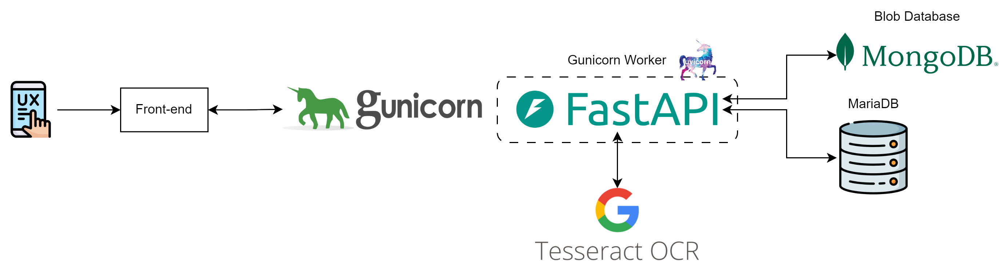
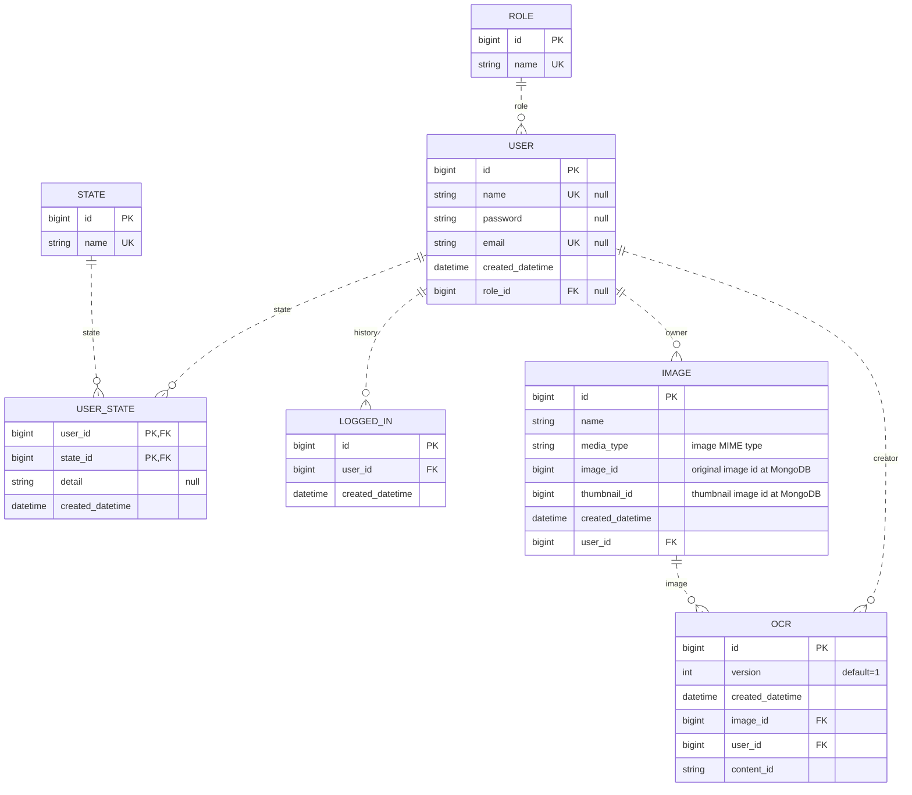
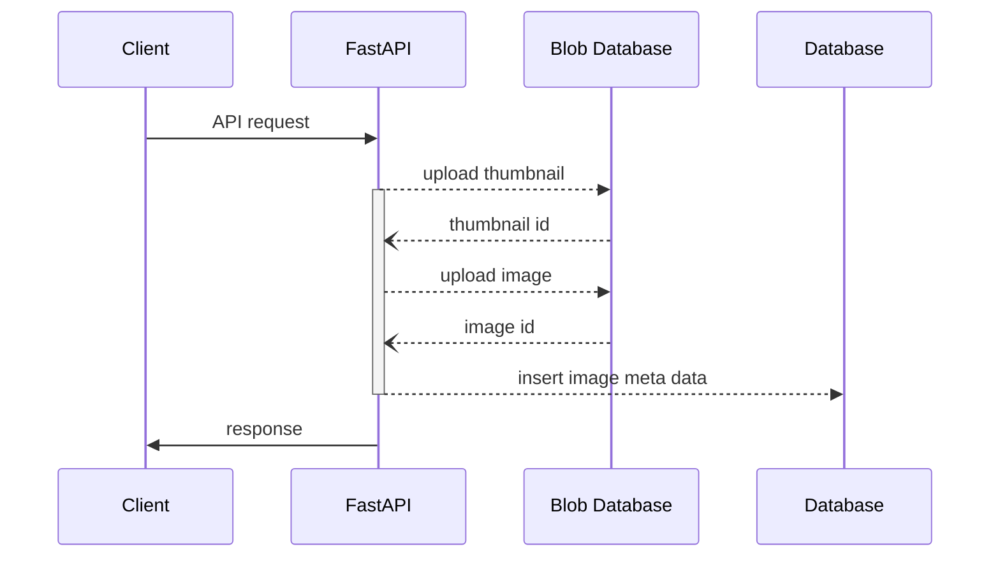
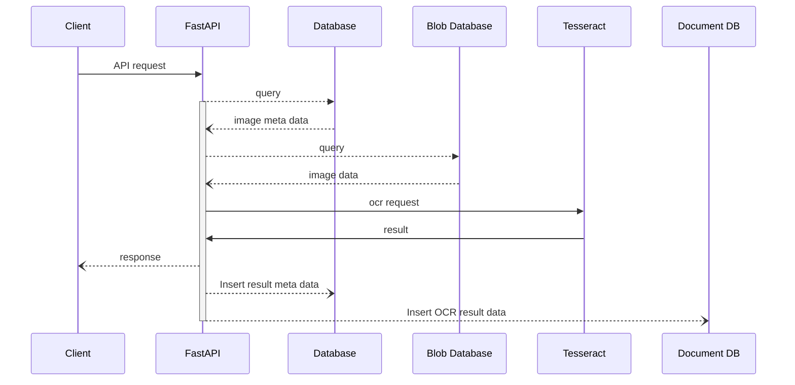

## 개요

[Github 저장소 링크](https://github.com/djccnt15/ocr_backend)

사용자가 이미지를 업로드 하고 업로드한 이미지에서 영역을 정해 OCR을 수행할 수 있는 서비스  

## 기술 스택

- 백엔드 서버 구성: 
{ loading=lazy }
{ loading=lazy }
{ loading=lazy }
- 데이터베이스: 
{ loading=lazy }
{ loading=lazy }
- OCR 인식 엔진: { loading=lazy }
- 배포: 
{ loading=lazy }

### 서비스 설명

- 서버 가용성 확보를 위한 비동기 처리 적용
- 유지보수 용이성 및 기능 확장성 확보를 위한 설계 적용
    - 도메인 주도의 레이어드 아키텍처
    - 헥사고날 아키텍처(port - adapter 패턴)
- JWT 기반 로그인 기능
- 배포를 위한 docker 컨테이너화
- 이미지 Blob 데이터베이스 및 인식 결과 문서 저장을 위한 No-SQL DB 활용
- 테서렉트 프로세스 관리를 위해 싱글턴 패턴 활용

## 아키텍처

### 시스템 아키텍처

### DB 설계

- IMAGE 엔티티의 `image_id`, `thumbnail_id` 칼럼은 Blob 데이터베이스에 저장된 이미지 데이터의 식별자
- OCR 엔티티의 `content_id` 칼럼은 배열로 도출되는 인식 결과를 문서 형태로 저장한 NO-SQL DB에서의 식별자

## 주요 비즈니스 프로세스

### 이미지 업로드 프로세스

### OCR 인식 프로세스

