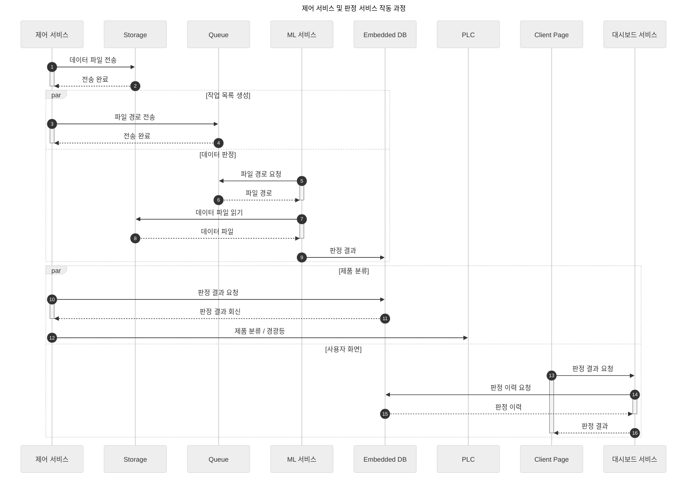
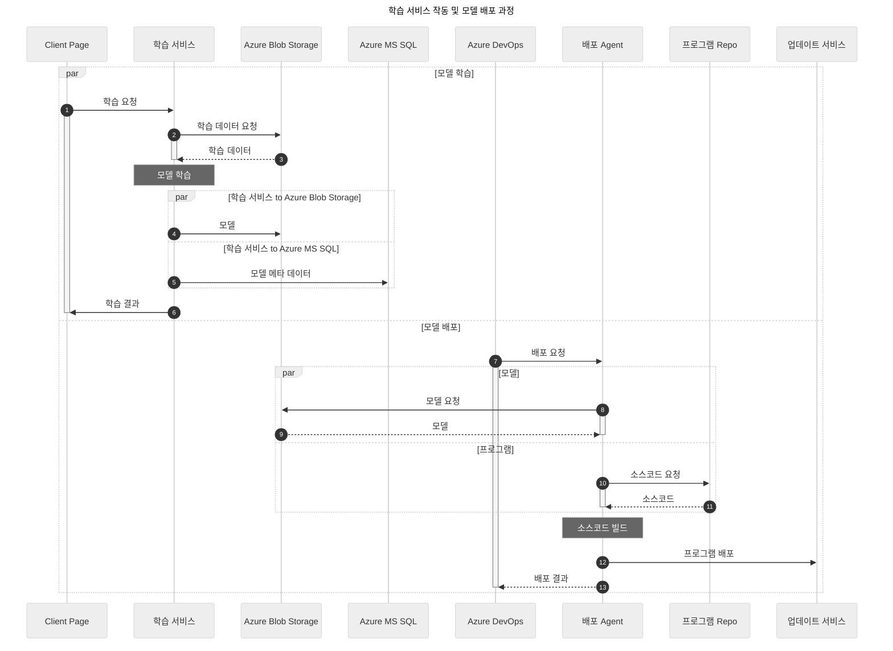
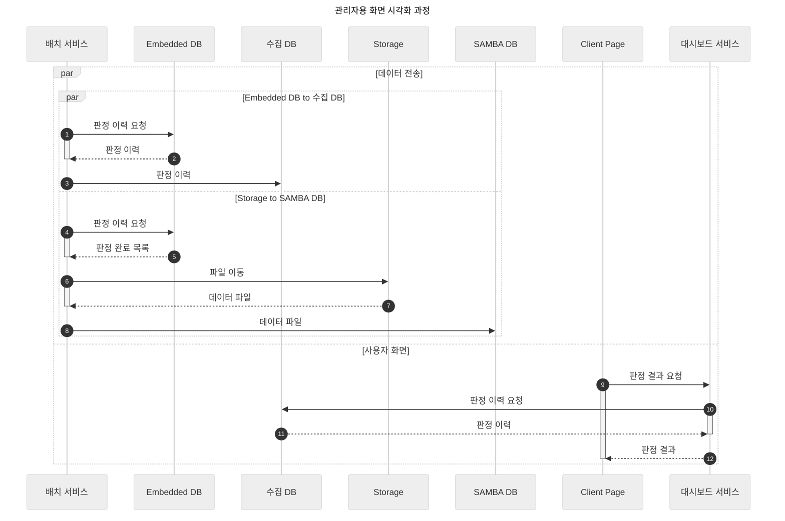

## 개요

- 비효율적 아키텍처 관련 이슈 해결 및 온프레미스 SW 통신 이슈 관련 개선을 위한 프로젝트
- 외부 요인으로 인한 AI 판정 시스템 오작동 최소화 목적
- 제조 현장 특수성을 고려한 온디바이스 아키텍처 설계 및 제안
- 단계별 적용 범위 분리를 통한 추진 전략 수립
- AI 판정 시스템 REST API 서버화
- 기존 시스템 구성 요소의 재활용을 통한 소요 공수 최소화

## 기술 스택

- 백엔드: 
{ loading=lazy }
{ loading=lazy }
{ loading=lazy }
- 데이터베이스:
{ loading=lazy }
{ loading=lazy }

## 서비스 설명

- Flask: Python AI 모델 서빙 애플리케이션
- Spring: 판정 이력 및 로우 데이터 아카이빙 중계용 서버 전송을 위한 스케쥴러 애플리케이션
- SQLite: 판정 이력 저장 및 데이터 아카이빙 상태 관리용 Embedded DB

## 아키텍처







```mermaid
---
title: 아카이빙 데이터 파이프라인 작동 과정
config:
    theme: 'neutral'
---
sequenceDiagram
    autonumber
    par Embedded DB to 수집 DB
        (초)배치 서비스 ->> Embedded DB : 판정 이력
        activate (초)배치 서비스
        Embedded DB -->> (초)배치 서비스 : 판정 이력
        deactivate (초)배치 서비스
        (초)배치 서비스 ->> 수집 DB : 판정 이력
    and Storage to SAMBA DB
        (초)배치 서비스 ->> Embedded DB : 판정 이력
        activate (초)배치 서비스
        Embedded DB -->> (초)배치 서비스 : 판정 완료 목록
        deactivate (초)배치 서비스
        (초)배치 서비스 ->> Storage : 파일 이동
        activate (초)배치 서비스
        Storage -->> (초)배치 서비스 : 데이터 파일
        deactivate (초)배치 서비스
        (초)배치 서비스 ->> SAMBA DB : 데이터 파일 이동
    end
    (초)배치 서비스 ->> Embedded DB : 과거 이력 삭제
    par SAMBA DB to Azure Blob Storage
        (일)배치 서비스 ->> SAMBA DB : 파일 이동
        activate (일)배치 서비스
        SAMBA DB -->> (일)배치 서비스 : 데이터 파일
        deactivate (일)배치 서비스
        (일)배치 서비스 ->> Azure Blob Storage : 데이터 파일 이동
    and 수집 DB to Azure MS SQL
        (일)배치 서비스 ->> 수집 DB : 판정 이력
        activate (일)배치 서비스
        수집 DB -->> (일)배치 서비스 : 판정 이력
        deactivate (일)배치 서비스
        (일)배치 서비스 ->> Azure MS SQL : 판정 이력
    end
```
