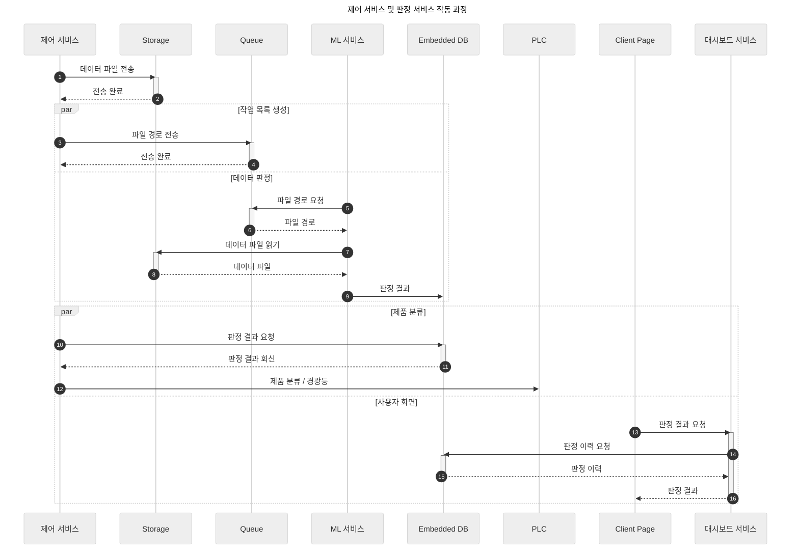
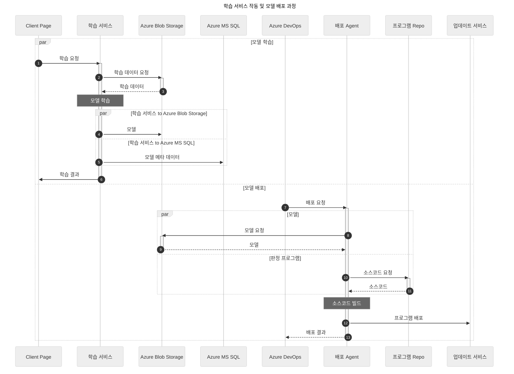
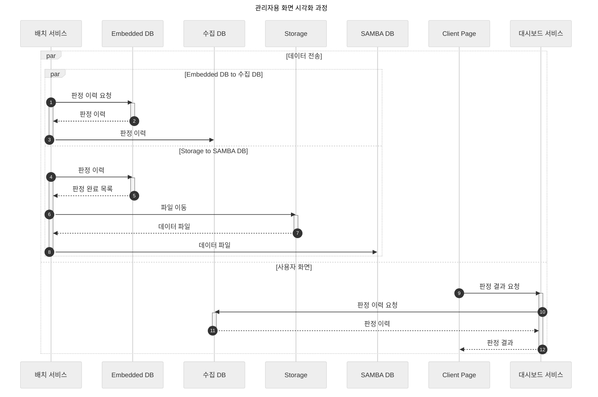
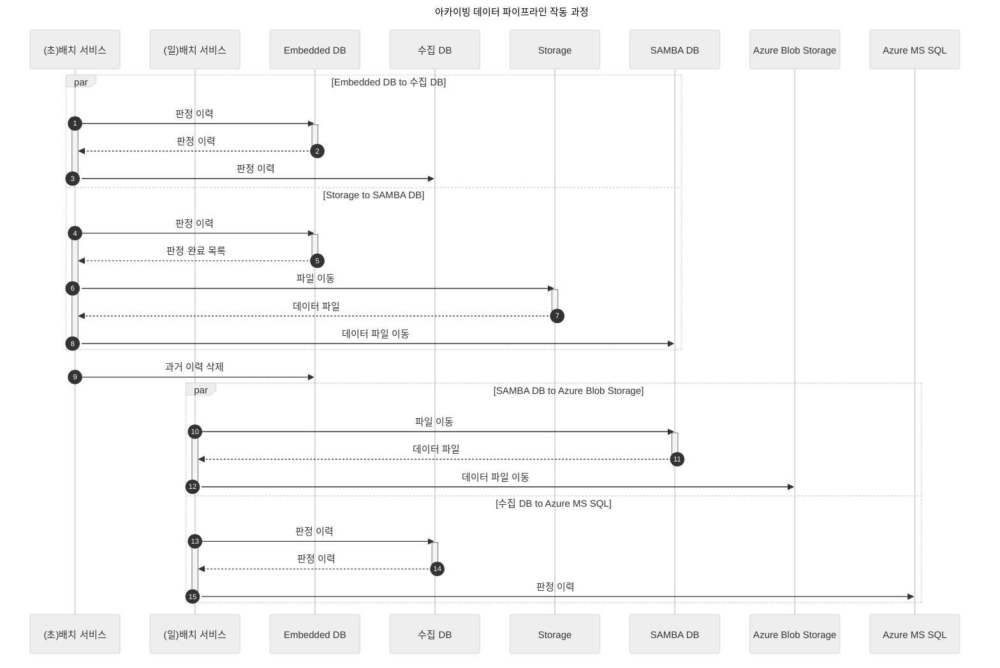

## 개요

- 비효율적 아키텍처 관련 이슈 해결 및 온프레미스 SW 통신 이슈 관련 개선을 위한 프로젝트
- 외부 요인으로 인한 AI 판정 시스템 오작동 최소화 목적
- 제조 현장 특수성을 고려한 온디바이스 아키텍처 설계 및 제안
- 단계별 적용 범위 분리를 통한 추진 전략 수립
- AI 판정 시스템 REST API 서버화
- 기존 시스템 구성 요소의 재활용을 통한 소요 공수 최소화

## 기술 스택

- 백엔드: 
{ loading=lazy }
{ loading=lazy }
{ loading=lazy }
- 데이터베이스:
{ loading=lazy }
{ loading=lazy }

## 서비스 설명

- Flask: Python AI 모델 서빙 애플리케이션
- Spring: 판정 이력 및 로우 데이터 아카이빙 중계용 서버 전송을 위한 스케쥴러 애플리케이션
- SQLite: 판정 이력 저장 및 데이터 아카이빙 상태 관리용 Embedded DB

## 아키텍처

```mermaid
---
title: 제어 서비스 및 판정 서비스 작동 과정
config:
    theme: 'neutral'
---
sequenceDiagram
    autonumber
    제어 서비스 ->> Storage : 데이터 파일 전송
    activate Storage
    Storage -->> 제어 서비스 : 전송 완료
    deactivate Storage
    par 작업 목록 생성
        제어 서비스 ->> Queue : 파일 경로 전송
        activate Queue
        Queue -->> 제어 서비스 : 전송 완료
        deactivate Queue
    and 데이터 판정
        ML 서비스 ->> Queue : 파일 경로 요청
        activate Queue
        Queue -->> ML 서비스 : 파일 경로
        deactivate Queue
        ML 서비스 ->> Storage : 데이터 파일 읽기
        activate Storage
        Storage -->> ML 서비스 : 데이터 파일
        deactivate Storage
        ML 서비스 ->> Embedded DB : 판정 결과
    end
    par 제품 분류
        제어 서비스 ->> Embedded DB : 판정 결과 요청
        activate Embedded DB
        Embedded DB -->> 제어 서비스 : 판정 결과 회신
        deactivate Embedded DB
        제어 서비스 ->> PLC : 제품 분류 / 경광등
    and 사용자 화면
        Client Page ->> 대시보드 서비스 : 판정 결과 요청
        activate 대시보드 서비스
        대시보드 서비스 ->> Embedded DB : 판정 이력 요청
        activate Embedded DB
        Embedded DB -->> 대시보드 서비스 : 판정 이력
        deactivate Embedded DB
        대시보드 서비스 -->> Client Page : 판정 결과
        deactivate 대시보드 서비스
    end
```

```mermaid
---
title: 학습 서비스 작동 및 모델 배포 과정
config:
    theme: 'neutral'
---
sequenceDiagram
    autonumber
    par 모델 학습
        Client Page ->> 학습 서비스 : 학습 요청
        activate 학습 서비스
        학습 서비스 ->> Azure Blob Storage : 학습 데이터 요청
        activate Azure Blob Storage
        Azure Blob Storage -->> 학습 서비스 : 학습 데이터
        deactivate Azure Blob Storage
        Note over 학습 서비스 : 모델 학습
        par 학습 서비스 to Azure Blob Storage
            학습 서비스 ->> Azure Blob Storage : 모델
        and 학습 서비스 to Azure MS SQL
            학습 서비스 ->> Azure MS SQL : 모델 메타 데이터
        end
        학습 서비스 ->> Client Page : 학습 결과
        deactivate 학습 서비스
    and 모델 배포
        Azure DevOps ->> 배포 Agent : 배포 요청
        activate 배포 Agent
        par 모델
            배포 Agent ->> Azure Blob Storage : 모델 요청
            activate Azure Blob Storage
            Azure Blob Storage -->> 배포 Agent : 모델
            deactivate Azure Blob Storage
        and 판정 프로그램
            배포 Agent ->> 프로그램 Repo : 소스코드 요청
            activate 프로그램 Repo
            프로그램 Repo -->> 배포 Agent : 소스코드
            deactivate 프로그램 Repo
        end
        Note over 배포 Agent : 소스코드 빌드
        배포 Agent ->> 업데이트 서비스 : 프로그램 배포
        배포 Agent -->> Azure DevOps : 배포 결과
        deactivate 배포 Agent
    end
```

```mermaid
---
title: 관리자용 화면 시각화 과정
config:
    theme: 'neutral'
---
sequenceDiagram
    autonumber
    par 데이터 전송
        par Embedded DB to 수집 DB
            배치 서비스 ->> Embedded DB : 판정 이력 요청
            activate 배치 서비스
            activate Embedded DB
            Embedded DB -->> 배치 서비스 : 판정 이력
            deactivate Embedded DB
            배치 서비스 ->> 수집 DB : 판정 이력
            deactivate 배치 서비스
        and Storage to SAMBA DB
            배치 서비스 ->> Embedded DB : 판정 이력 
            activate 배치 서비스
            activate Embedded DB
            Embedded DB -->> 배치 서비스 : 판정 완료 목록
            deactivate Embedded DB
            배치 서비스 ->> Storage : 파일 이동
            activate Storage
            Storage -->> 배치 서비스 : 데이터 파일
            deactivate Storage
            배치 서비스 ->> SAMBA DB : 데이터 파일
            deactivate 배치 서비스
        end
    and 사용자 화면
        Client Page ->> 대시보드 서비스 : 판정 결과 요청
        activate 대시보드 서비스
        대시보드 서비스 ->> 수집 DB : 판정 이력 요청
        activate 수집 DB
        수집 DB -->> 대시보드 서비스 : 판정 이력
        deactivate 수집 DB
        대시보드 서비스 -->> Client Page : 판정 결과
        deactivate 대시보드 서비스
    end
```

```mermaid
---
title: 아카이빙 데이터 파이프라인 작동 과정
config:
    theme: 'neutral'
---
sequenceDiagram
    autonumber
    participant SecBatch as (초)배치 서비스
    participant DayBatch as (일)배치 서비스
    
    par Embedded DB to 수집 DB
        SecBatch ->> Embedded DB : 판정 이력
        activate SecBatch
        activate Embedded DB
        Embedded DB -->> SecBatch : 판정 이력
        deactivate Embedded DB
        SecBatch ->> 수집 DB : 판정 이력
        deactivate SecBatch
    and Storage to SAMBA DB
        SecBatch ->> Embedded DB : 판정 이력
        activate SecBatch
        activate Embedded DB
        Embedded DB -->> SecBatch : 판정 완료 목록
        deactivate Embedded DB
        SecBatch ->> Storage : 파일 이동
        activate Storage
        Storage -->> SecBatch : 데이터 파일
        deactivate Storage
        SecBatch ->> SAMBA DB : 데이터 파일 이동
        deactivate SecBatch
    end
    SecBatch ->> Embedded DB : 과거 이력 삭제
    par SAMBA DB to Azure Blob Storage
        DayBatch ->> SAMBA DB : 파일 이동
        activate DayBatch
        activate SAMBA DB
        SAMBA DB -->> DayBatch : 데이터 파일
        deactivate SAMBA DB
        DayBatch ->> Azure Blob Storage : 데이터 파일 이동
        deactivate DayBatch
    and 수집 DB to Azure MS SQL
        DayBatch ->> 수집 DB : 판정 이력
        activate DayBatch
        activate 수집 DB
        수집 DB -->> DayBatch : 판정 이력
        deactivate 수집 DB
        DayBatch ->> Azure MS SQL : 판정 이력
        deactivate DayBatch
    end
```
