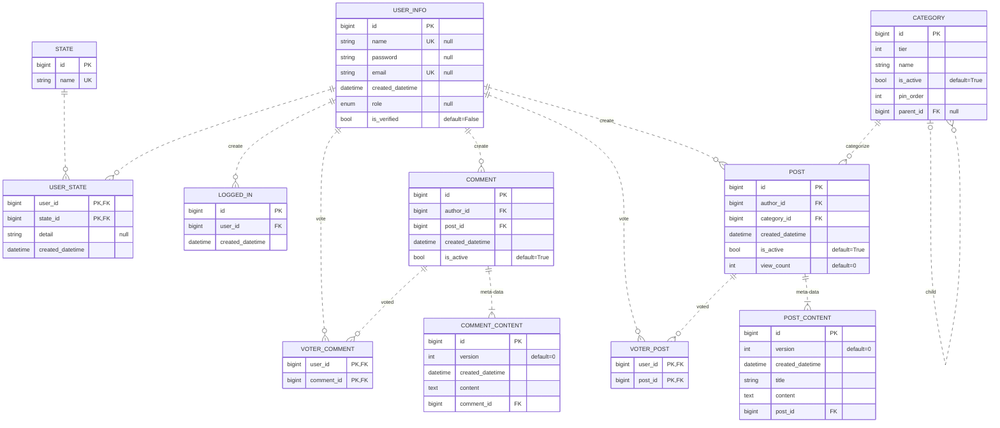

## 개요

[GitHub 저장소 링크](https://github.com/djccnt15/spring_board)

- Spring 기반 게시판 서비스
- 게시글 및 댓글 작성 및 수정 기능
- 게시글 및 댓글 추천 기능
- 회원 가입 및 로그인 기능
    - 회원 가입 시 이메일 인증 기능
    - Cache 서버 활용을 통한 인증키 시간 제한
    - 비밀번호 분실 시 이메일을 통한 임시 비밀번호 발급 기능
    - Spring Security 기능 Override를 통한 로그인 기능 및 세션 정보 개선
    <!-- - 소셜 로그인 기능 -->
- 관리자 기능
    - 회원 권한 관리 기능 및 권한 변경 시 강제 로그아웃 기능
    - 글, 댓글 삭제 및 수정
    - 이력성 정보 CSV, Excel 파일 다운로드 기능(글, 댓글 수정 이력)
    - 상세 게시판 및 카테고리 생성 및 삭제 기능
    - 메인 화면 노출 게시판 설정 및 노출 순서 설정 기능
- 유저 프로필 기능
    - 회원정보 확인 기능
    - 작성 글 및 댓글 확인 기능

## 기술 스택

- 프론트엔드: 
{ loading=lazy }
{ loading=lazy }
- 백엔드: 
{ loading=lazy }
{ loading=lazy }
{ loading=lazy }
- 데이터베이스: 
{ loading=lazy }
- 캐시 서버: 
{ loading=lazy }
- 모니터링: 
{ loading=lazy }

## 서비스 설명

- Spring MVC + JPA 기반 CRUD
- Spring Security 기반 로그인 및 사용자 권한 관리
- Servlet Filter를 활용한 API 응답속도 측정
- Custom Exception 및 `ControllerAdvice` 활용을 통한 예외 처리 관리
- 절차적 프로그래밍을 기반으로 한 도메인 주도의 레이어드 아키텍처 구성을 통해 코드 가독성 확보
    - *Endpoint Controller - Business Process - Service Logic - Data Access* 의 4층 Layer 구조를 통한 코드 분리
- Stream API 및 Converter Pattern 활용을 통한 코드 가독성 향상
- SQL 수준에서 Pagination 적용
- 서버 상태 모니터링을 위한 Prometheus 적용
<!-- - 테스트 코드 및 빌드 시 테스트를 통한 코드 스펙 자동 검사 -->

## 아키텍처

### 시스템 아키텍처

- 커넥션 풀(connection pool) 기반의 ORM 사용
    - SQL injection 방지
    - 데이터베이스 부하 방지
- 데이터베이스 부하를 줄이기 위한 캐시 서버([cache aside 패턴](../blog/posts/2023-12-23-cache_pattern.md/#cache-aside-pattern)) 활용

### DB 설계



- 데이터의 생성 및 관리 단위에 따라 테이블 분리 및 정규화
    - 게시글과 댓글의 이력 관리를 위한 테이블 분리
- N + 1 문제 방지를 위해 연관 관계(relationship mapping) 사용 지양
- 복잡한 연관 관계의 테이블에서 정확한 데이터 추출을 위해 `projection` 및 native 쿼리 조합 사용

    ??? note "게시글 리스트 추출 Query"

        ```sql
        WITH LatestPostContent AS (
            SELECT
                t1.id,
                t1.created_datetime,
                t1.title,
                t1.content,
                t1.version,
                t1.post_id
            FROM post_content AS t1
            INNER JOIN (
                SELECT
                    post_id,
                    MAX(version) AS max_version
                FROM post_content
                GROUP BY post_id
            ) AS t2 ON t1.post_id = t2.post_id AND t1.version = t2.max_version
        ),
        CommentCounts AS (
            SELECT
                c.post_id,
                COUNT(*) AS comment_count
            FROM comment c
            WHERE c.is_active = TRUE
            GROUP BY c.post_id
        ),
        VoteCounts AS (
            SELECT
                post_voter.post_id,
                COUNT(*) AS vote_count
            FROM post_voter
            GROUP BY post_voter.post_id
        )
        SELECT
            p.id,
            p.created_datetime,
            pc.created_datetime AS updated_datetime,
            u.username,
            u.id AS user_id,
            c.name AS category,
            pc.title,
            pc.content,
            pc.version,
            COALESCE(p.view_count, 0) AS view_count,
            COALESCE(comment.comment_count, 0) AS comment_count,
            COALESCE(vote.vote_count, 0) AS vote_count
        FROM post AS p
        JOIN category c ON p.category_id = c.id
        JOIN user_info u ON p.author_id = u.id
        JOIN LatestPostContent AS pc ON p.id = pc.post_id
        LEFT JOIN CommentCounts AS comment ON p.id = comment.post_id
        LEFT JOIN VoteCounts AS vote ON p.id = vote.post_id
        WHERE 1=1
            AND p.is_active = TRUE
            AND c.parent_id = :category_id
            AND (:sub_category_id IS NULL OR c.id = :sub_category_id)
            AND (
                u.username LIKE :keyword
                OR pc.title LIKE :keyword
                OR pc.content LIKE :keyword
            )
        ORDER BY p.id DESC
        OFFSET :page ROWS
        FETCH FIRST :size ROWS ONLY
        ```

### 캐시 패턴

DB 호출 빈도가 가장 높은 API에 [Cache Aside 패턴](../blog/posts/2023-12-23-cache_pattern.md/#cache-aside-pattern)을 활용한 캐싱 적용

- 게시글 상세 내용 기능


