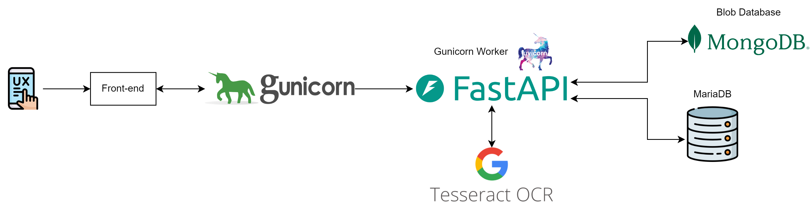
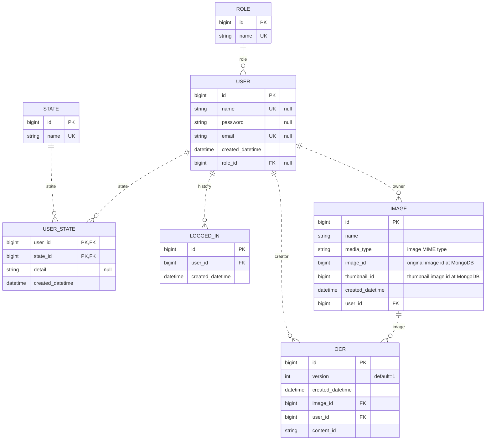
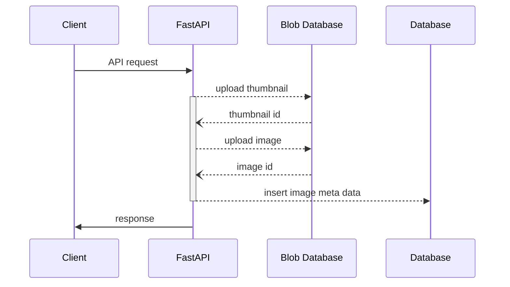
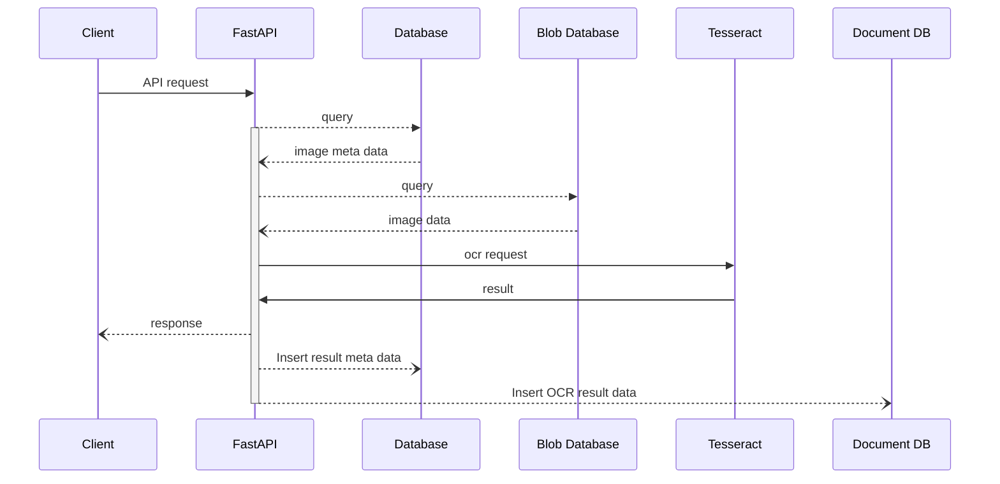

## 개요

[Github 저장소 링크](https://github.com/djccnt15/fastapi_vision)

사용자가 이미지를 업로드 하고 업로드한 이미지에서 영역을 정해 OCR을 수행할 수 있는 서비스  

## 기술 스택

- 백엔드 서버 구성: 
{ loading=lazy }
{ loading=lazy }
{ loading=lazy }
- 데이터베이스: 
{ loading=lazy }
{ loading=lazy }
- OCR 인식 엔진: { loading=lazy }
- 배포: 
{ loading=lazy }

### 서비스 설명

- 절차적 프로그래밍을 기반으로 한 도메인 주도의 레이어드 아키텍처 구성을 통해 코드 가독성 확보
- 객체 지향적 프로그래밍 기반의 헥사고날 아키텍처(port - adapter 패턴) 적용을 통해 설계 유연성 확보
- 배열 데이터의 일괄 처리 시 가독성 향상을 위해 comprehension 문법을 사용한 함수형 프로그래밍 적용
- `bcrypt` 알고리즘을 사용한 JWT 로그인 기능
- 배포를 위한 docker 컨테이너화

## 아키텍처

### 시스템 아키텍처



- 서버 가용성 확보를 위한 비동기 처리 적용
- 커넥션 풀(connection pool) 기반의 ORM 사용
    - SQL injection 방지
    - 데이터베이스 부하 방지
- 이미지 Blob 데이터베이스 및 인식 결과 문서 저장을 위한 No-SQL DB 활용
- 테서렉트 프로세스 관리를 위해 싱글턴 패턴 활용

    ??? note "테서렉트 프로세스 관리 class"

        ```python
        class TesseractInferencer(OcrInferencer):
            _instance = None

            def __new__(cls, path: Path, *args, **kwargs):
                if not cls._instance:
                    cls._instance = super(TesseractInferencer, cls).__new__(
                        cls, *args, **kwargs
                    )
                    pytesseract.pytesseract.tesseract_cmd = path
                return cls._instance

            async def extract_text(
                self,
                *,
                image: Image.Image,
                roi: ocr_model.Roi,
                lang: str | None = None,
                config: str = "",
                nice: int = 0,
                timeout: int = 0,
            ) -> list[str]:
                image = crop_image(image=image, roi=roi)
                extracted_text: str = await concurrency.run_in_threadpool(
                    func=pytesseract.image_to_string,
                    image=image,
                    lang=lang,
                    config=config,
                    nice=nice,
                    timeout=timeout,
                )
                res = extracted_text.replace("\n", "").split(" ")
                return res
        ```

### DB 설계



- 데이터의 생성 및 관리 단위에 따라 테이블 분리 및 정규화
- N + 1 문제 방지를 위해 연관 관계(relationship mapping) 사용 지양
- IMAGE 엔티티의 `image_id`, `thumbnail_id` 칼럼은 Blob 데이터베이스에 저장된 이미지 데이터의 식별자
- OCR 엔티티의 `content_id` 칼럼은 배열로 도출되는 인식 결과를 문서 형태로 저장한 NO-SQL DB에서의 식별자

## 주요 비즈니스 프로세스

### 이미지 업로드 프로세스



### OCR 인식 프로세스

